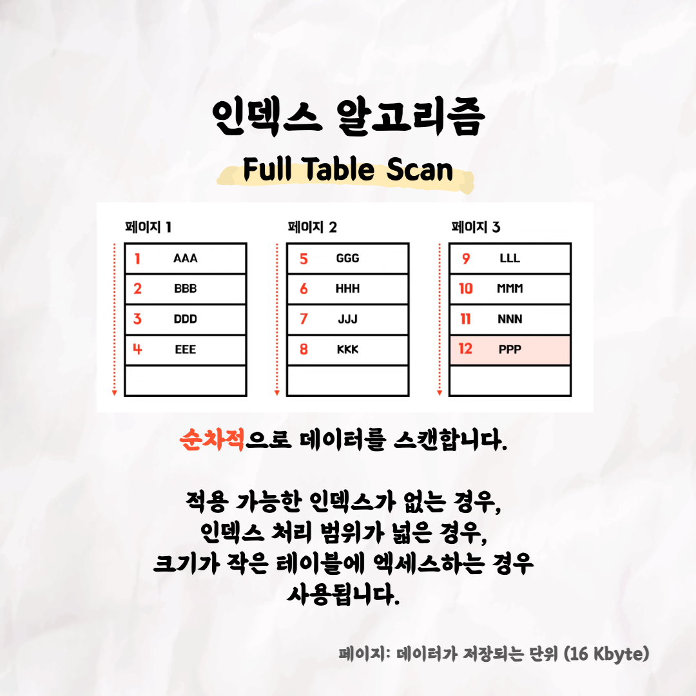

# 테코톡 - 라라, 제로의 데이터베이스 인덱스

### 글

 

테코톡 👩🏻‍💻🧑🏻‍💻  
  
주제 : 데이터베이스 인덱스
  
발표자 : 라라 🤷🏻‍♀️, 제로 0️⃣

데이터베이스 인덱스가 무엇이고 언제 동작하는지 알고 계신가요?

면접 단골 질문이니 만큼 백엔드 개발자라면 꼭 알아야 하는 지식이라고 생각해요!

데이터베이스 인덱스에 대한 자세한 설명을 듣고 싶다면 라라, 제로의 테코톡을 시청해주세요!

영상은 유튜브에 "라라, 제로의 데이터베이스 인덱스"로 검색하시면  
찾아보실 수 있습니다.

우아한Tech 유튜브 : https://www.youtube.com/c/%EC%9A%B0%EC%95%84%ED%95%9CTech

우아한테크코스 홈페이지 : https://woowacourse.github.io

우테코 블로그(Tecoble) : https://tecoble.techcourse.co.kr

#우아한테크코스 #우테코 #잠실 #선릉 #부트캠프 #java #javascript #spring #react #개발문화 #개발 #개발자 #wooteco #techcourse #테코톡 #tecotalk #database #index #인덱스 #MySQL #InnoDB
