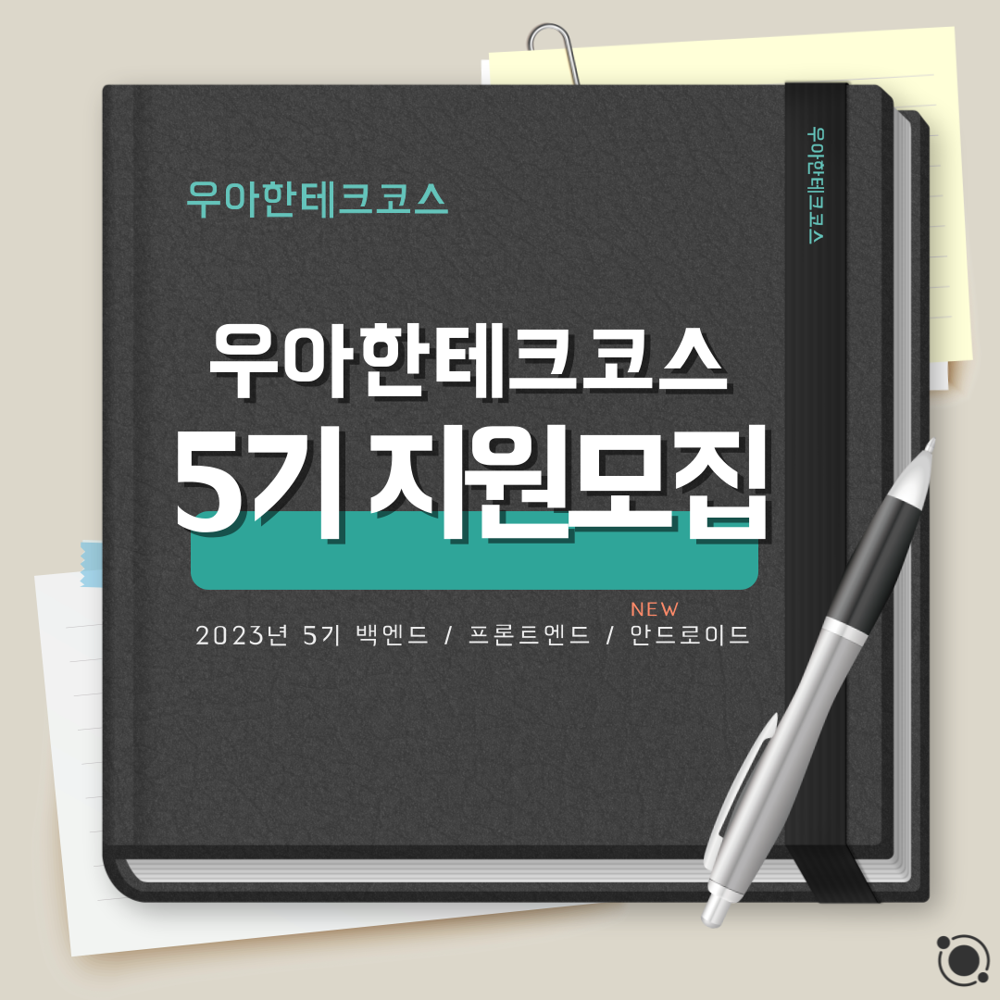
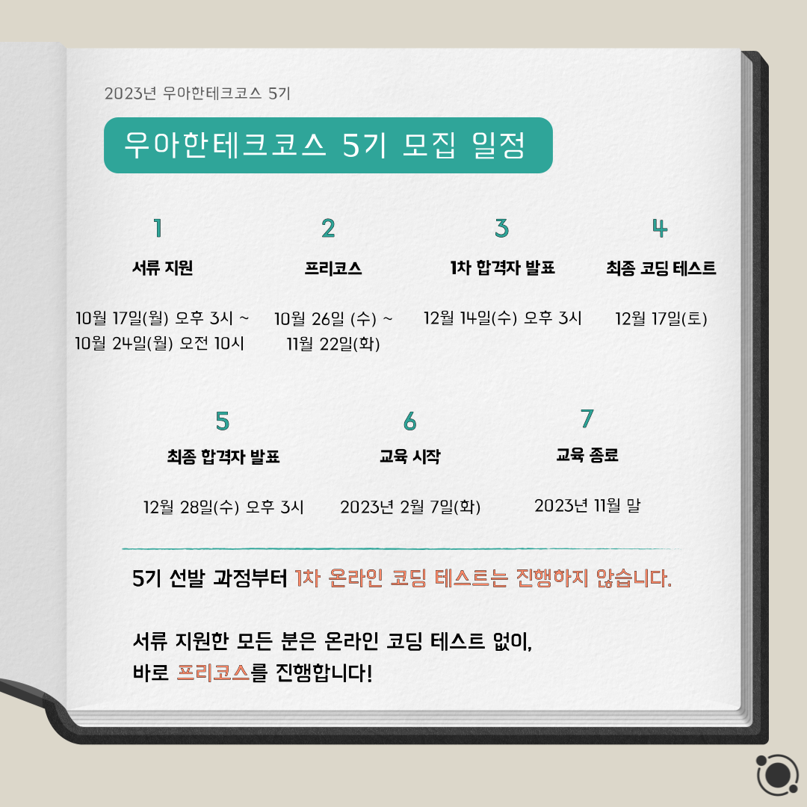
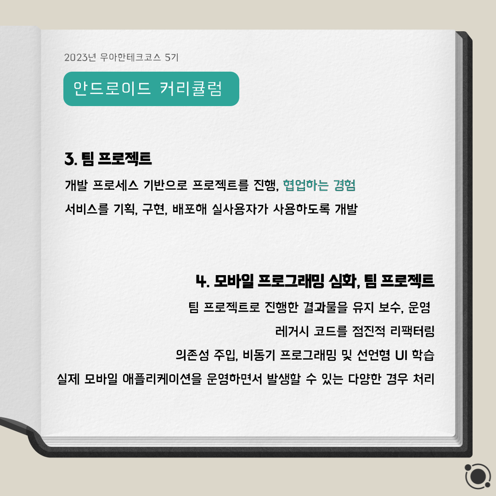
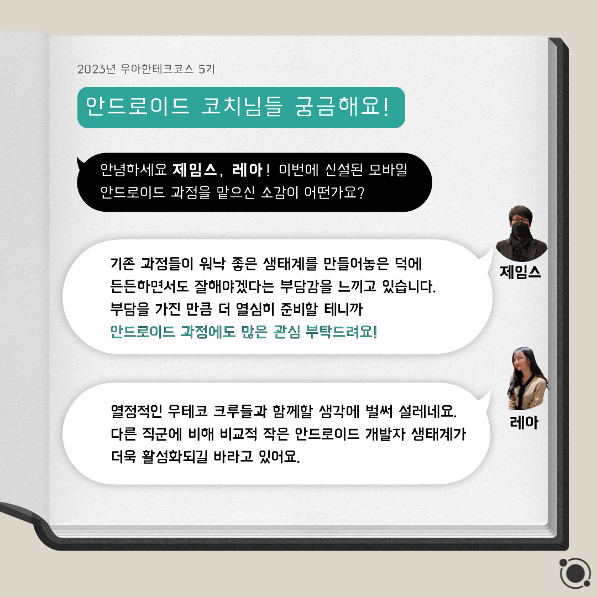
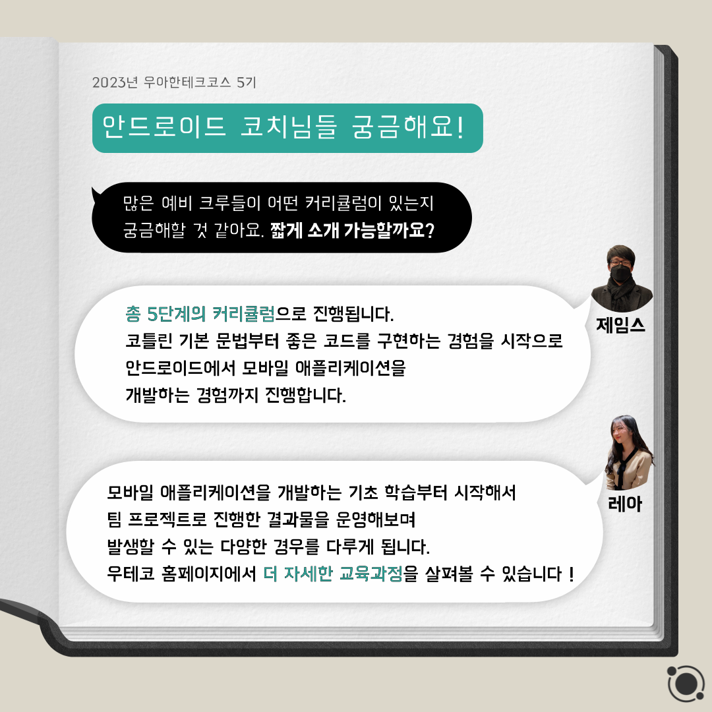
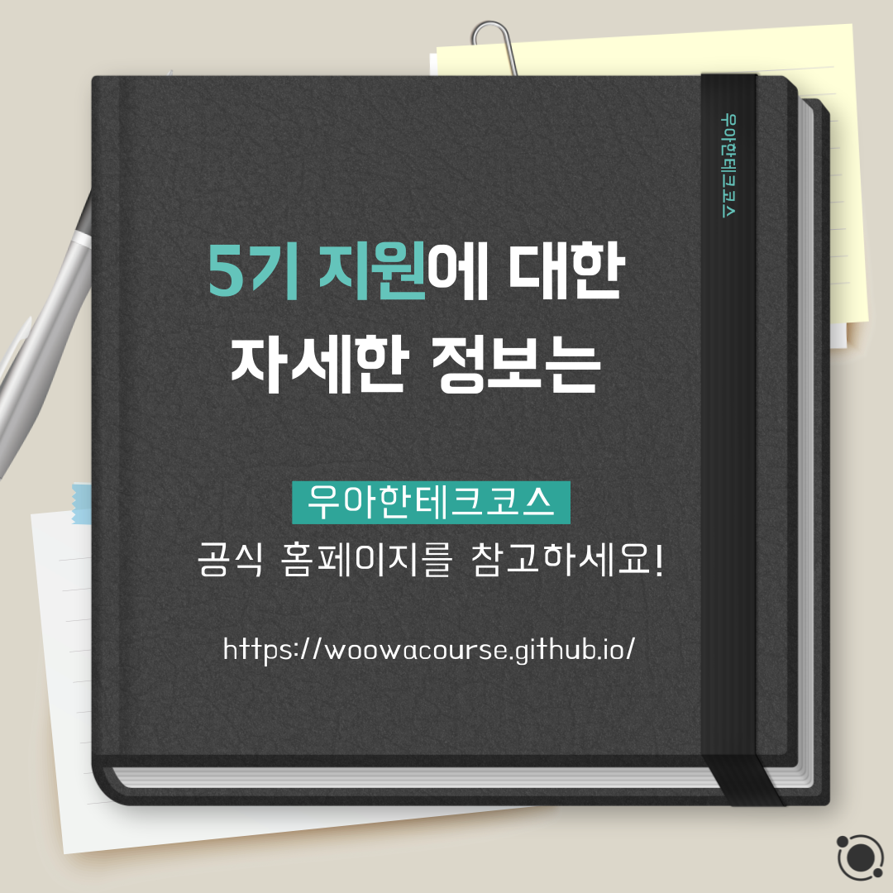

## 5기 지원 모집 

 

📄 5기 지원 모집, 자세히 알아볼까요? 🧐   
  
우아한테크코스 5기 모집이 시작되었습니다! 😆   

이번 5기부터는 📱 안드로이드 과정이 추가되었는데요!  

서류 모집 기한은 10월 17일(월) 오후 3시부터 10월 24일(월) 오전 10시까지입니다.   

자세한 내용은 공식 홈페이지를 참고해주세요!  

우아한테크코스 홈페이지 : https://woowacourse.github.io
