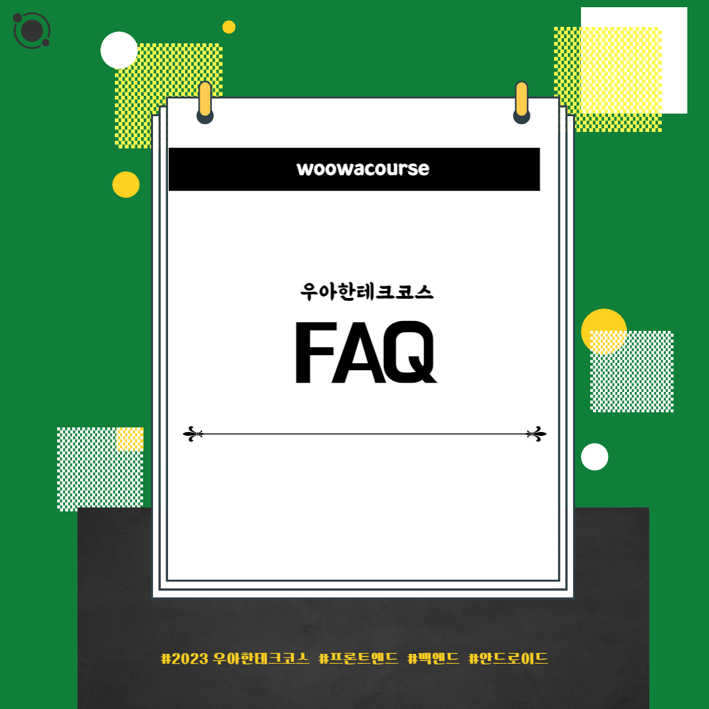
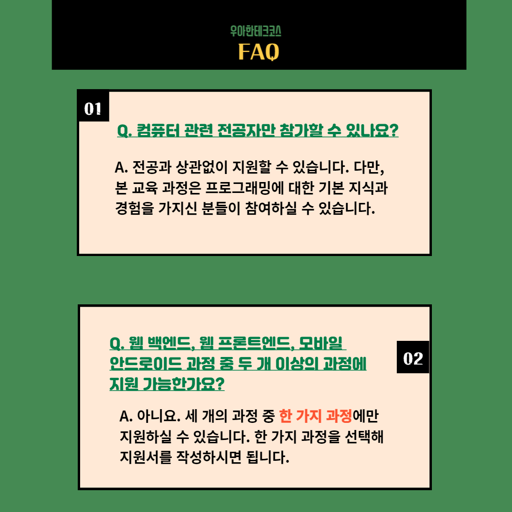
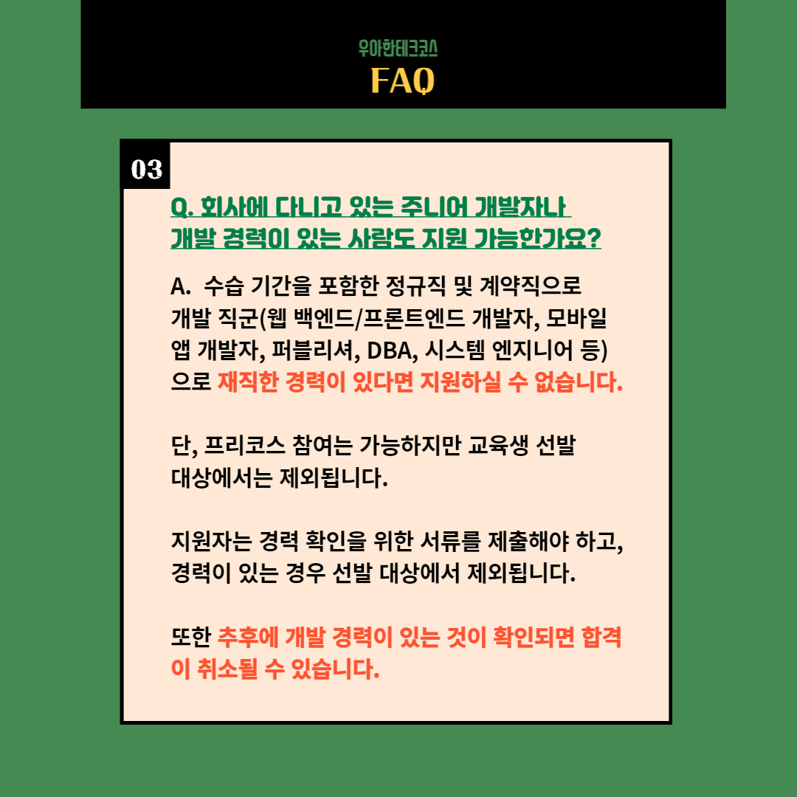
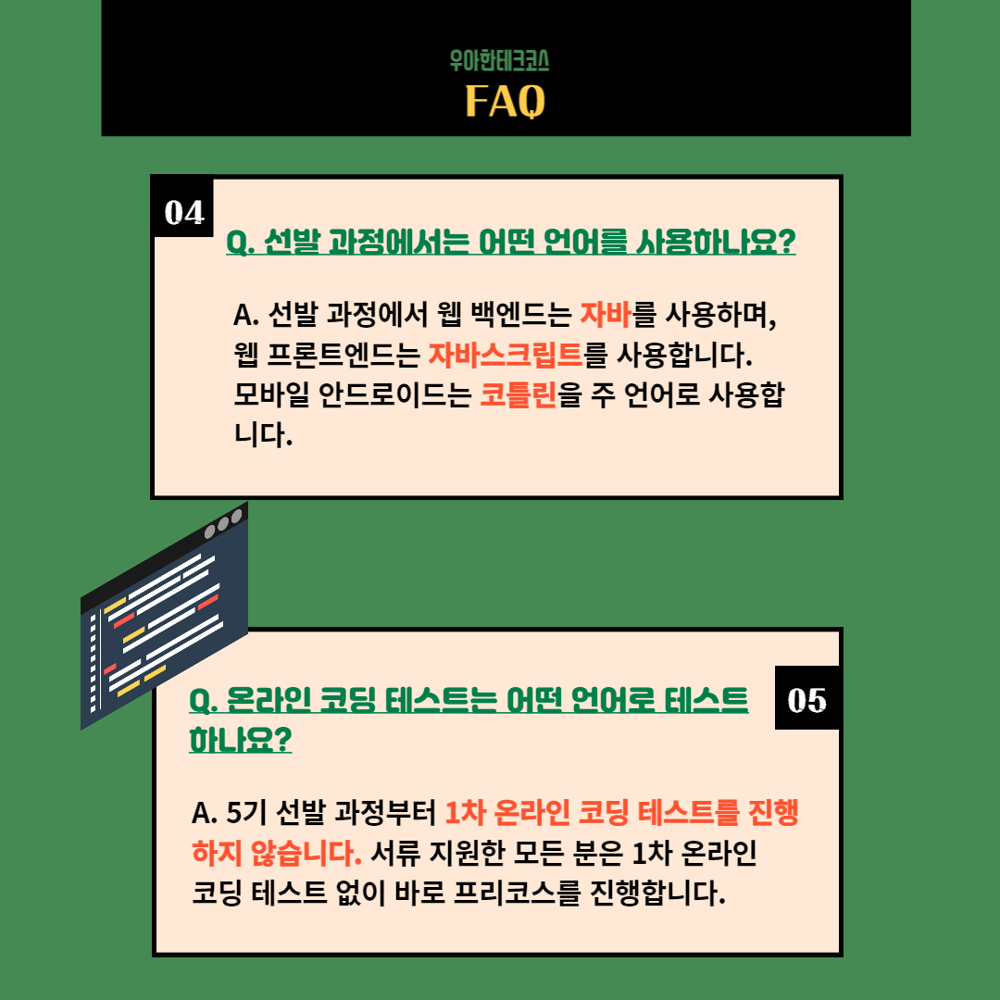
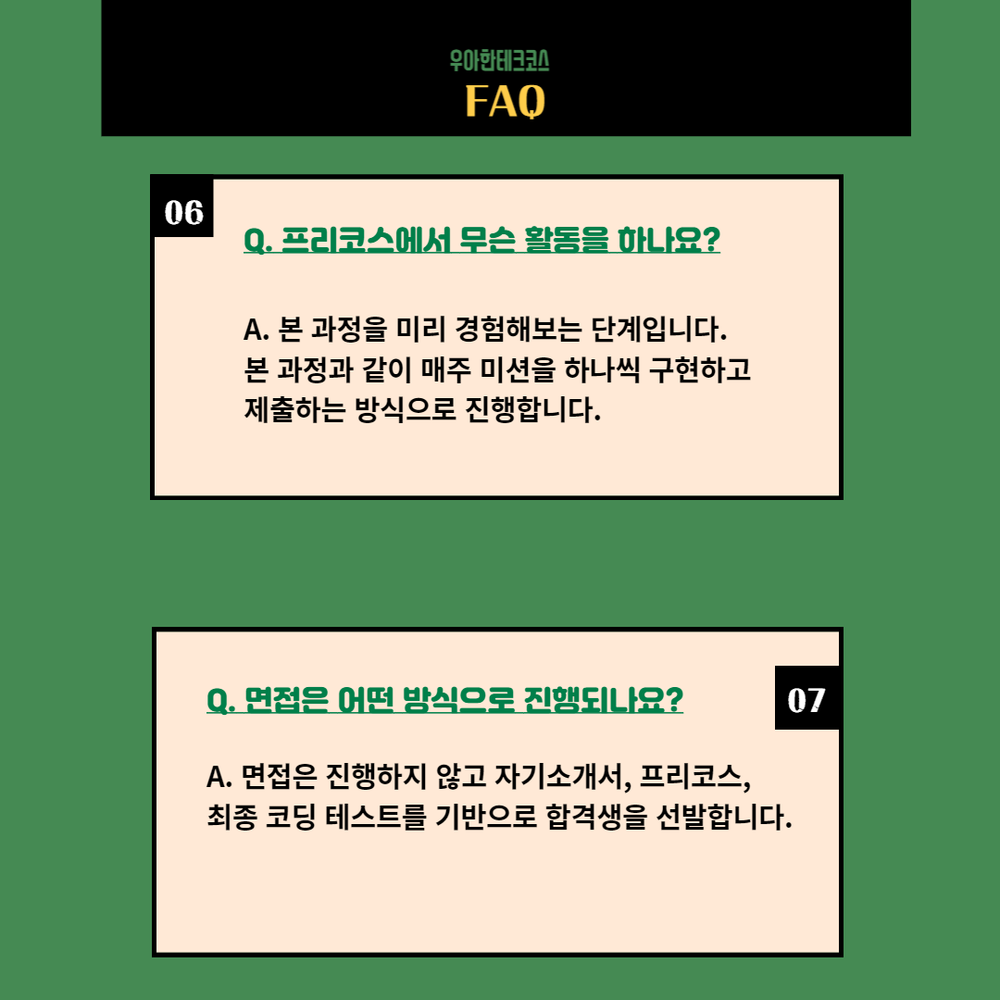
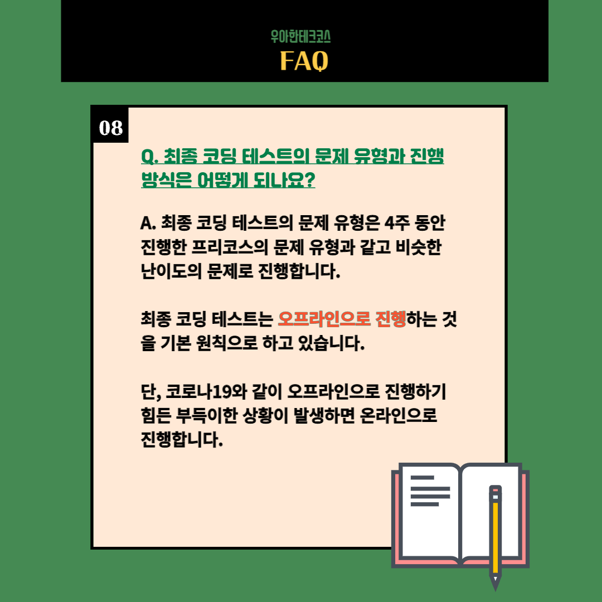
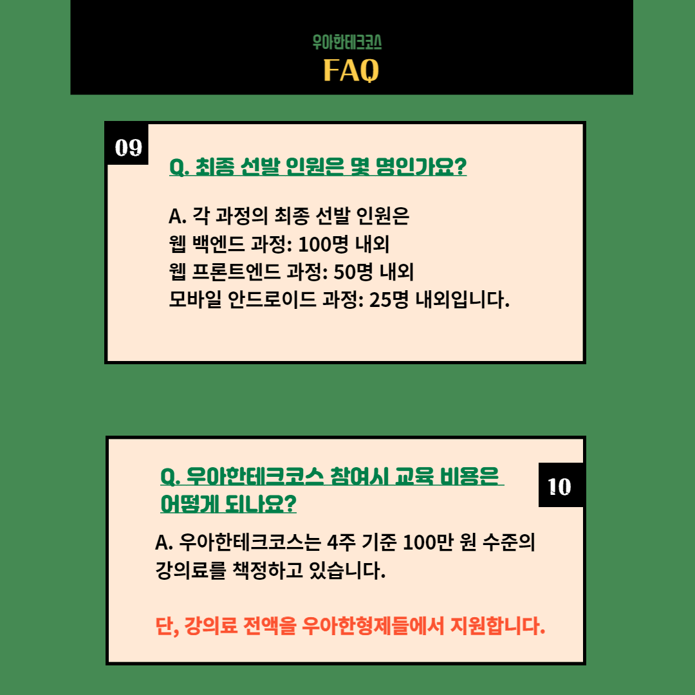
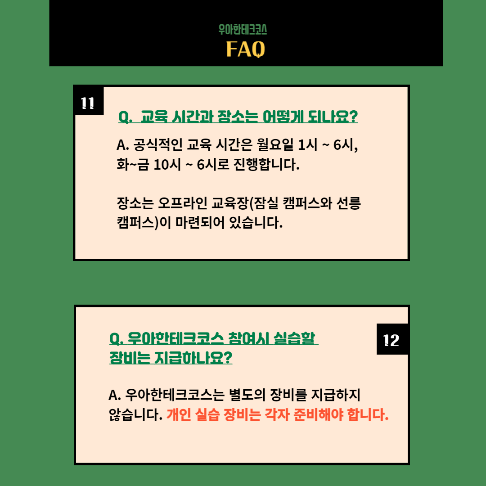
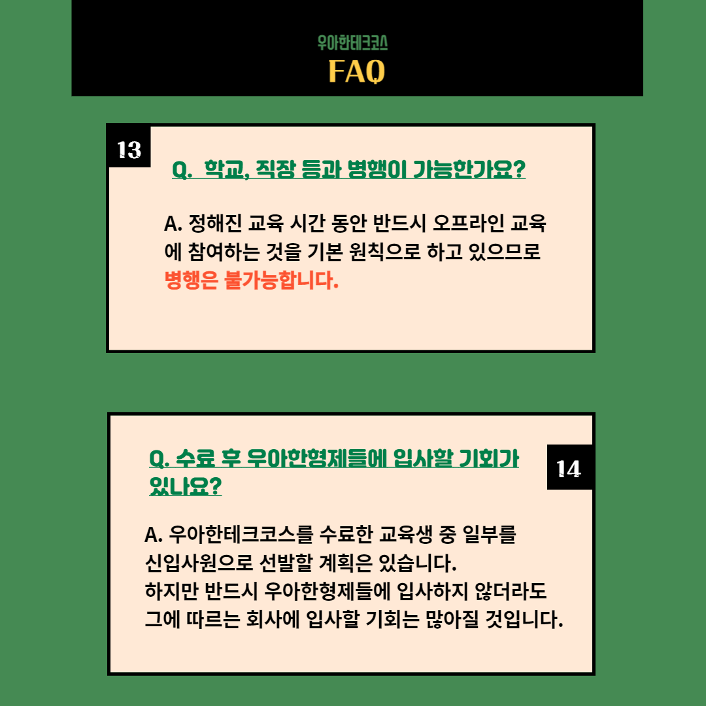
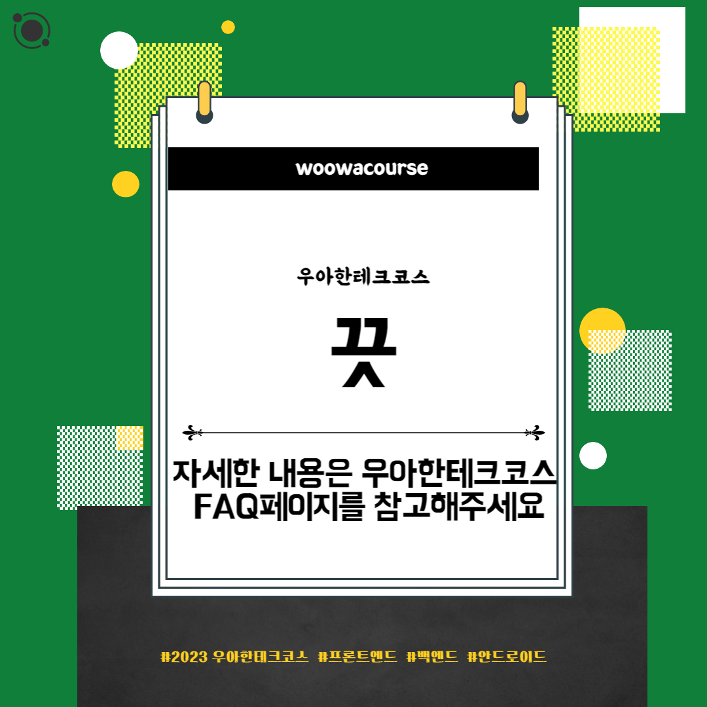

### 문화 - FAQ

📮 문화

주제: FAQ

우아한테크코스 5기 모집을 시작했습니다!

이번 5기부터는 안드로이드 과정이 추가되었는데요!

기존의 모집 방식에서 어떻게 변했는지 살펴보시죠!

자세한 사항은 구글에 "우아한테크코스 지원하기"를 검색해주세요.

우아한Tech 유튜브:https://www.youtube.com/c/%EC%9A%B0%EC%95%84%ED%95%9CTech

우아한테크코스 홈페이지:https://woowacourse.github.io

우테코 블로그(Tecoble):https://tecoble.techcourse.co.kr

#우아한테크코스#우테코#테코톡#개발자#java#javascript#spring#react#개발문화#개발#개발자#woowahantechcourse#wooteco#techcourse#FAQ
