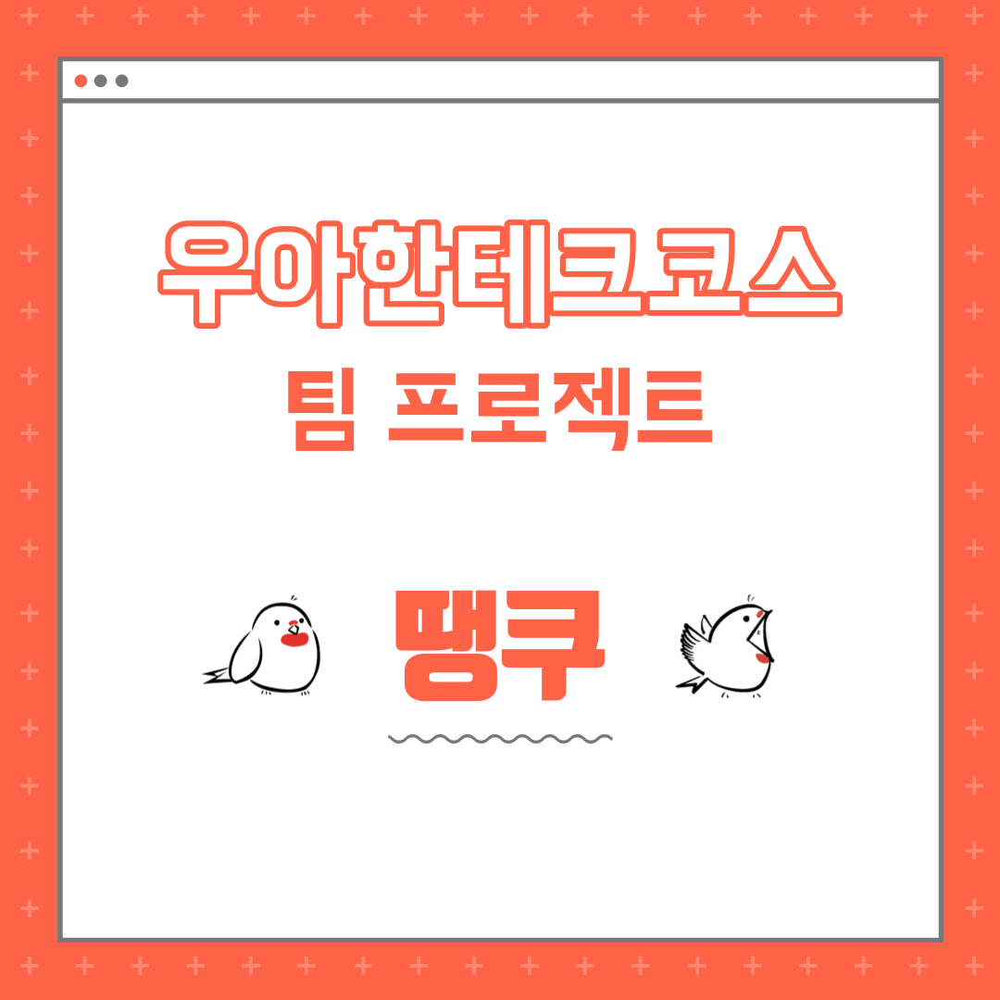
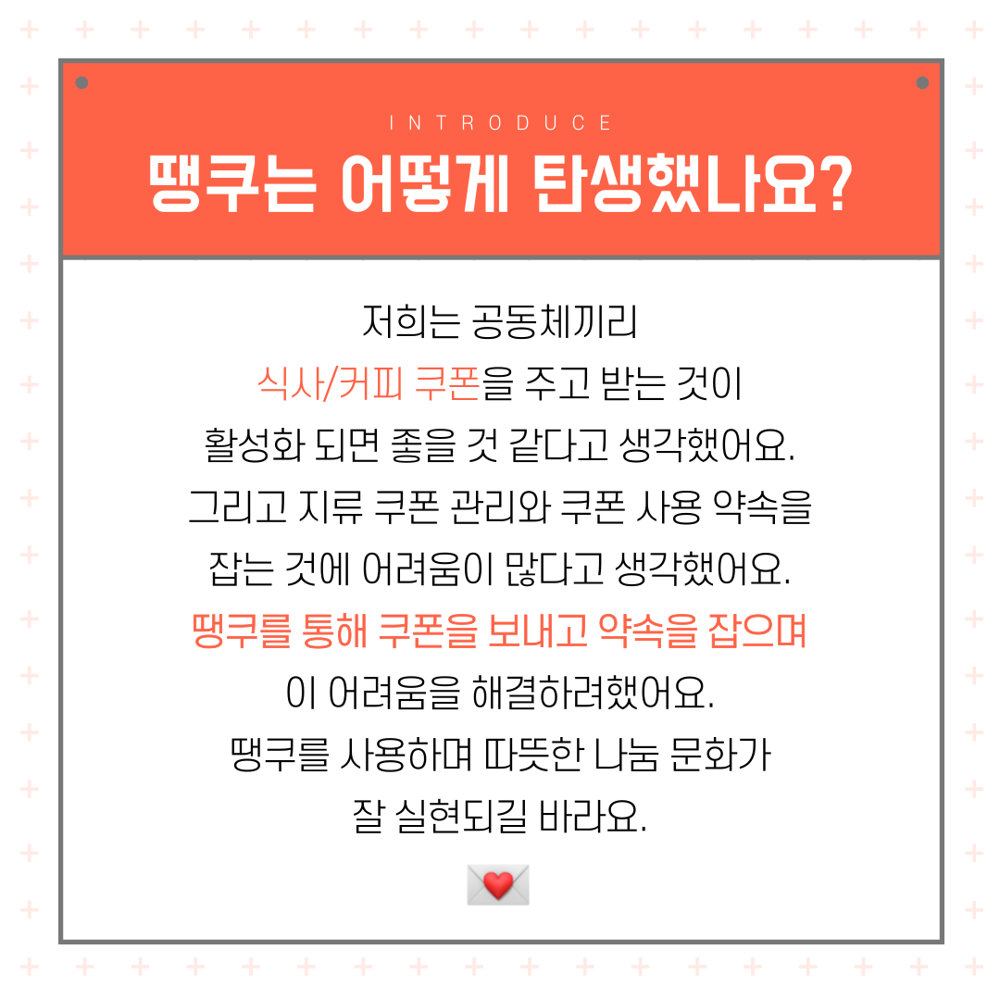
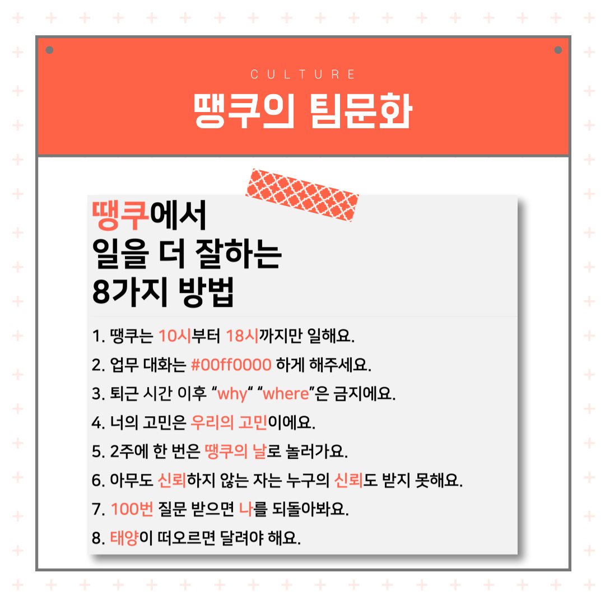
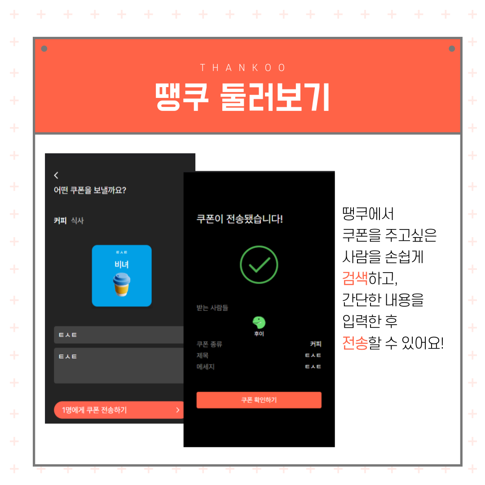
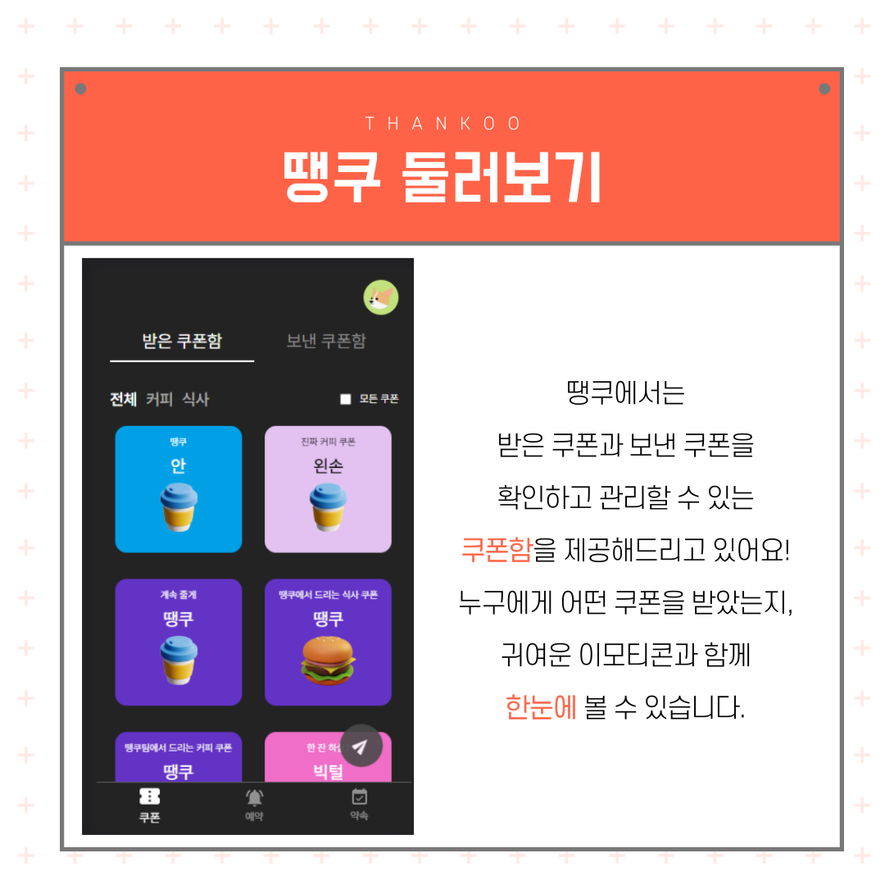
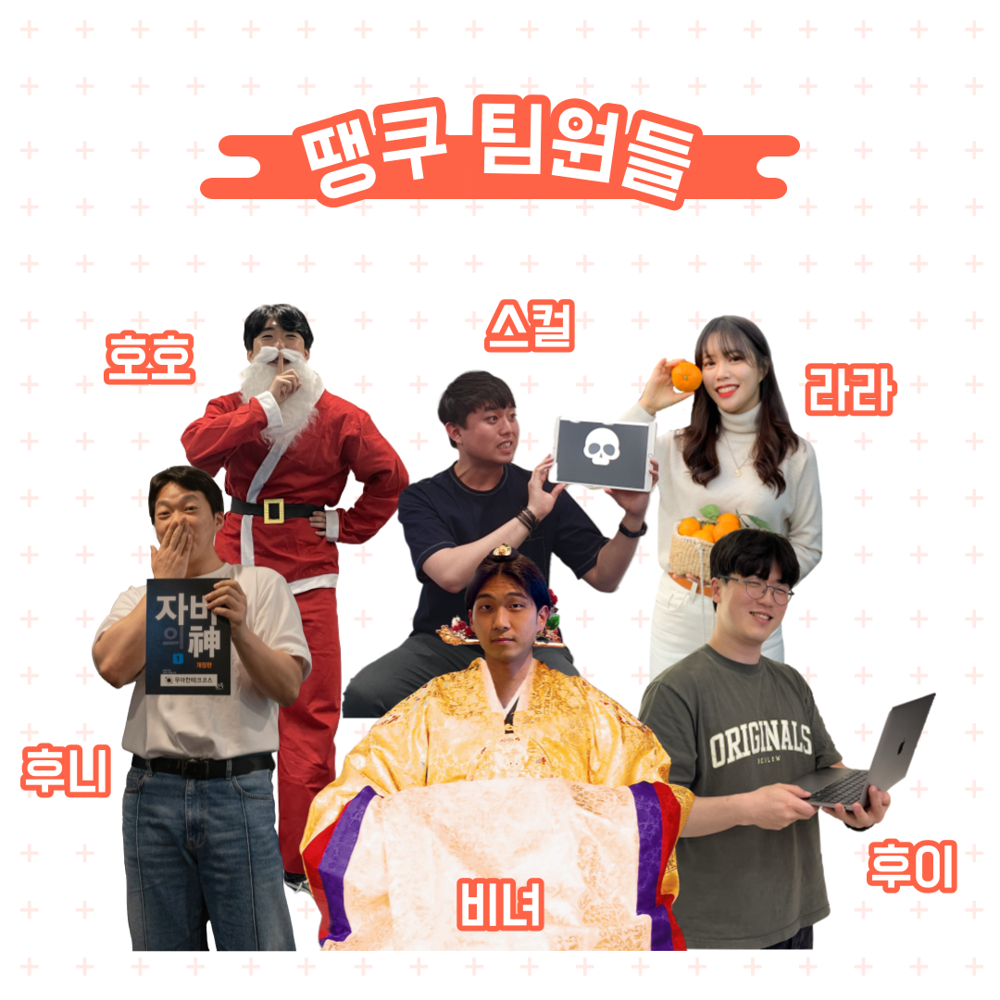
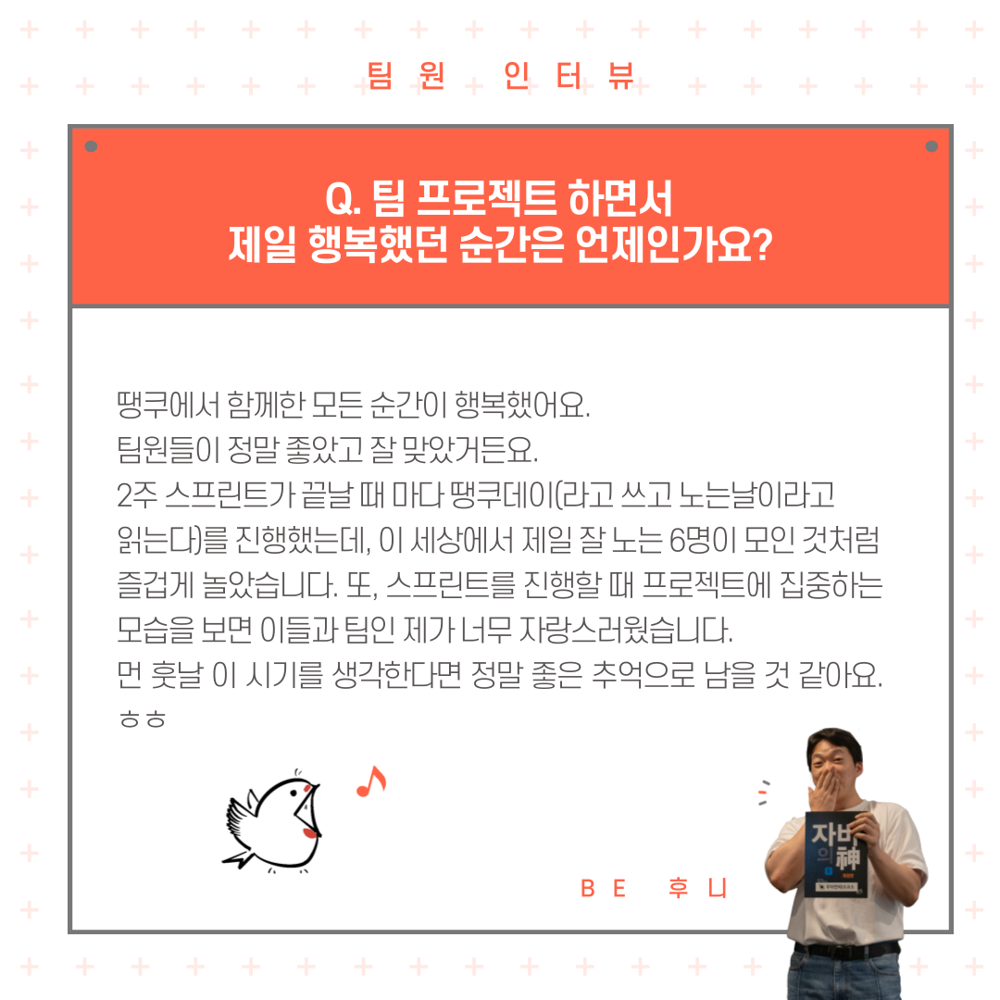
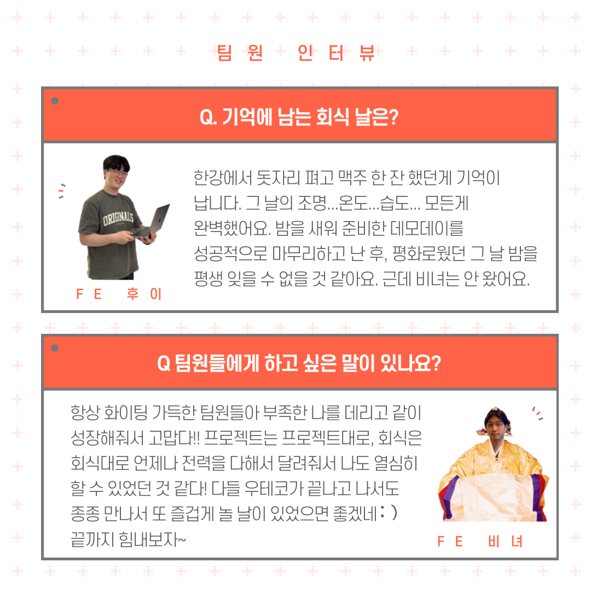
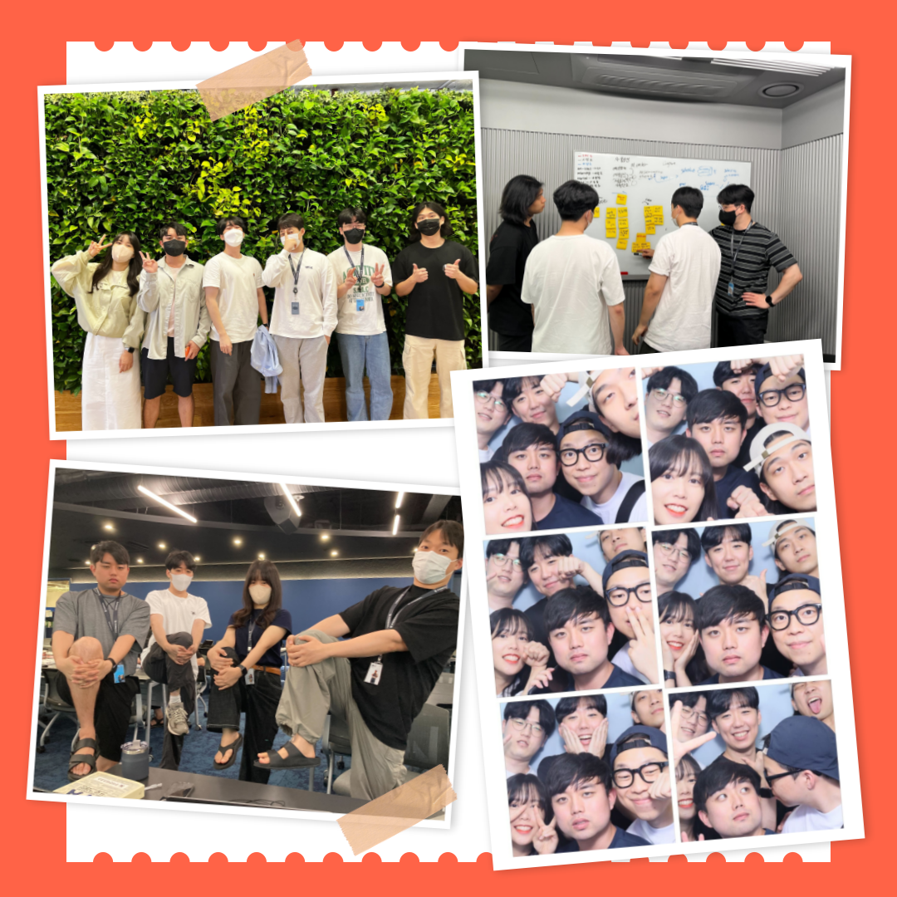
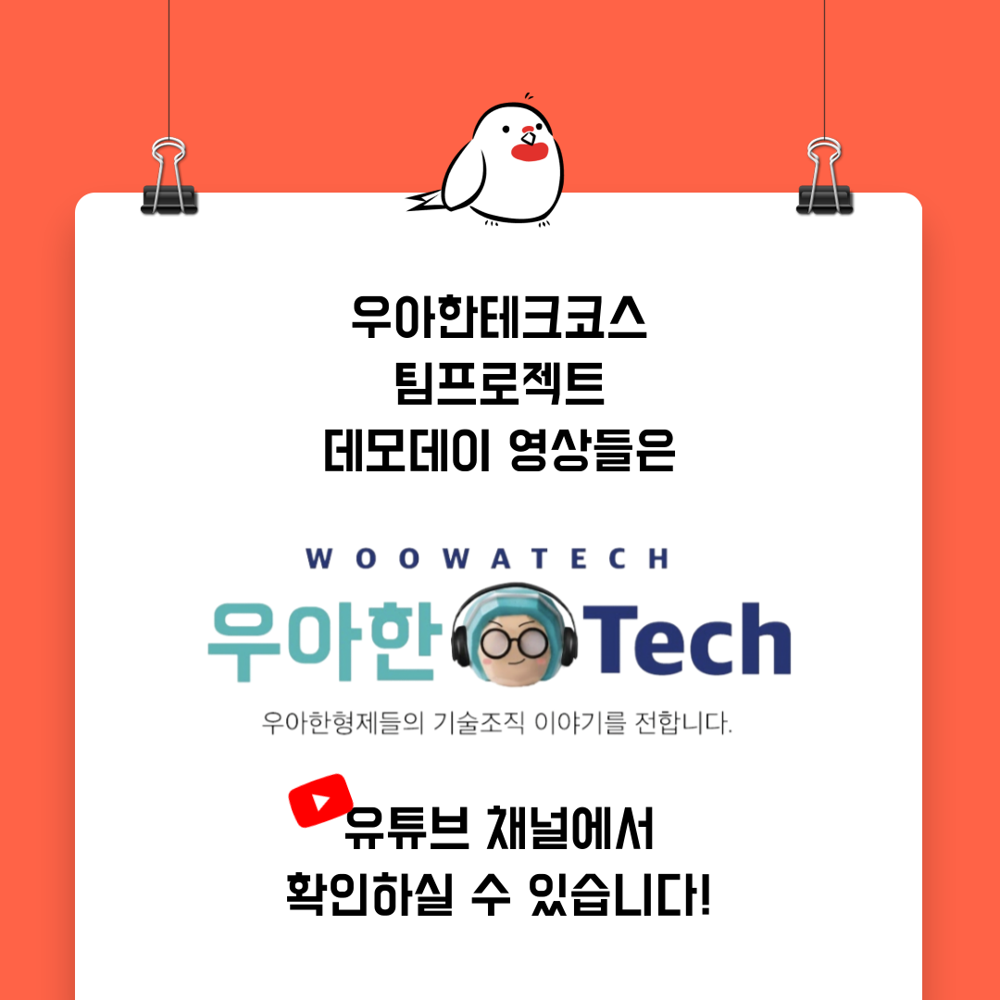

001

002

003

004

005

006

007

008

009

010

📮 <우아한테크코스 팀프로젝트>

우아한테크코스에서는 레벨3에 팀프로젝트를 진행합니다.

이번엔 우아한테크코스 4기 팀들 중 하나인 '땡쿠'에 대해서 소개하려고 합니다👏

'땡쿠'의 데모 영상들이 궁금하다면?💌

유튜브에 '땡쿠 데모'로 검색하시면 찾아보실 수 있습니다!

우아한Tech 유튜브 : https://www.youtube.com/c/%EC%9A%B0%EC%95%84%ED%95%9CTech

우아한테크코스 홈페이지 : https://woowacourse.github.io

우테코 블로그(Tecoble) : https://tecoble.techcourse.co.kr

#우아한테크코스 #우테코 #잠실 #선릉 #부트캠프 #java #javascript #spring #react #개발문화 #개발 #개발자 #wooteco #techcourse #페어 #페어프로그래밍 #협업
