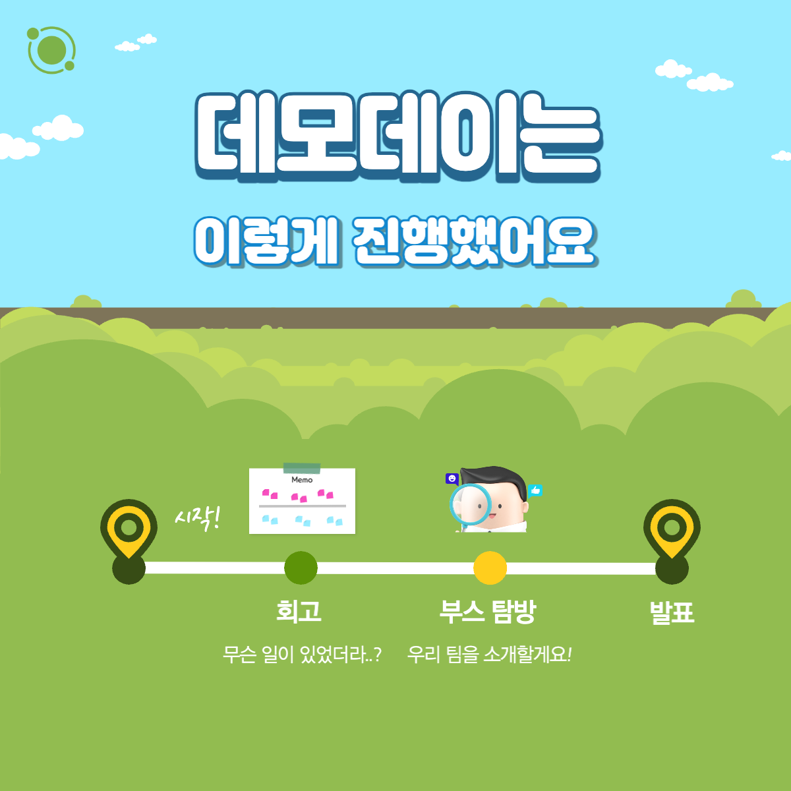
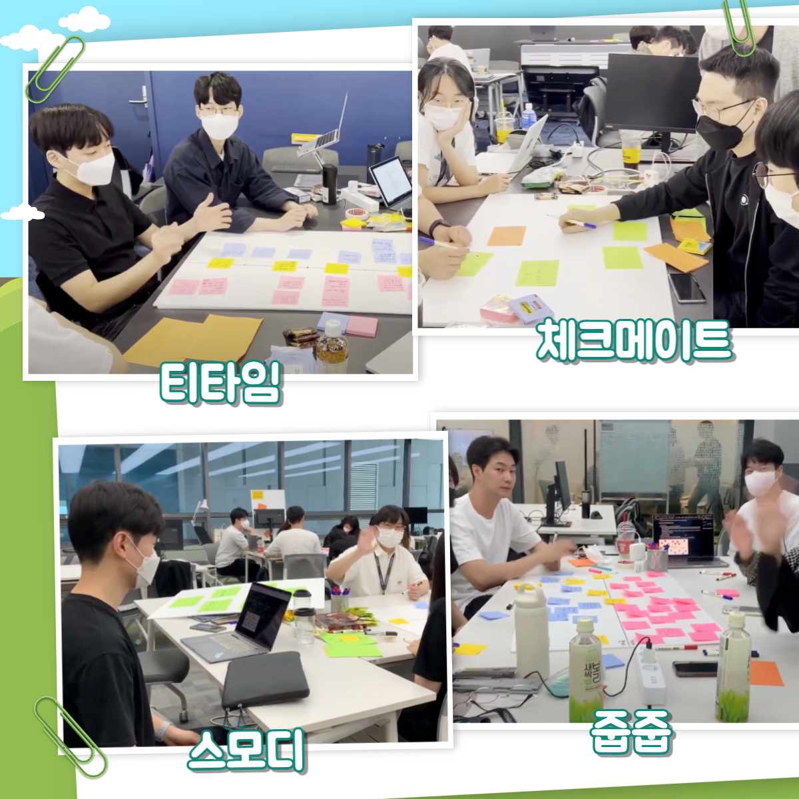
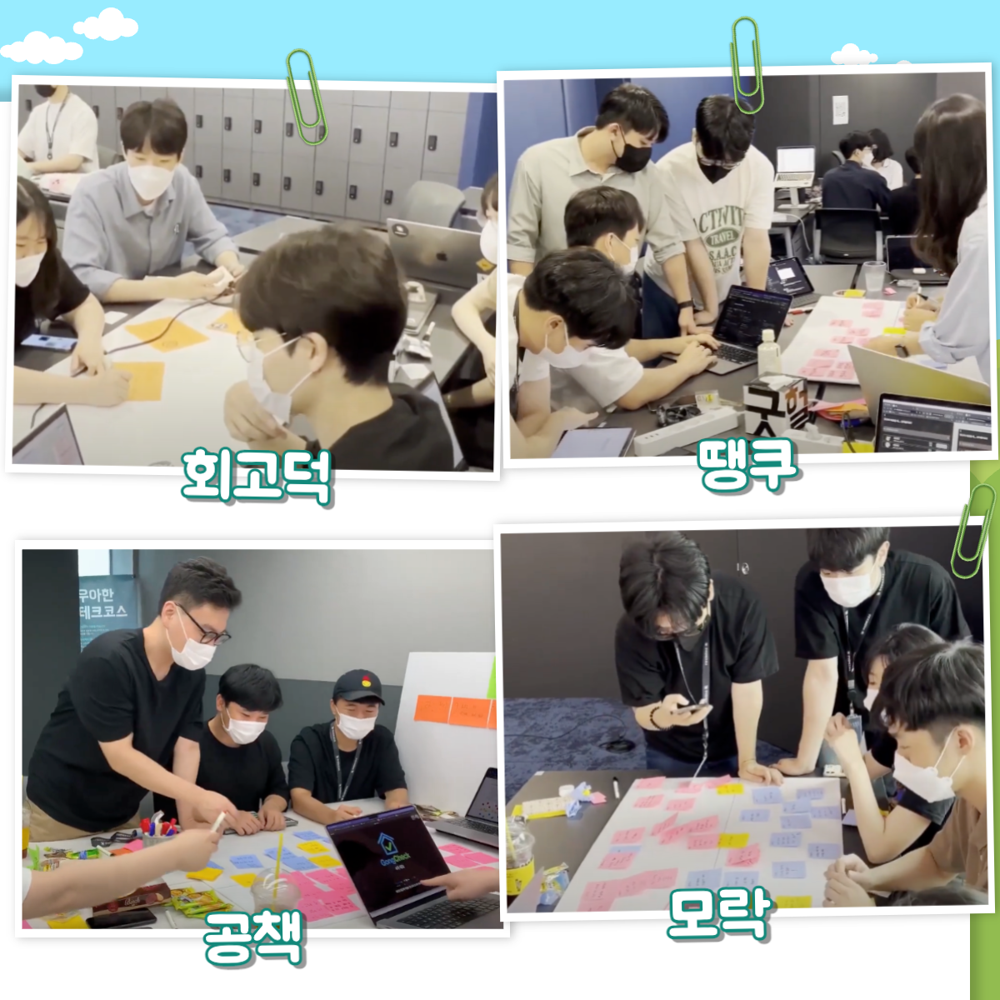
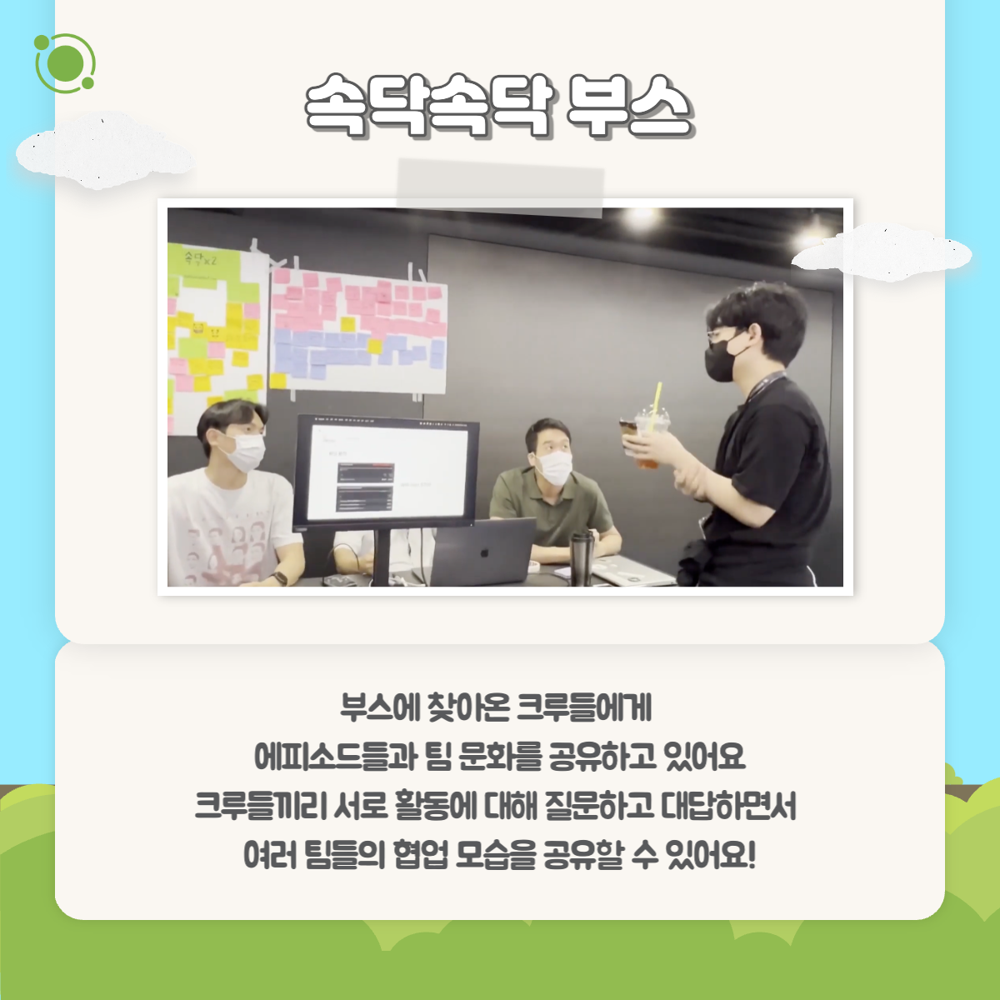
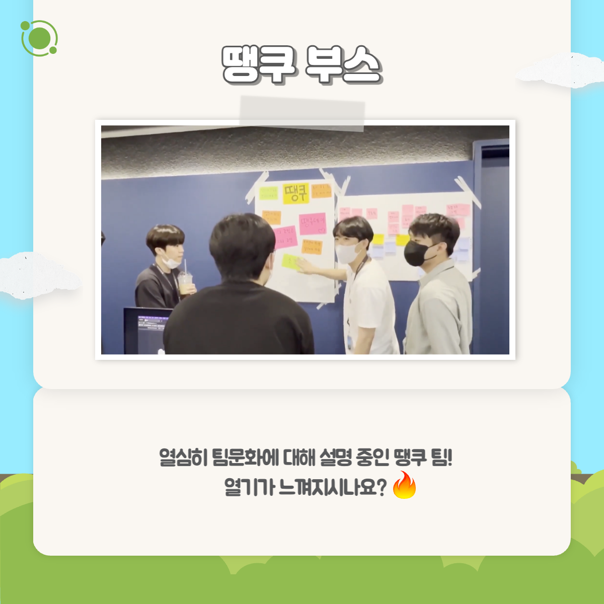
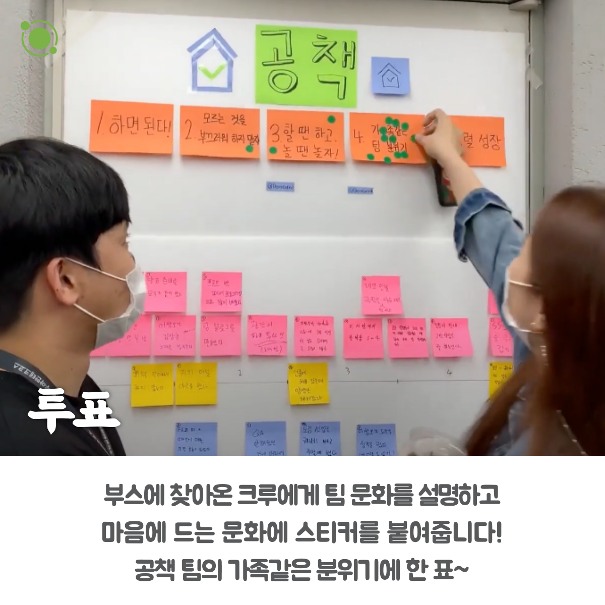
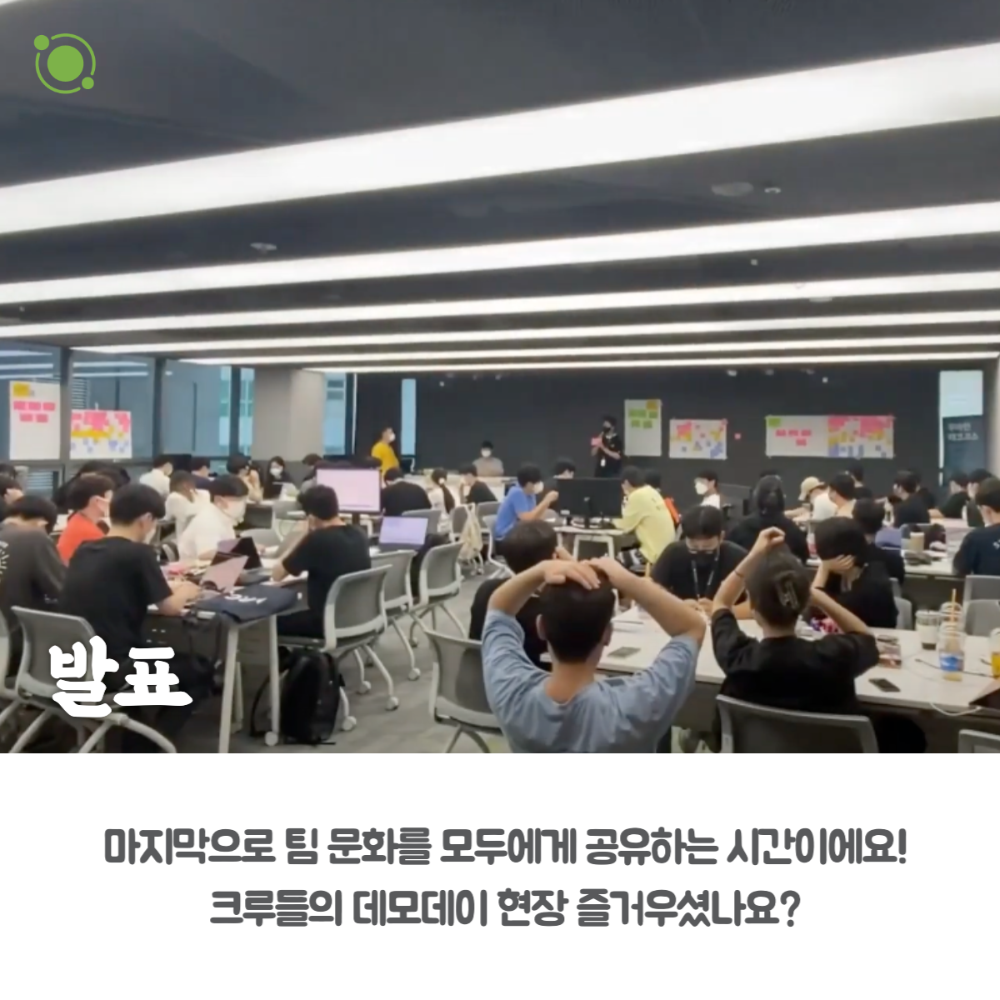
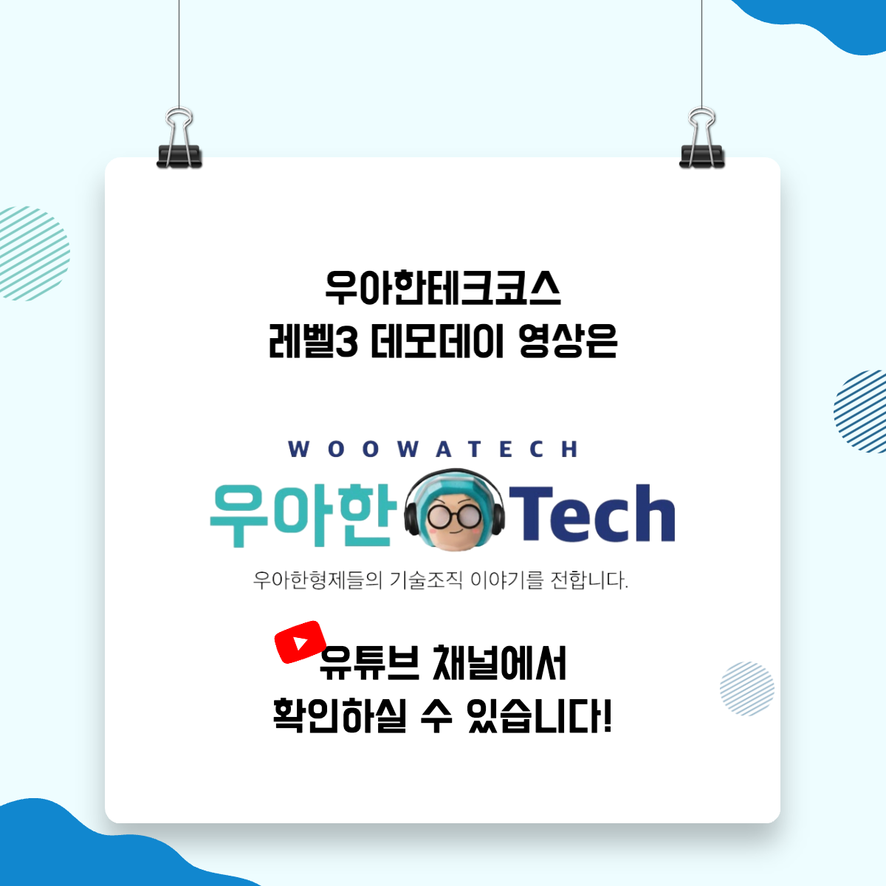

### 레벨3 데모데이

📮 문화

주제: 레벨3 데모데이

우아한테크코스 레벨3 기간 중 '협업'을 주제로 현장 데모를 진행한 날입니다.
우아한테크코스는 기술 뿐 아니라 협업하는 과정 또한 매우 중요하게 여겨요! 그래서 온종일 프로젝트를 한 팀별로 서로의 협업을 나누고 자랑하는 시간을 보냈는데요. 어떤 협업 과정을 만들어 갔는지 보러가시죠!

영상은 유튜브에 "우아한테크코스 레벨3 데모데이"로 검색하시면 찾아보실 수 있습니다

우아한Tech 유튜브:https://www.youtube.com/c/%EC%9A%B0%EC%95%84%ED%95%9CTech

우아한테크코스 홈페이지:https://woowacourse.github.io

우테코 블로그(Tecoble):https://tecoble.techcourse.co.kr

#우아한테크코스#우테코#테코톡#개발자#java#javascript#spring#react#개발문화#개발#개발자#woowahantechcourse#wooteco#techcourse#데모데이
