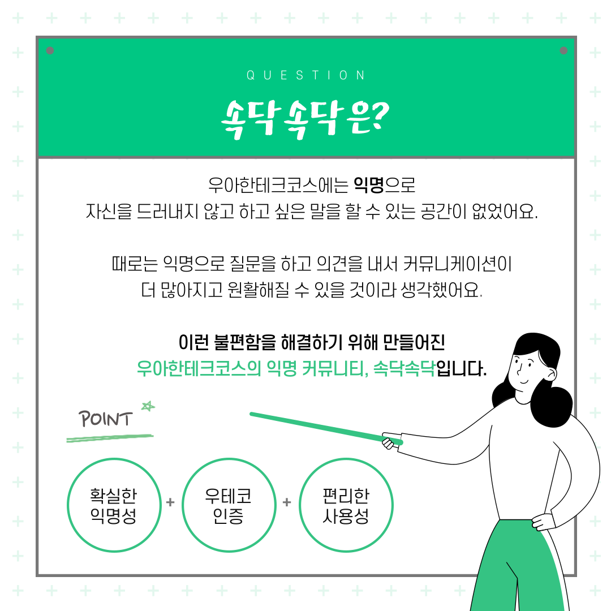
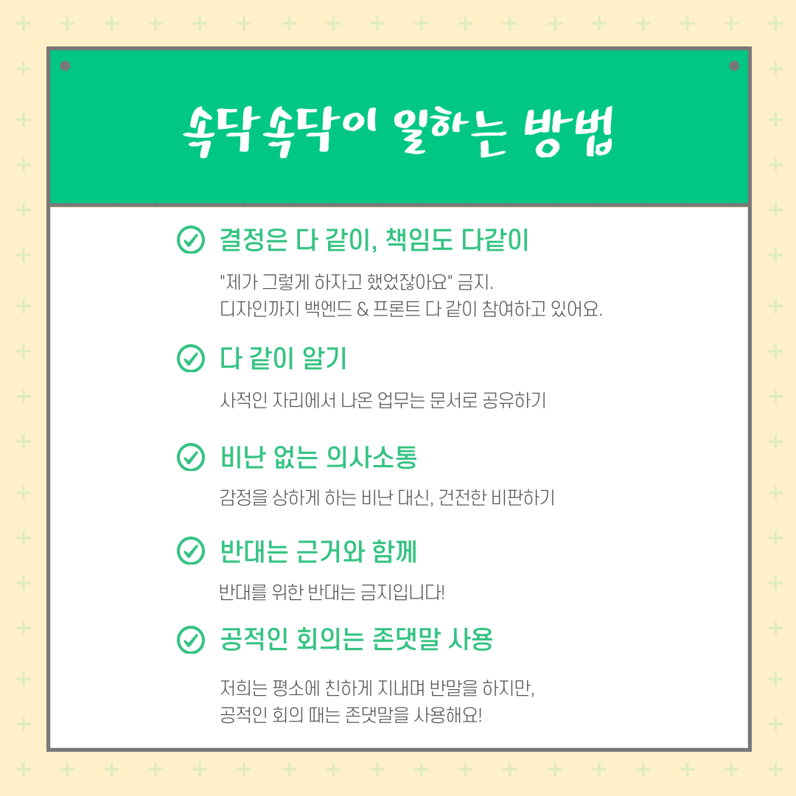
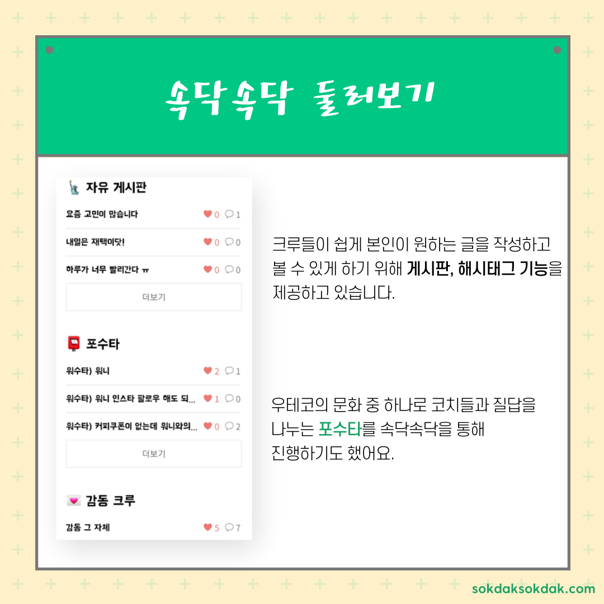
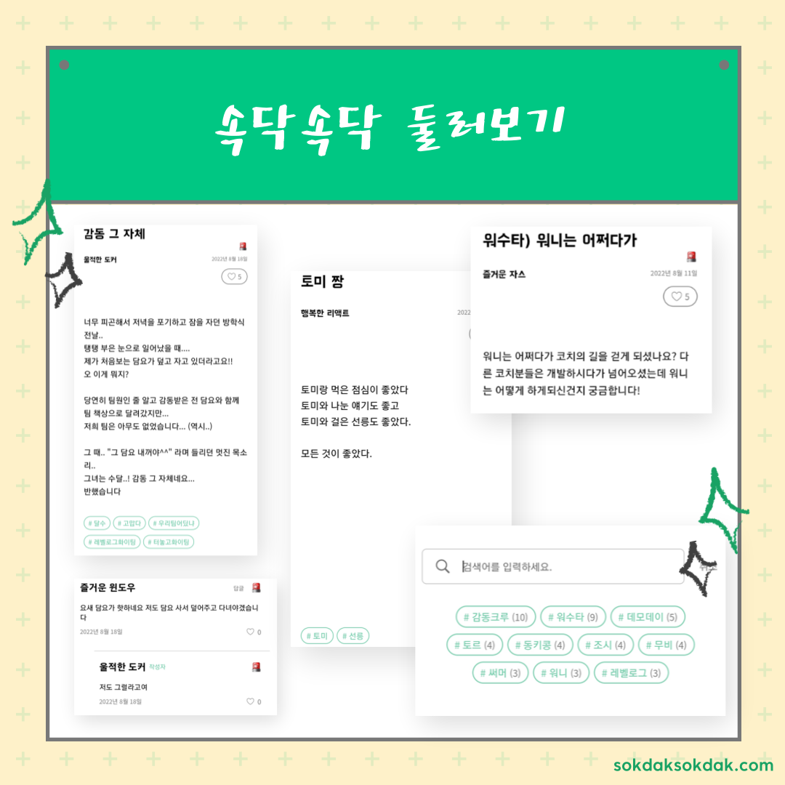
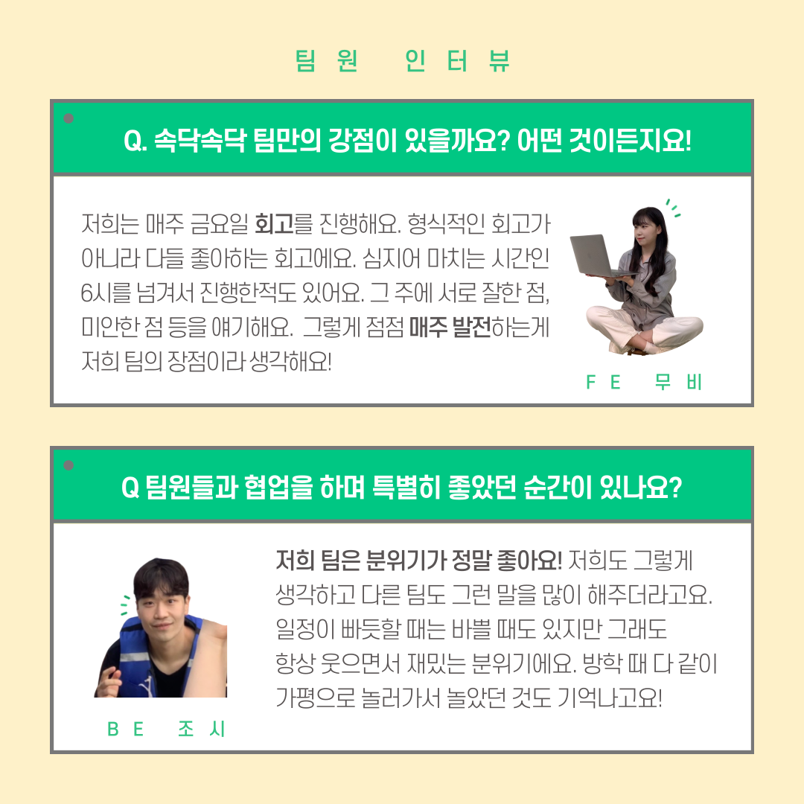
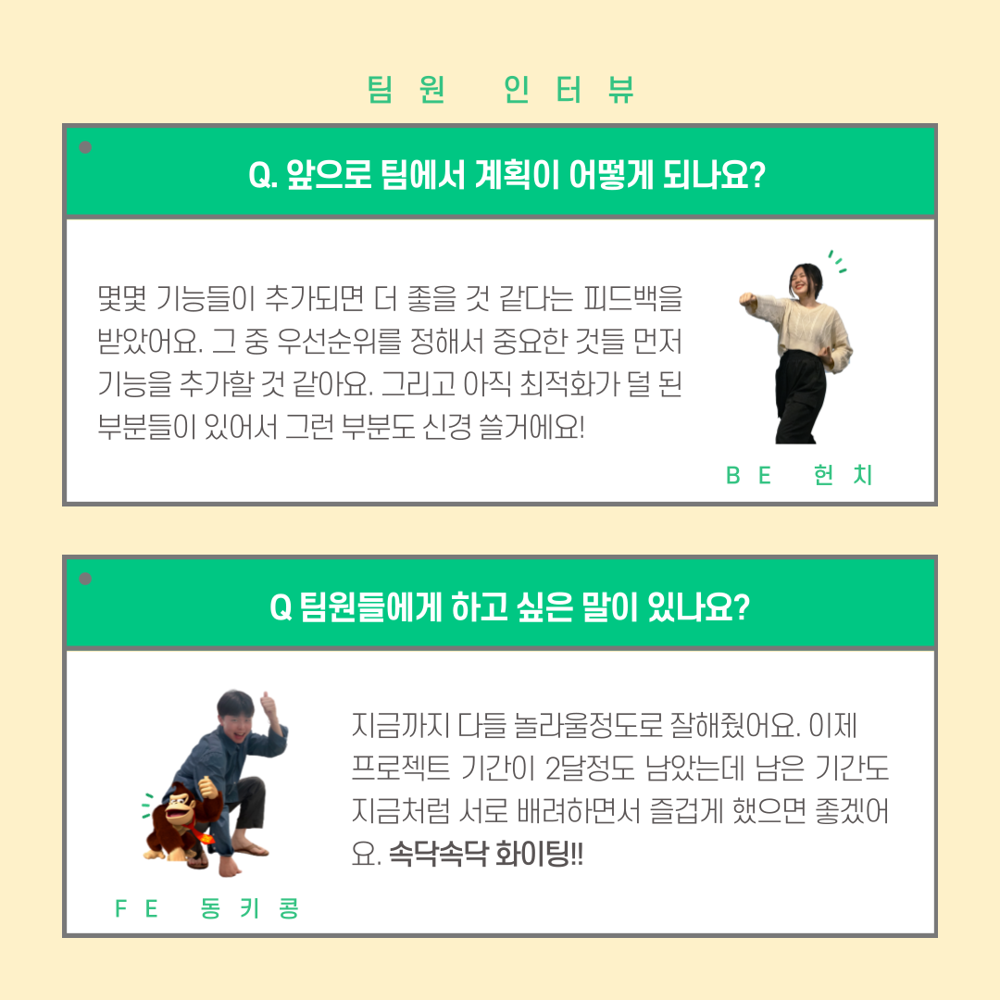
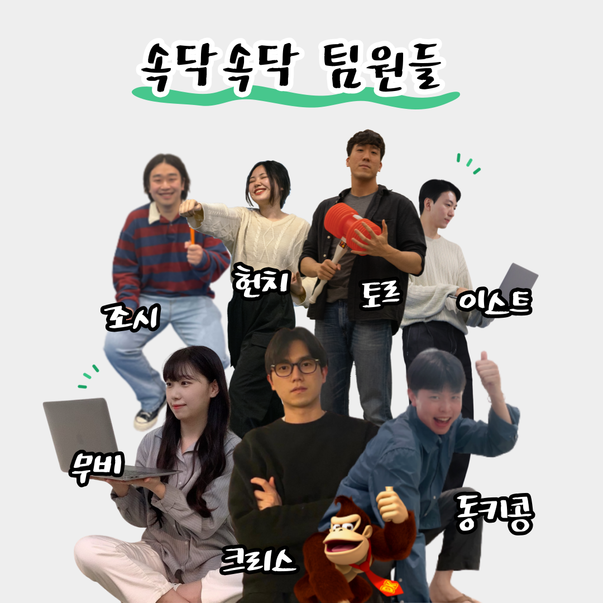
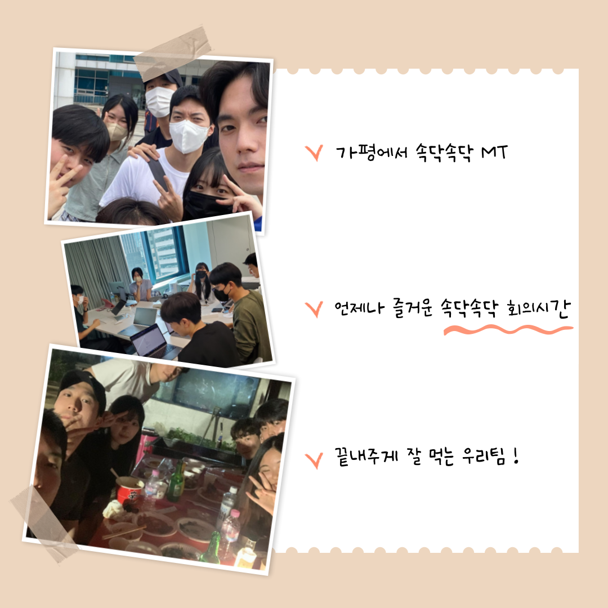

## 문화 - 속닥속닥 팀소개

### 글

우아한테크코스 레벨 3 과정은 팀 프로젝트로 진행됩니다.

오늘은 우아한테크코스 4기의 프로젝트 팀 중 하나인 속닥속닥 팀을 소개합니다 😆👏

속닥속닥팀의 데모 영상은 우아한Tech 유튜브 채널에서 찾아보실 수 있습니다.

속닥속닥 : https://sokdaksokdak.com/

우아한Tech 유튜브 : https://www.youtube.com/c/%EC%9A%B0%EC%95%84%ED%95%9CTech

우아한테크코스 홈페이지 : https://woowacourse.github.io

우테코 블로그(Tecoble) : https://tecoble.techcourse.co.kr

#우아한테크코스 #우테코 #잠실 #선릉 #부트캠프 #java #javascript #spring #react #개발문화 #개발 #개발자 #wooteco #techcourse #페어 #페어프로그래밍 #협업 #속닥속닥

