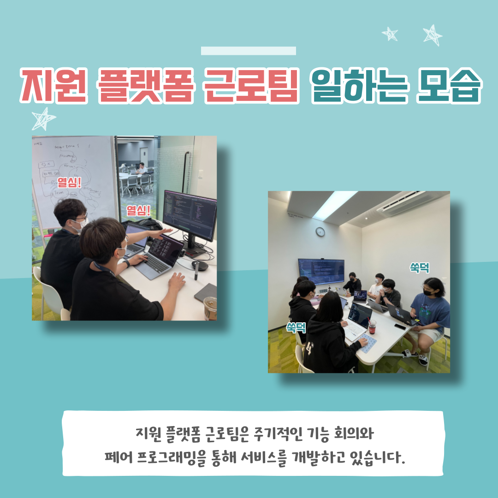

### 문화 - 지원 플랫폼 근로 소개

### 글

📮 <우아한테크코스 지원 플랫폼 근로팀>

현재 우아한테크코스에서는 4개의 근로팀이 있습니다. 오늘은 그 중 하나인 지원 플랫폼 근로팀에 대해 소개합니다!

지원 플랫폼 근로팀은 우아한테크코스 지원부터 최종 합격까지의 모든 과정을 관리하는 플랫폼을 개발하고 있습니다.

자원 플랫폼 크루들은 어떻게 일을 하고 있을까요? 카드뉴스를 통해 만나보시죠!

우아한Tech 유튜브 : https://www.youtube.com/c/%EC%9A%B0%EC%95%84%ED%95%9CTech

우아한테크코스 홈페이지 : https://woowacourse.github.io

우테코 블로그(Tecoble) : https://tecoble.techcourse.co.kr

#우아한테크코스 #우테코 #유튜브 #근로 #지원플랫폼 #개발 #개발자

