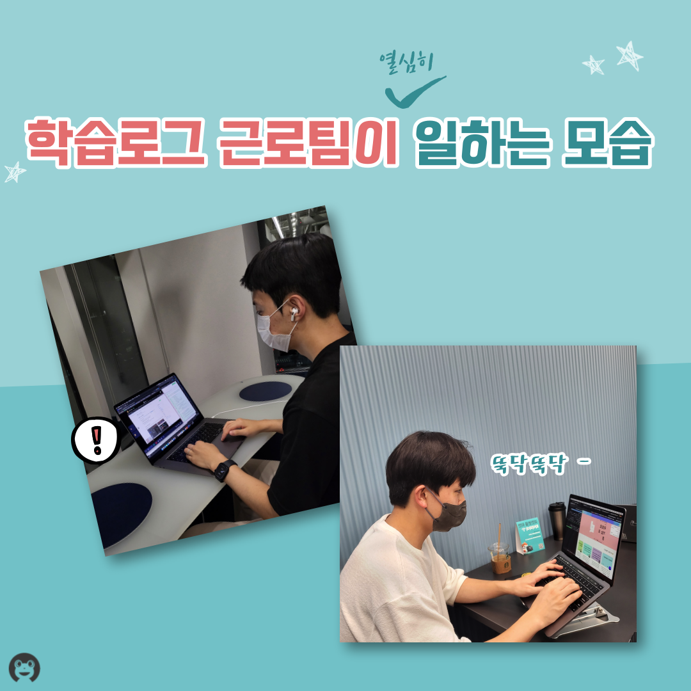
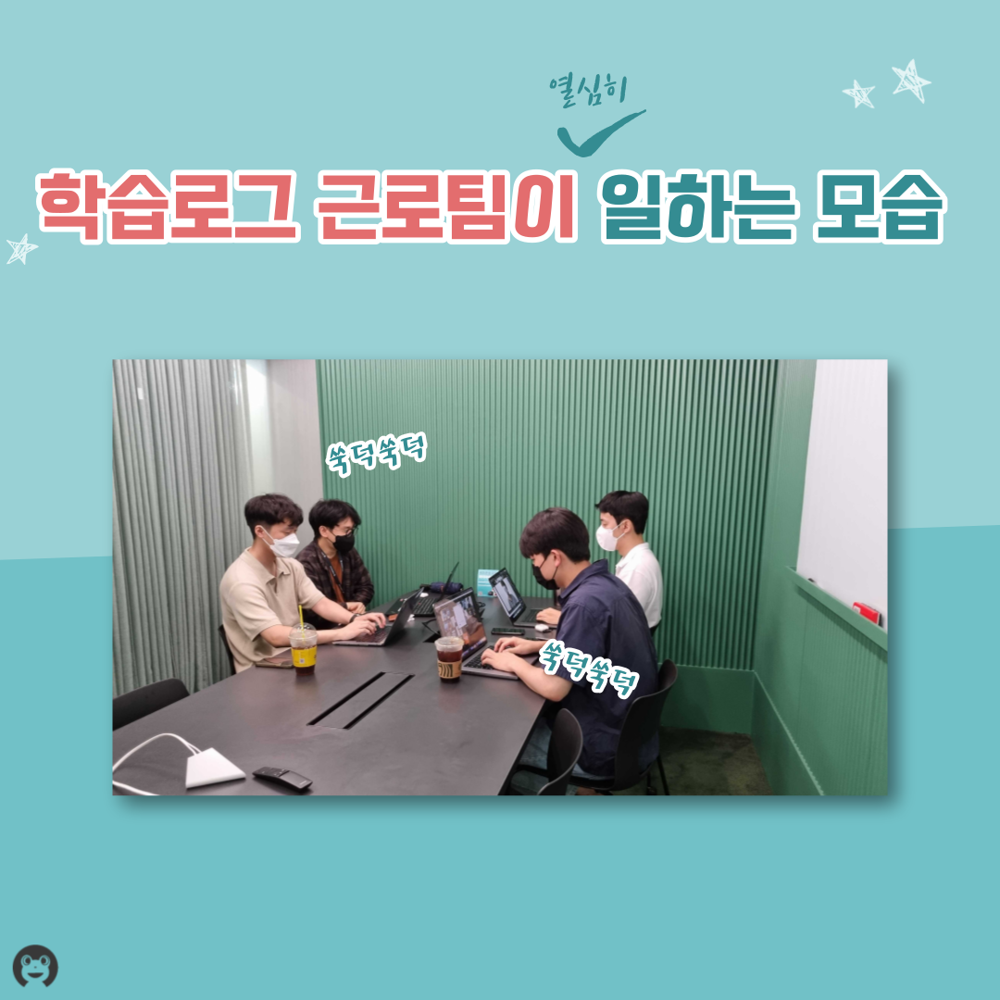
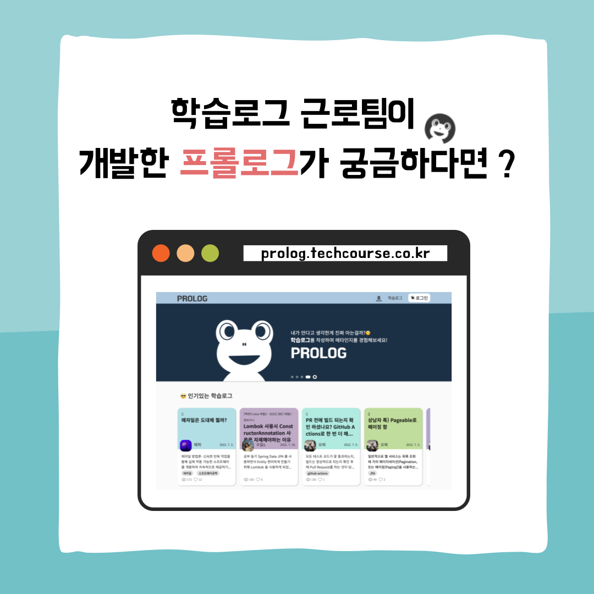

## 문화 - 학습근로 소개 

### 1번 

### 2번

### 3번

### 4번

### 5번

### 6번

### 7번

### 8번

### 9번

 

💡 우테코의 📄 학습로그 근로팀을 소개합니다 ! 💡
 
우아한테크코스에서는 근로 장학생 제도를 운용하고 있는데요.   
이번에는 두번째 근로팀인, 학습로그 근로팀에 대해 소개드리려고 합니다!   

학습로그 근로팀은 우아한테크코스 크루들의 메타인지를 위해, 프롤로그 사이트를 개발하고 있습니다.   
어떤 일을 하는지 궁금하실 여러분을 위해 인터뷰도 준비해보았는데요! 재밌게 봐주세요!   

⬇️⬇️ 학습로그 근로팀의 프롤로그 사이트가 궁금하다면 ? ⬇️⬇️  

주소창에 "우아한테크코스 프롤로그"를 검색해보세요! 👏  

Prolog : https://prolog.techcourse.co.kr/ 
  
우아한Tech 유튜브 : https://www.youtube.com/c/%EC%9A%B0%EC%95%84%ED%95%9CTech. 

우아한테크코스 홈페이지 : https://woowacourse.github.io

우테코 블로그(Tecoble) : https://tecoble.techcourse.co.kr

#우아한테크코스 #우테코 #잠실 #선릉 #부트캠프 #java #javascript #spring #react #개발문화 #개발 #개발자 #wooteco #techcourse #문화 #근로 #학습로그 #프롤로그 #prolog
