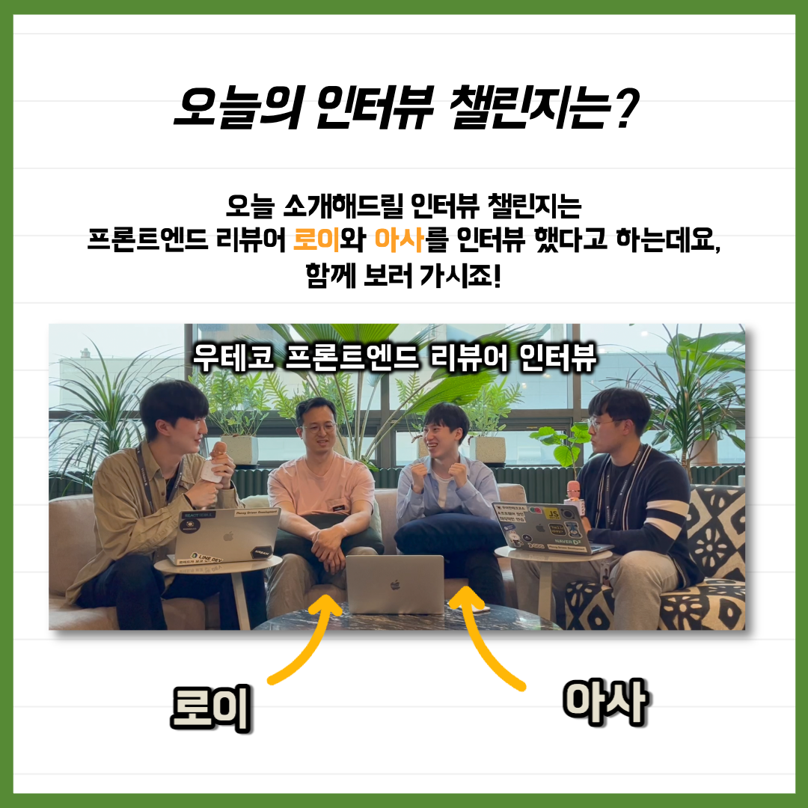
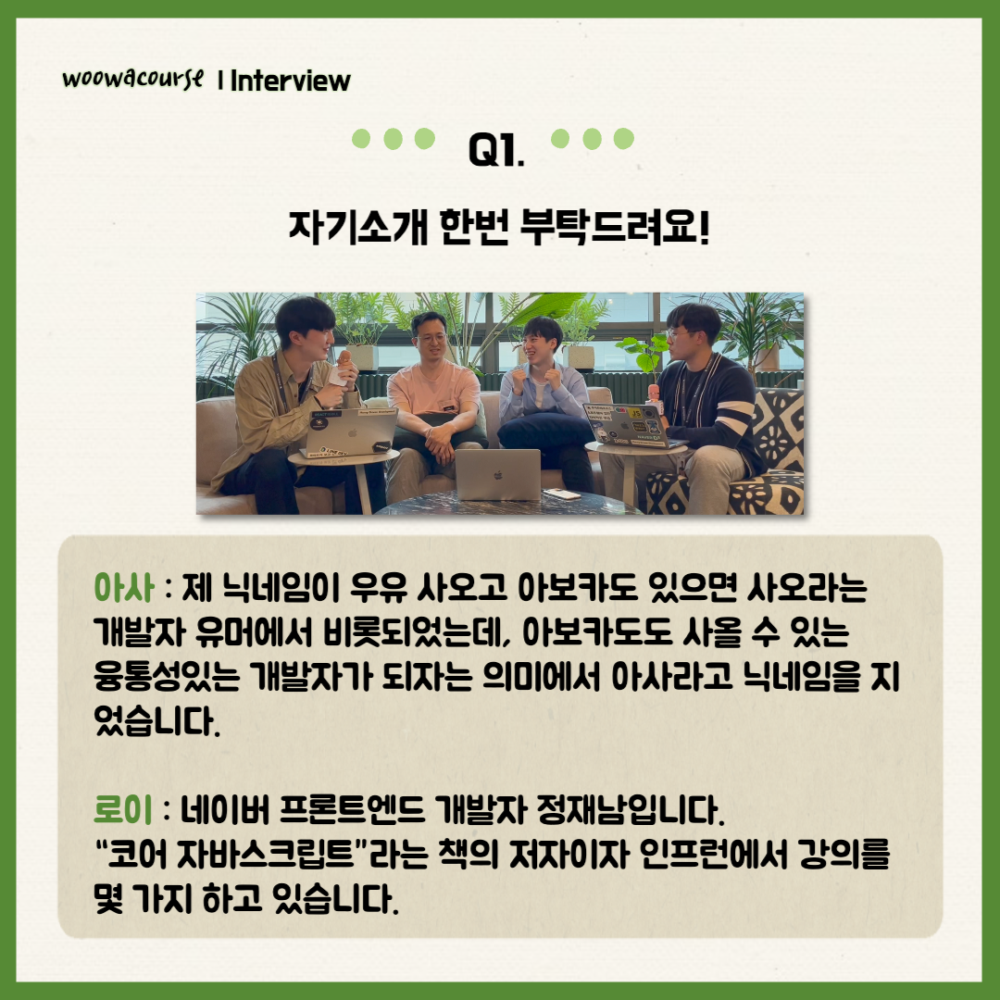
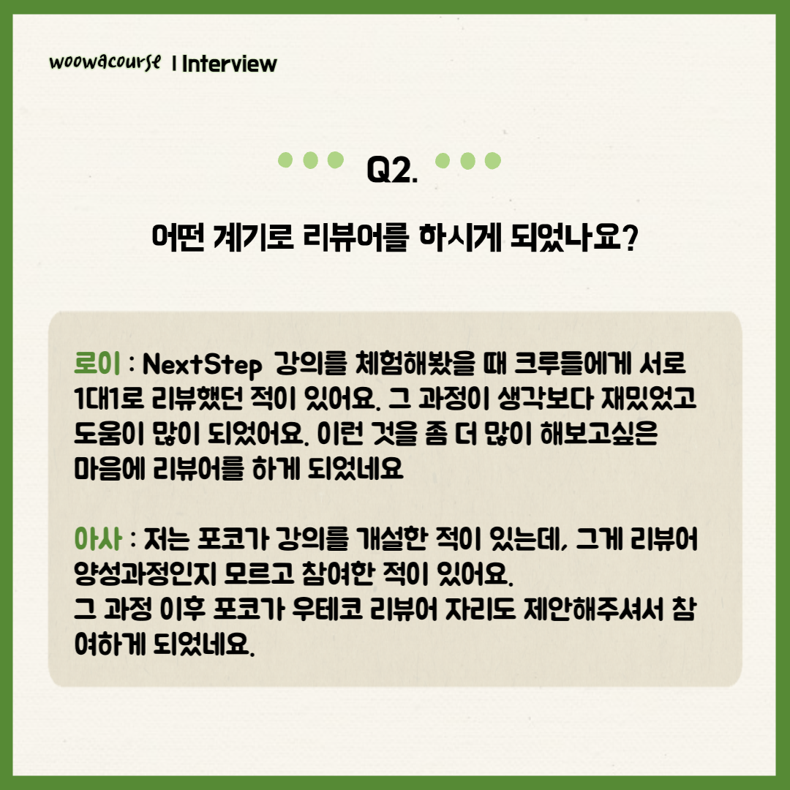
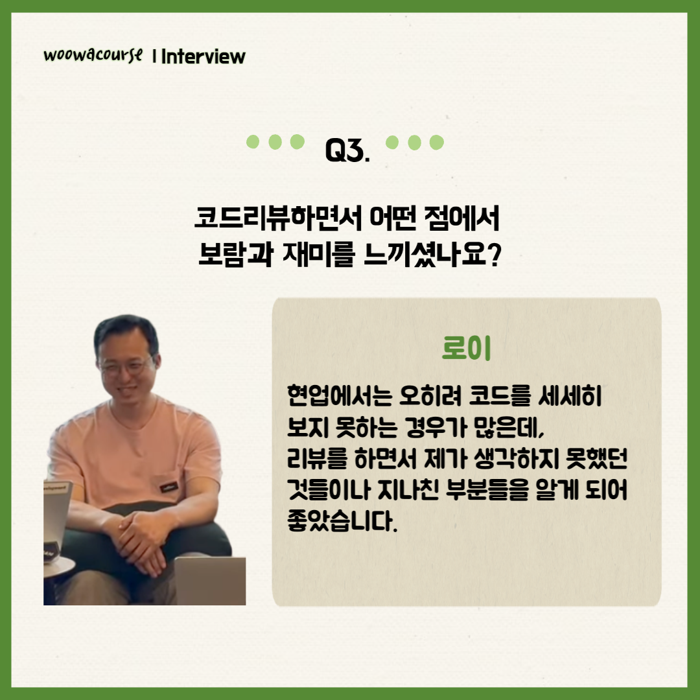
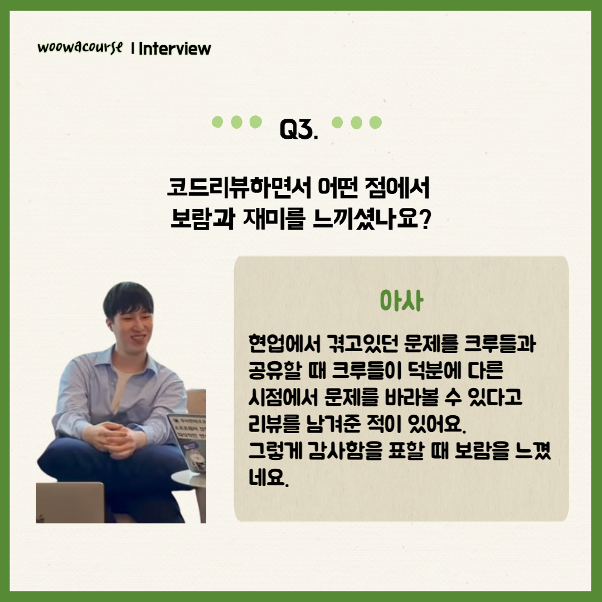
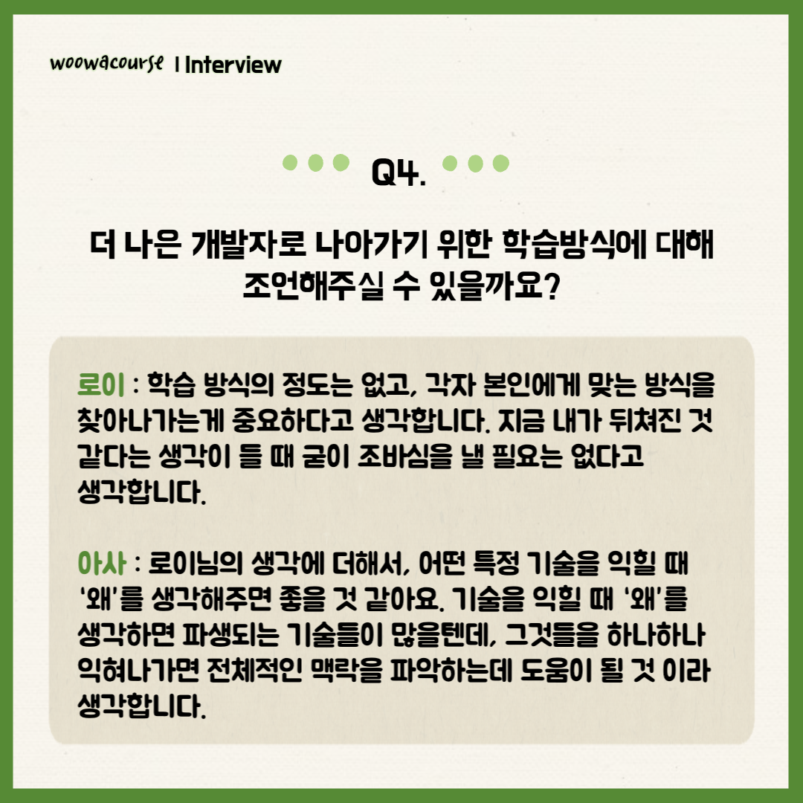
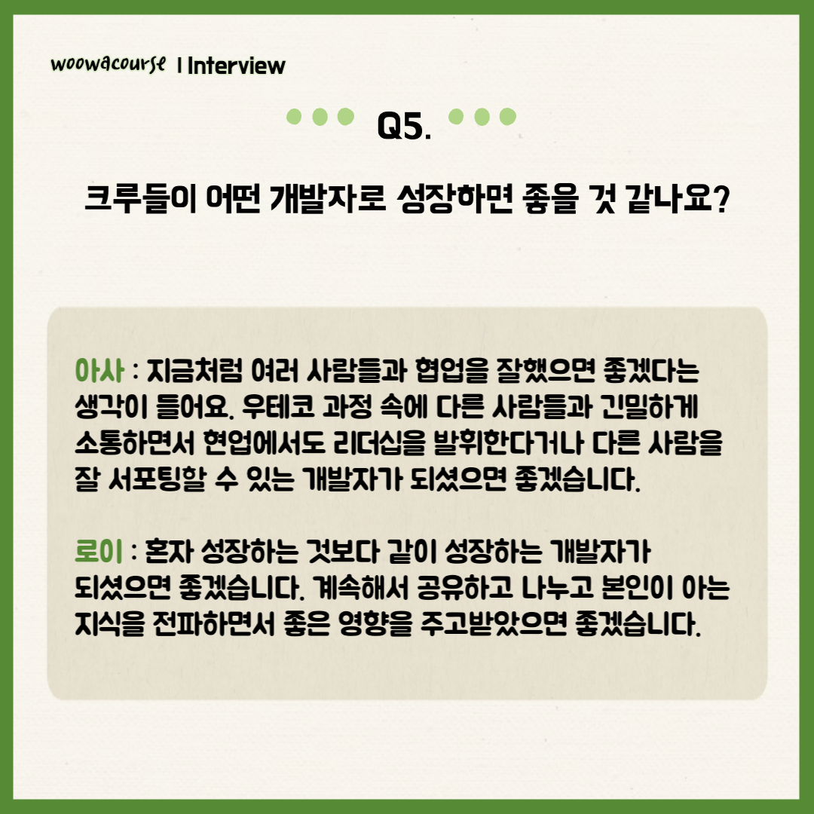
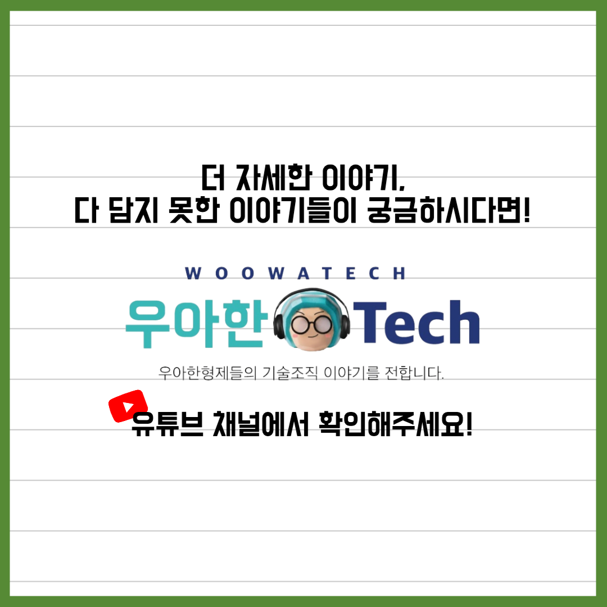

### 인터뷰 챌린지 - 로이, 아사

📮 인터뷰 챌린지

이번에는 프론트엔드 리뷰어 로이와 아사를 만나봤습니다!👏👏
코드 리뷰어로서의 경험과 개발자의 성장에 관련된 얘기를 해주셨는데요😁
로이와 아사가 크루들에게 전하는 따스한 조언이 궁금하시다면!!

유튜브에 "우테코 프론트엔드 리뷰어 로이, 아사에게 묻다!"으로 검색하시면 찾아보실 수 있습니다.

우아한Tech 유튜브:https://www.youtube.com/c/%EC%9A%B0%EC%95%84%ED%95%9CTech
우아한테크코스 홈페이지:https://woowacourse.github.io
우테코 블로그(Tecoble):https://tecoble.techcourse.co.kr

#우아한테크코스#우테코#테코톡#개발자#java#javascript#spring#react#개발문화#개발#개발자#woowahantechcourse#wooteco#techcourse
