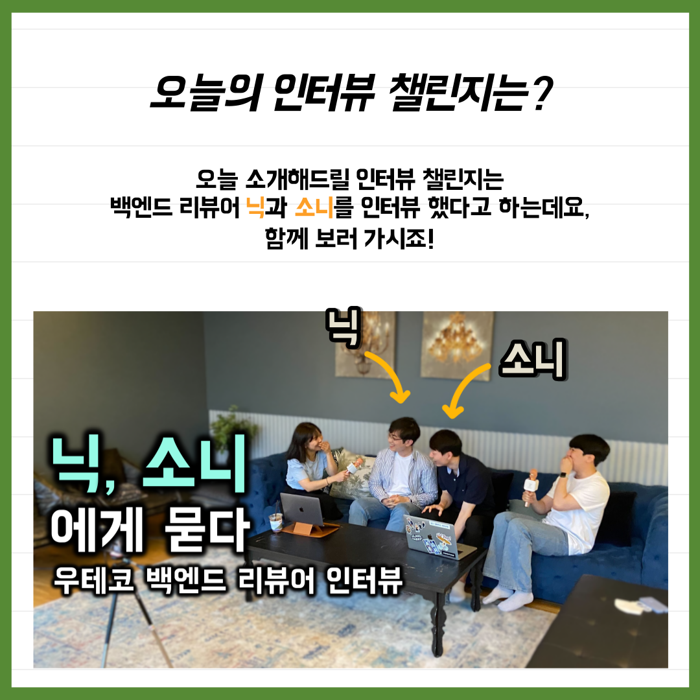
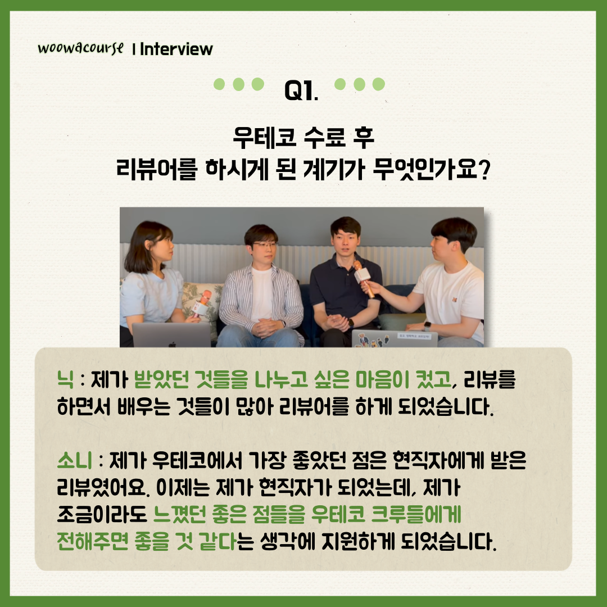
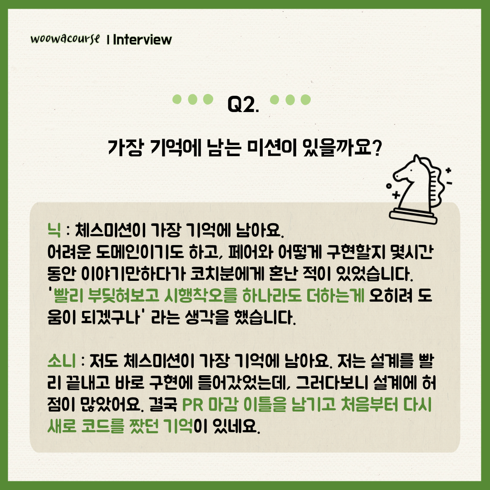
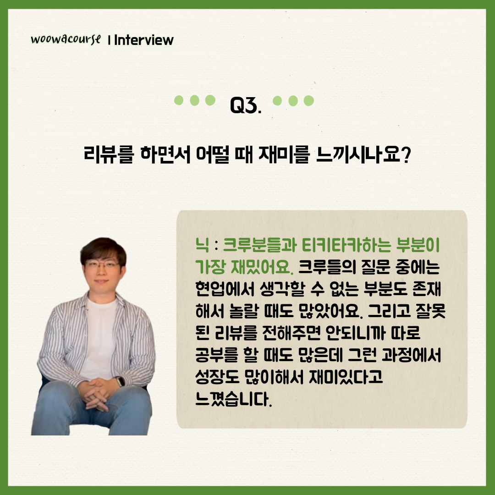
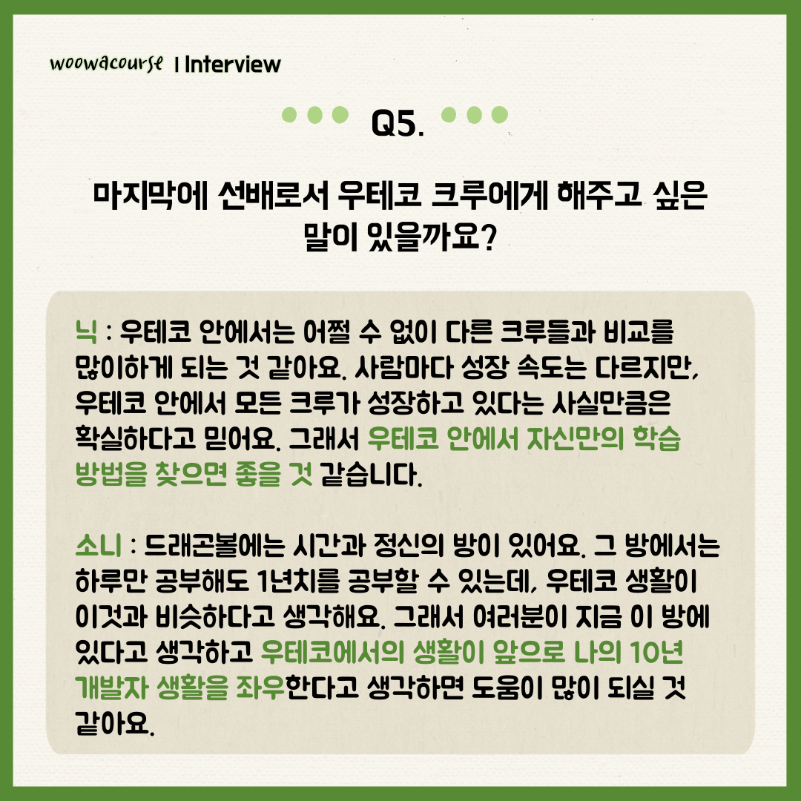

### 인터뷰 챌린지 - 닉, 소니

001

002

003

004

005

006

007

008

📮 인터뷰 챌린지

우아한테크코스 크루들의 인터뷰 챌린지가 돌아왔습니다!👏👏
우테코 백엔드 리뷰어 닉과 소니의 인터뷰를 진행해보았는데요! 리뷰어들은 어떤 생각으로 리뷰에 임하고 있을까요?
우테코 리뷰어의 코드 리뷰 꿀팁이 궁금하시다면!?

유튜브에 "[우테코 인터뷰 챌린지] 우테코 백엔드 리뷰어 닉, 소니에게 묻다!"로 검색하시면 찾아보실 수 있습니다.

우아한Tech 유튜브:https://www.youtube.com/c/%EC%9A%B0%EC%95%84%ED%95%9CTech
우아한테크코스 홈페이지:https://woowacourse.github.io
우테코 블로그(Tecoble):https://tecoble.techcourse.co.kr

#우아한테크코스#우테코#개발자#java#javascript#spring#react#개발문화#개발#개발자#woowahantechcourse#wooteco#techcourse
