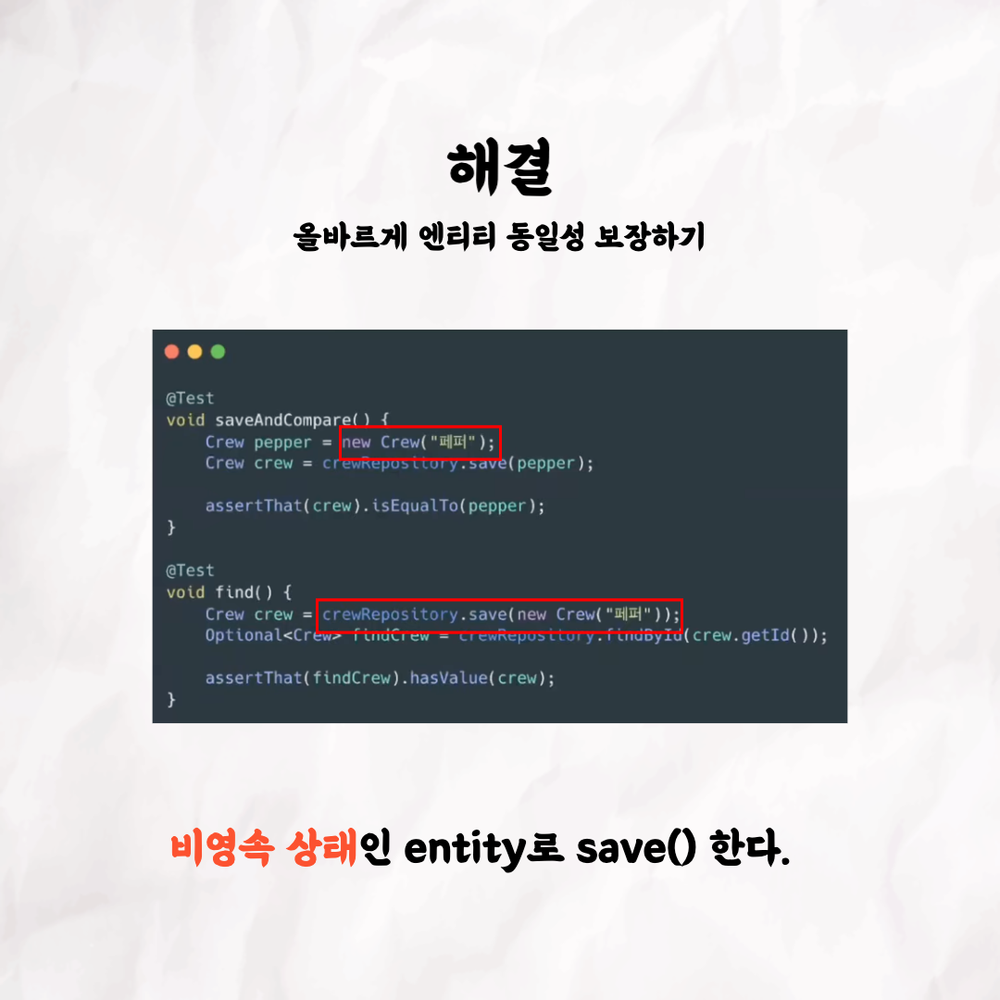

## 돔하디의 Virtual DOM

### 1번 - 표지

### 2번

### 3번

### 4번

### 5번

### 6번

### 7번

### 8번

### 9번

### 10번

 

테코톡 👩🏻‍💻🧑🏻‍💻  
  
주제 : Spring Data JPA 삽질일지 
  
발표자 : 잉 🖋, 페퍼 🍕 

JPA를 사용하면 여러가지 상황들과 마주하게 됩니다.
여러분들은 어떤 상황들을 마주했고 어떻게 해결했나요?
잉과 페퍼가 JPA를 사용하면서 겪은 상황들을 공유해드립니다. 😄

영상은 유튜브에 "잉, 페퍼의 Spring Data JPA 삽질일지"로 검색하시면  
찾아보실 수 있습니다.

우아한Tech 유튜브 : https://www.youtube.com/c/%EC%9A%B0%EC%95%84%ED%95%9CTech

우아한테크코스 홈페이지 : https://woowacourse.github.io

우테코 블로그(Tecoble) : https://tecoble.techcourse.co.kr

#우아한테크코스 #우테코 #잠실 #선릉 #부트캠프 #java #javascript #spring #react #개발문화 #개발 #개발자 #wooteco #techcourse #테코톡 #tecotalk #Spring Data JPA #JPA #SQL
