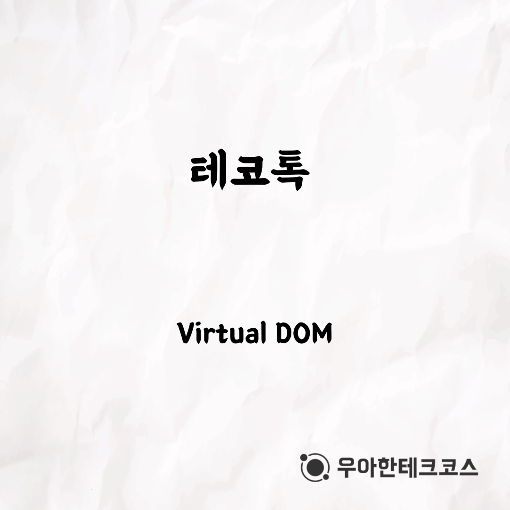
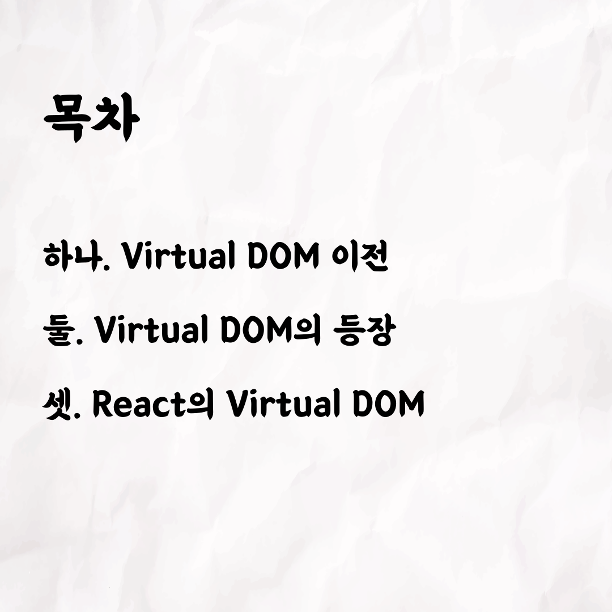
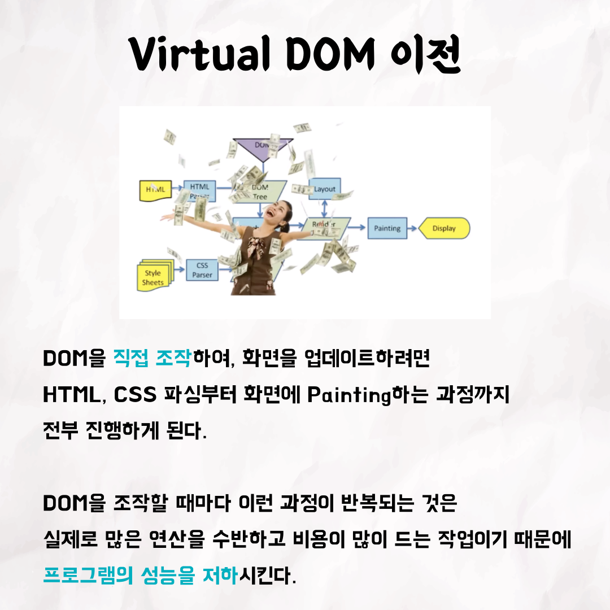
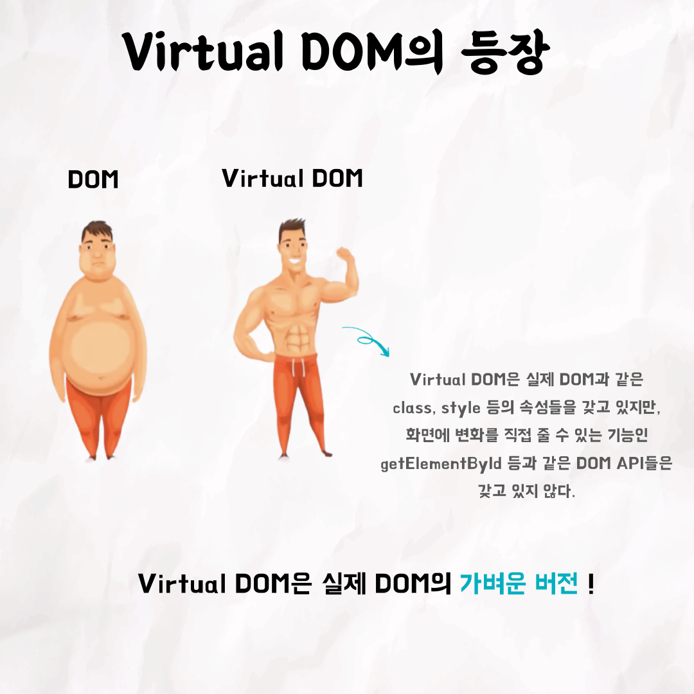
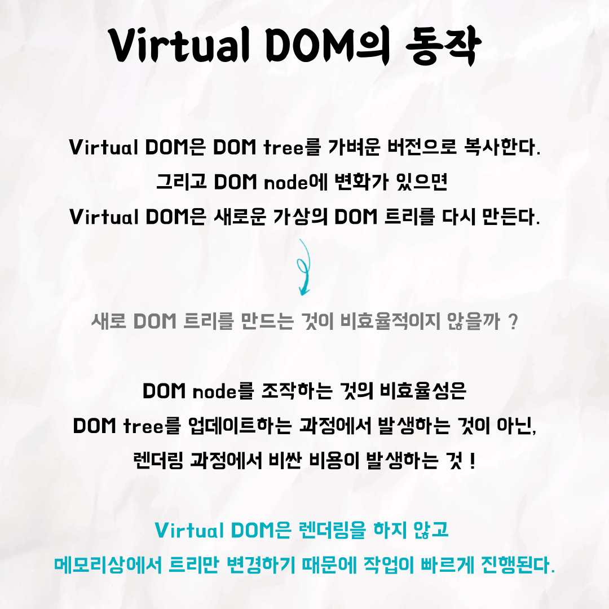
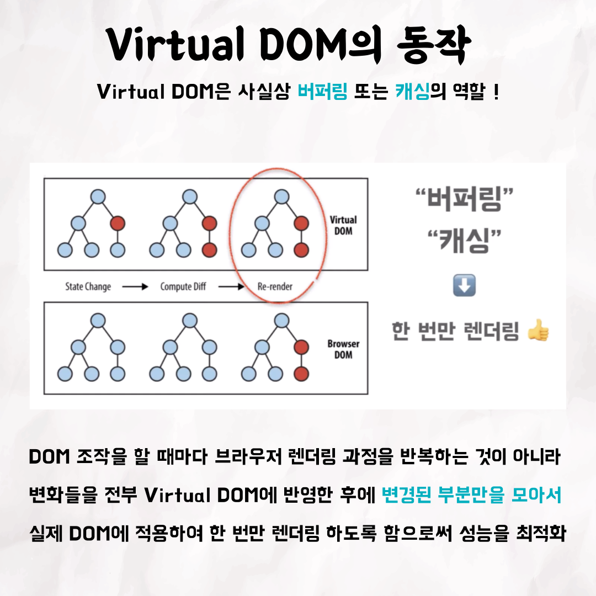
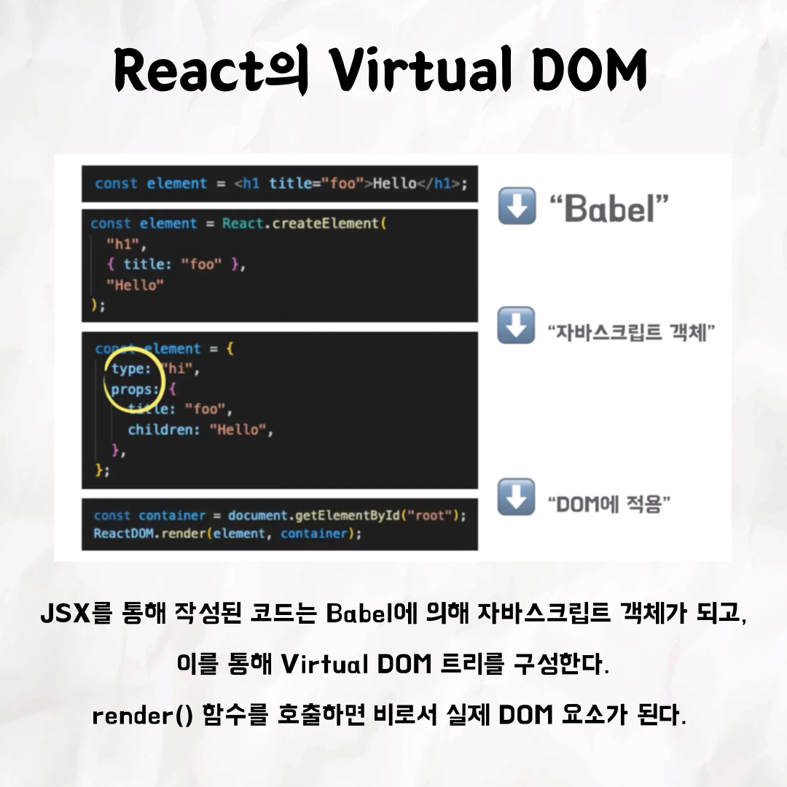
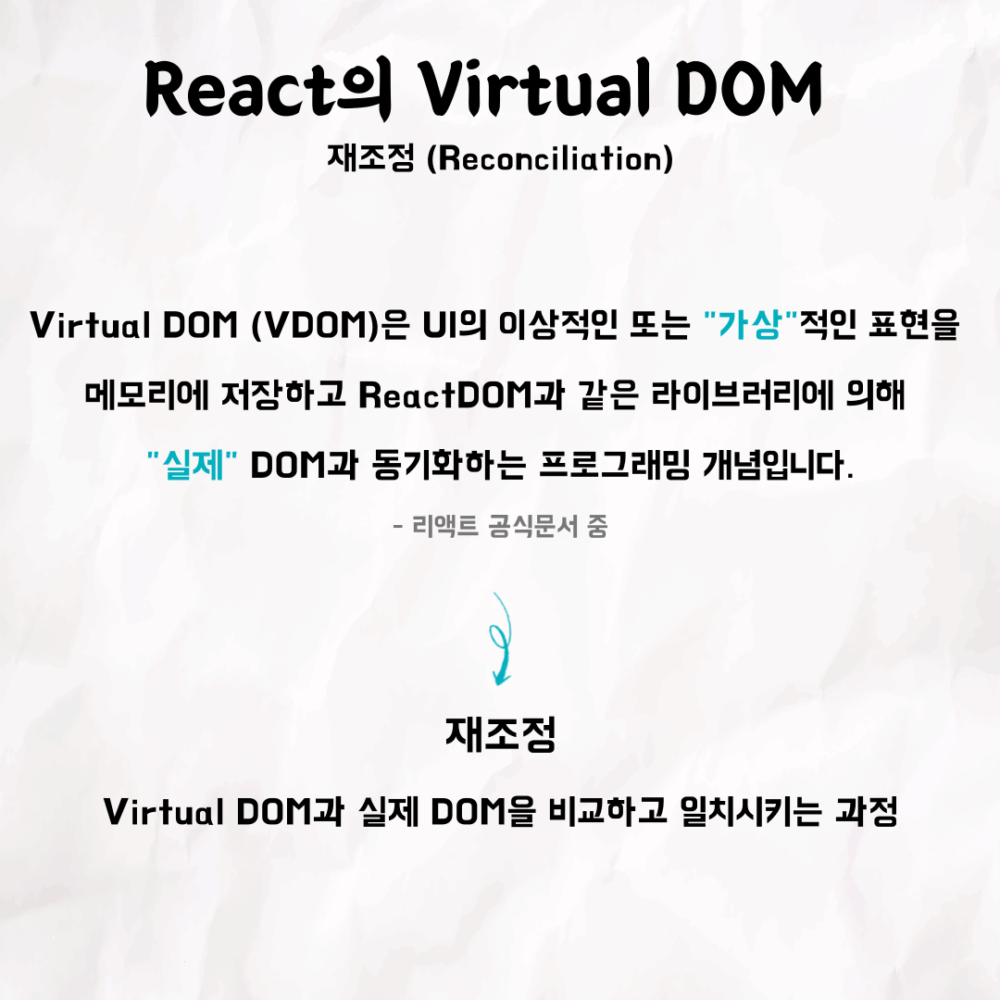

## 돔하디의 Virtual DOM

### 1번 - 표지

### 2번

### 3번

### 4번

### 5번

### 6번

### 7번

### 8번

### 9번

### 10번

 

테코톡 👩🏻‍💻🧑🏻‍💻  
  
주제 : Virtual DOM  
  
발표자 : 돔하디 🧔🏽‍♂️  

virtual DOM이란 무엇이고, 왜 등장하게 되었을까요?  
virtual DOM이 등장하게 된 이유, 등장 이후, react에서의 virtual DOM까지  
돔박사 돔하디가 자세히 설명해드립니다 😎  

영상은 유튜브에 "돔하디의 Virtual DOM"로 검색하시면  
찾아보실 수 있습니다.

우아한Tech 유튜브 : https://www.youtube.com/c/%EC%9A%B0%EC%95%84%ED%95%9CTech

우아한테크코스 홈페이지 : https://woowacourse.github.io

우테코 블로그(Tecoble) : https://tecoble.techcourse.co.kr

#우아한테크코스 #우테코 #잠실 #선릉 #부트캠프 #java #javascript #spring #react #개발문화 #개발 #개발자 #wooteco #techcourse #테코톡 #tecotalk #virtualDOM
