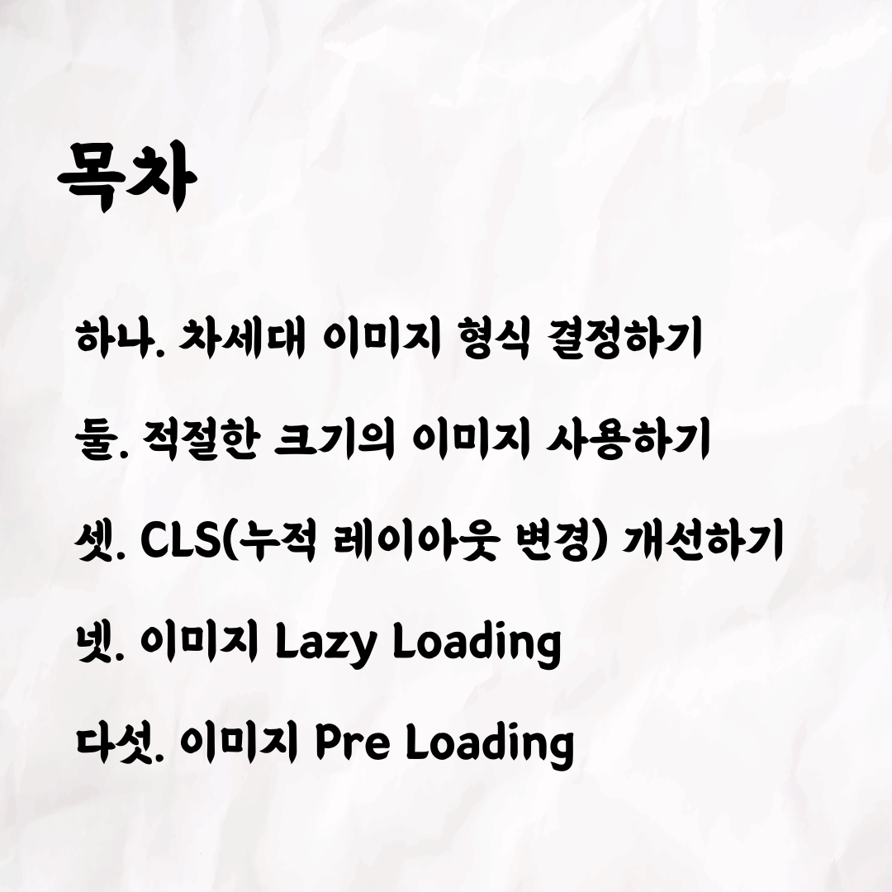
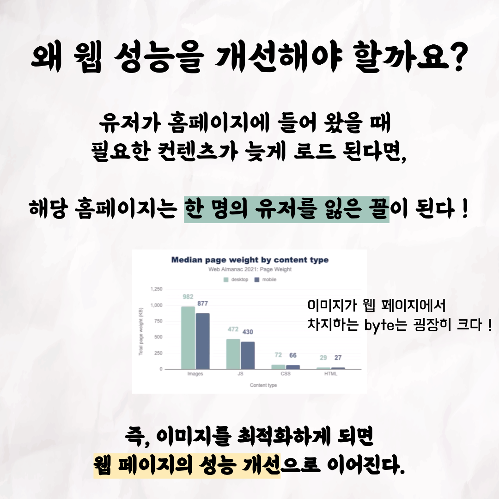
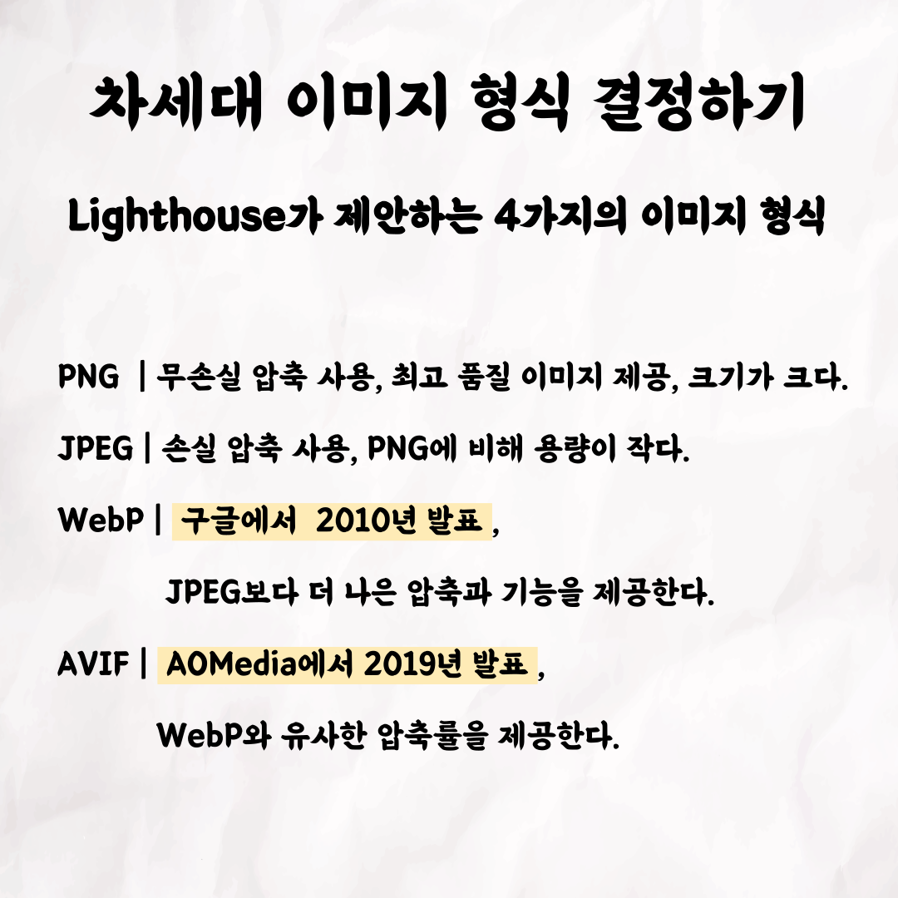
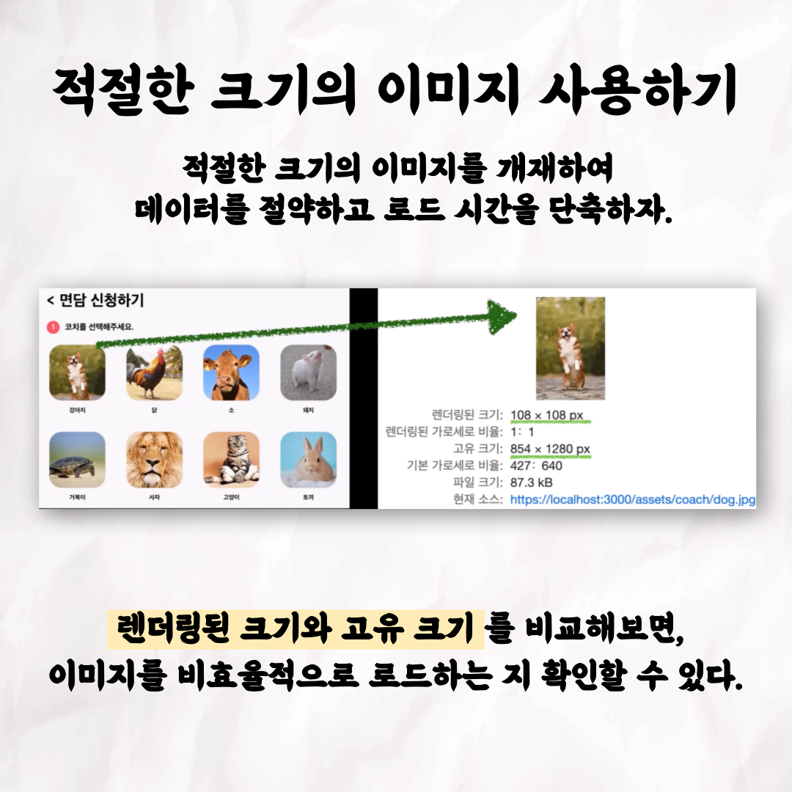
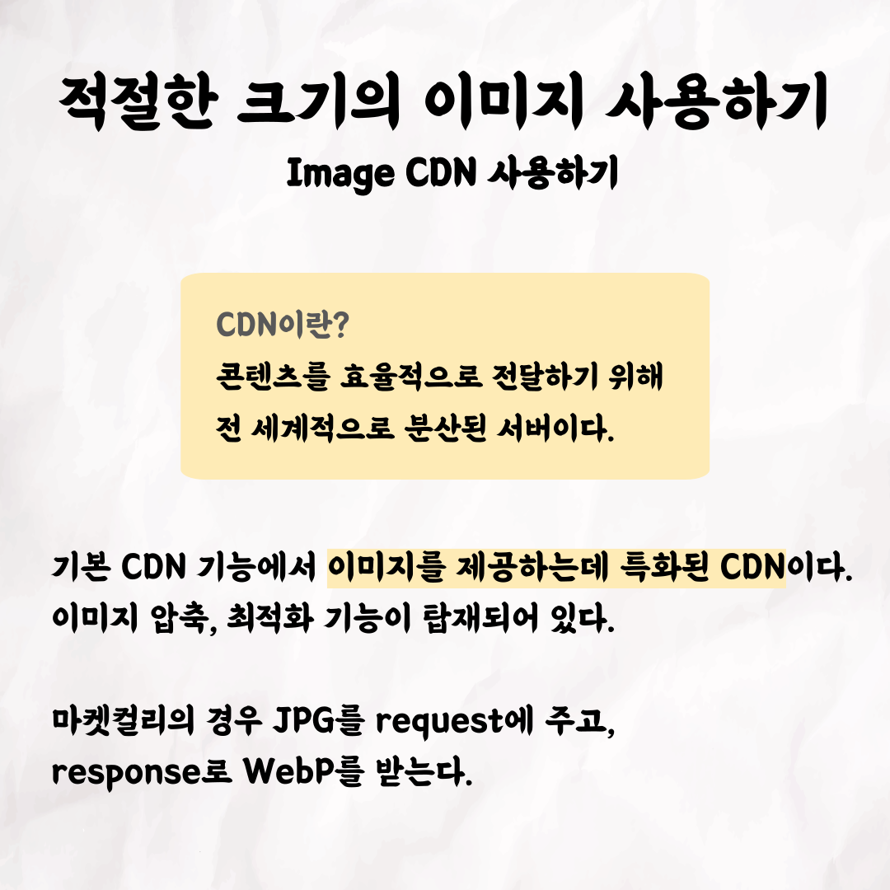
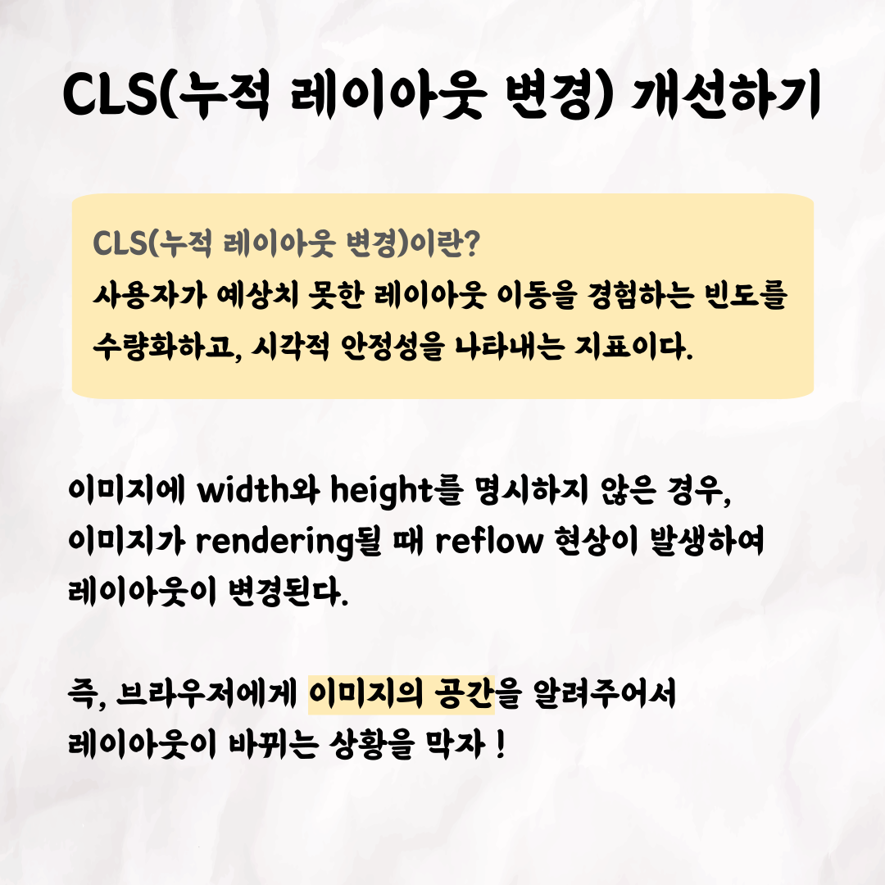
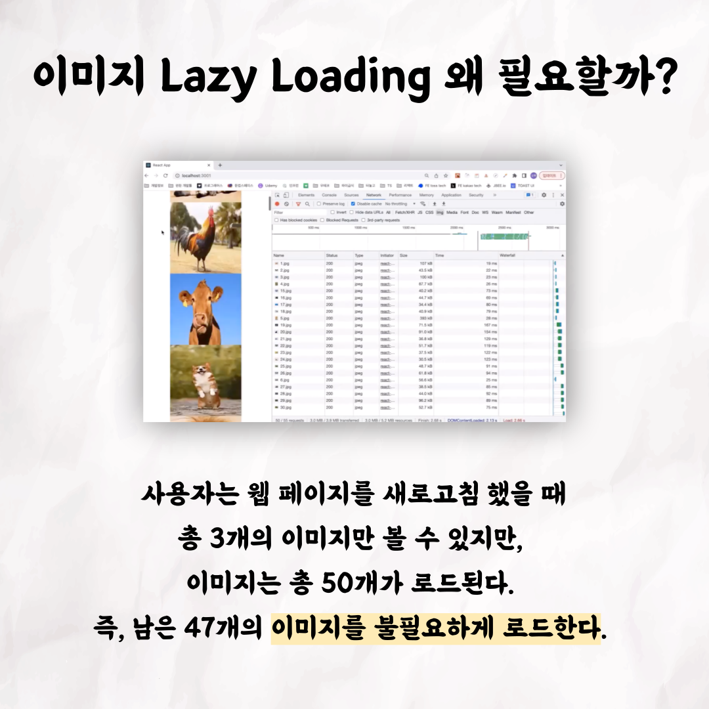
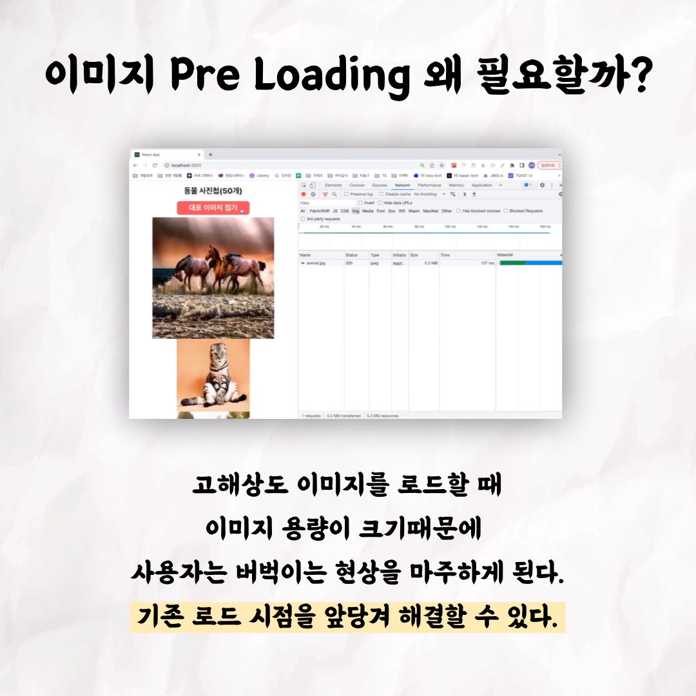

## 록바의 웹 성능 개선하기 - 이미지

 

테코톡 👩🏻‍💻🧑🏻‍💻    
  
주제 : 웹 성능 개선하기 - 이미지  
  
발표자 : 록바 💪🏽   
   
우아한테크코스만의 문화인 테코톡,   
이번 주인공은 록바인데요. 💪🏽   
웹 성능은 어떻게 개선할 수 있을까요?  
성능에 영향을 많이 끼치는 이미지부터 개선해봅시다!   
록바가 이미지를 통한 웹 성능 개선을 소개 드릴게요. 😎  
   
영상은 유튜브에 "록바의 웹 성능 개선하기"로 검색하시면    
찾아보실 수 있습니다.  
   
우아한Tech 유튜브 : https://www.youtube.com/c/%EC%9A%B0%EC%95%84%ED%95%9CTech

우아한테크코스 홈페이지 : https://woowacourse.github.io

우테코 블로그(Tecoble) : https://tecoble.techcourse.co.kr

#우아한테크코스 #우테코 #잠실 #선릉 #부트캠프 #java #javascript #spring #react #개발문화 #개발 #개발자 #wooteco #techcourse #테코톡 #tecotalk #웹 #웹성능 #성능개선 #이미지
