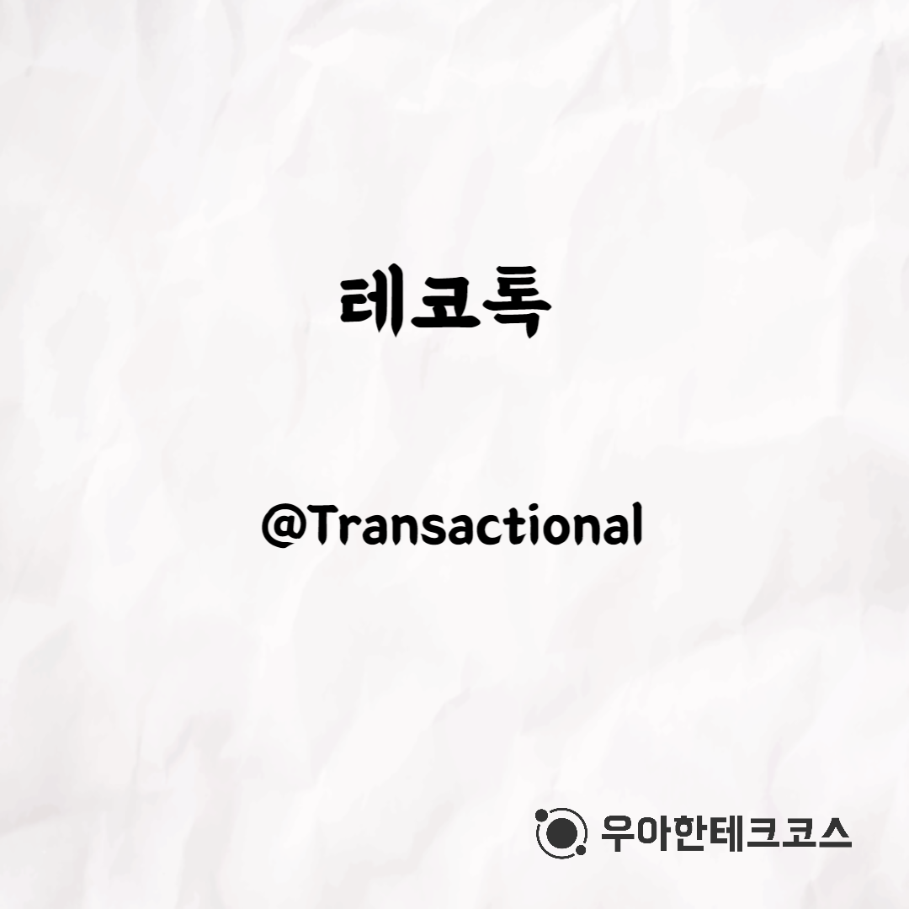
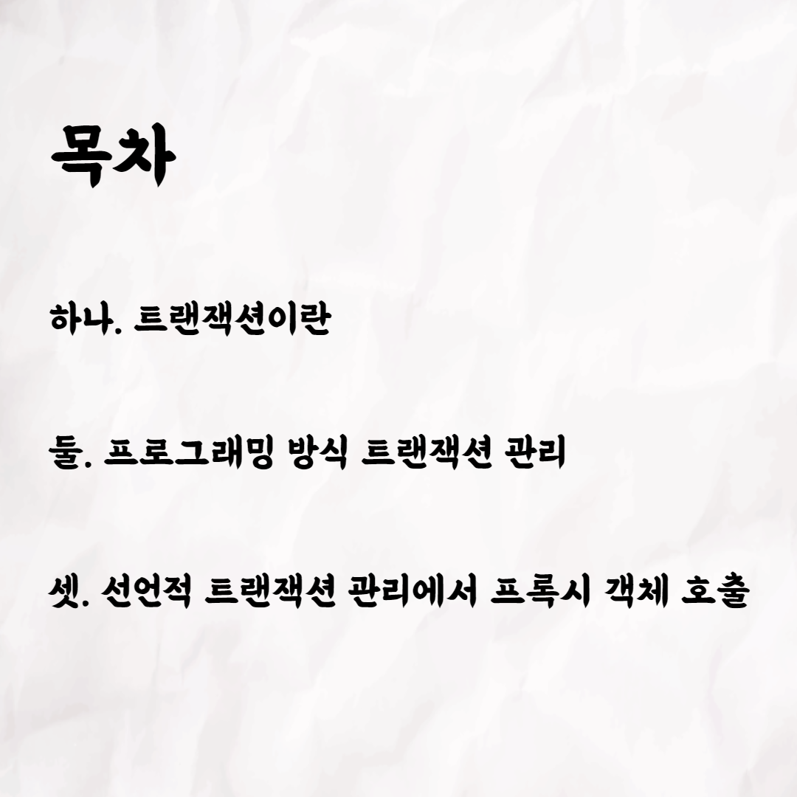
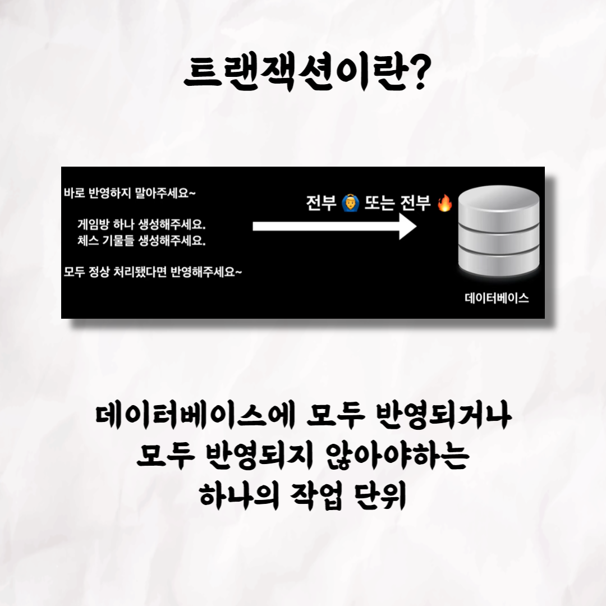
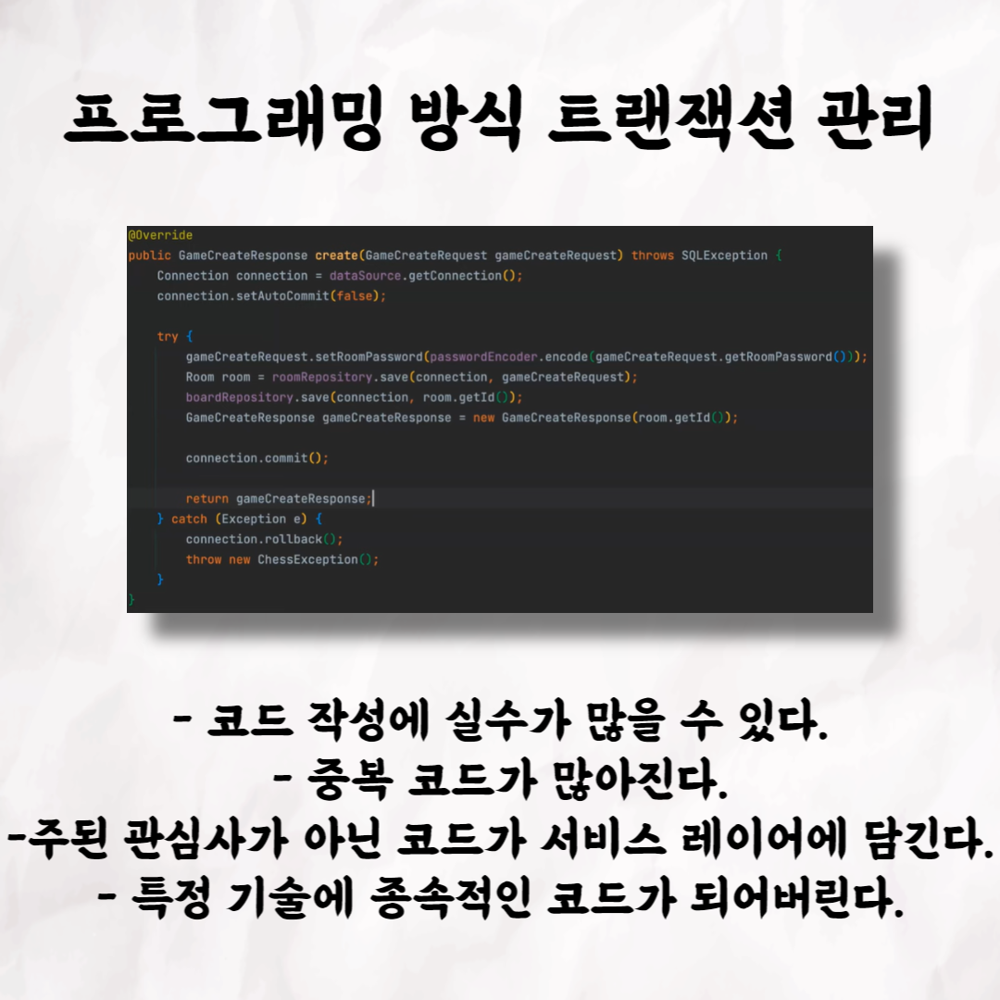
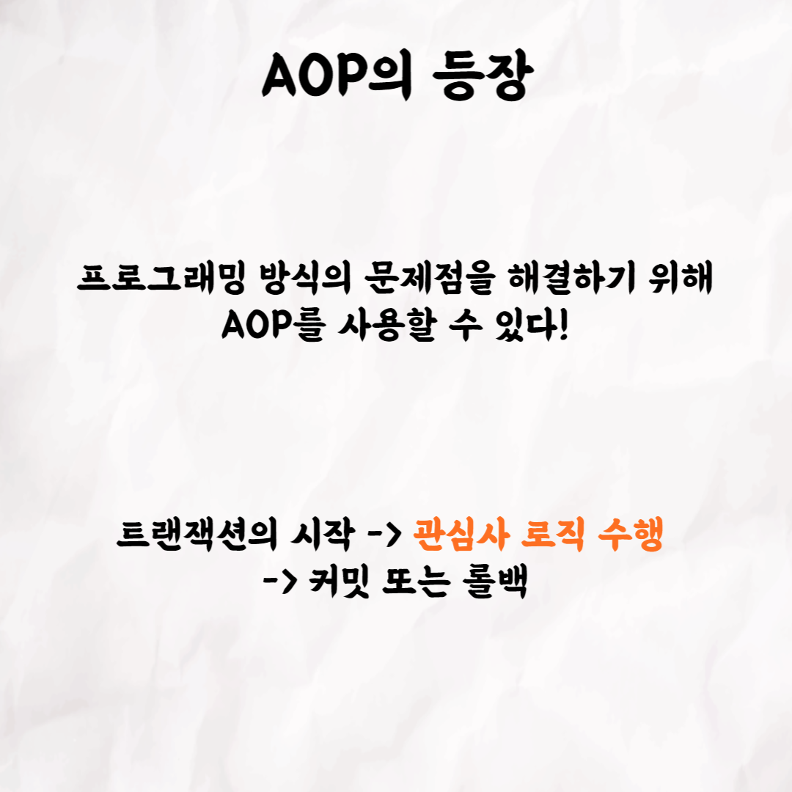
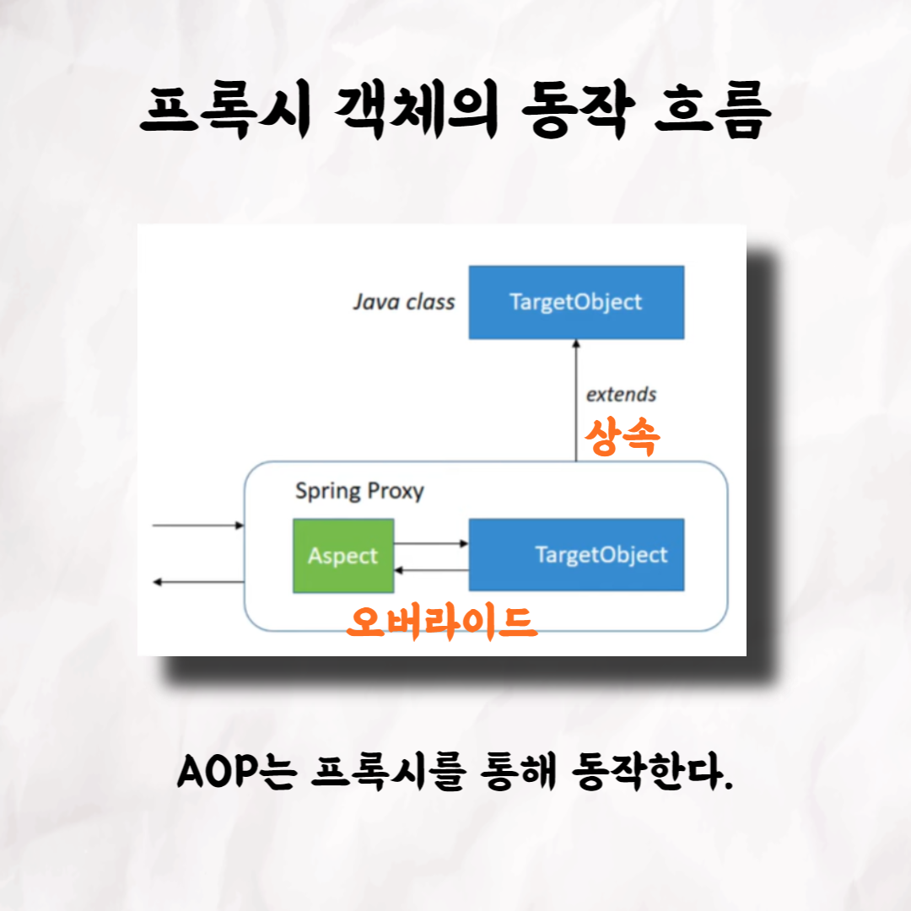
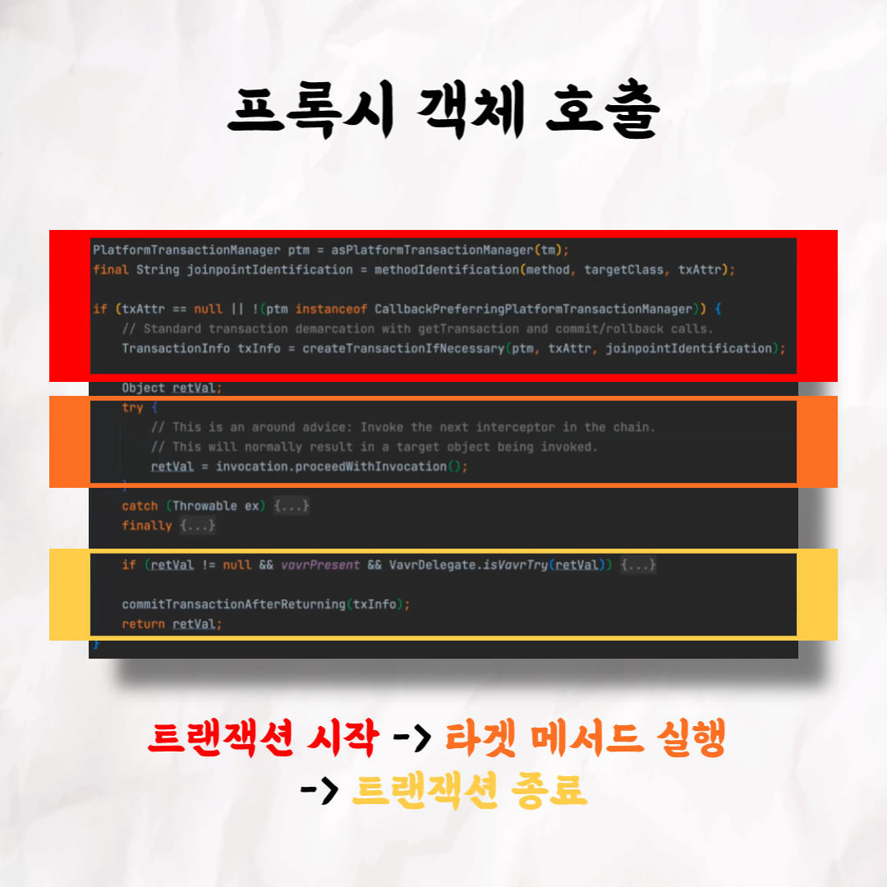
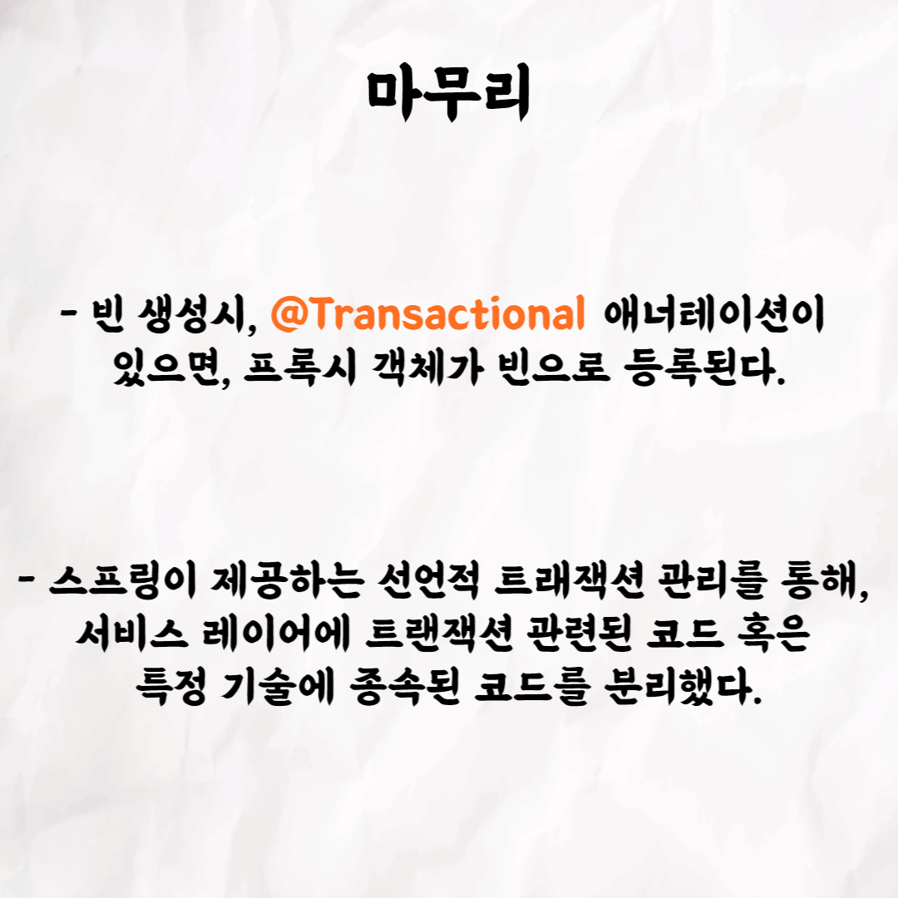
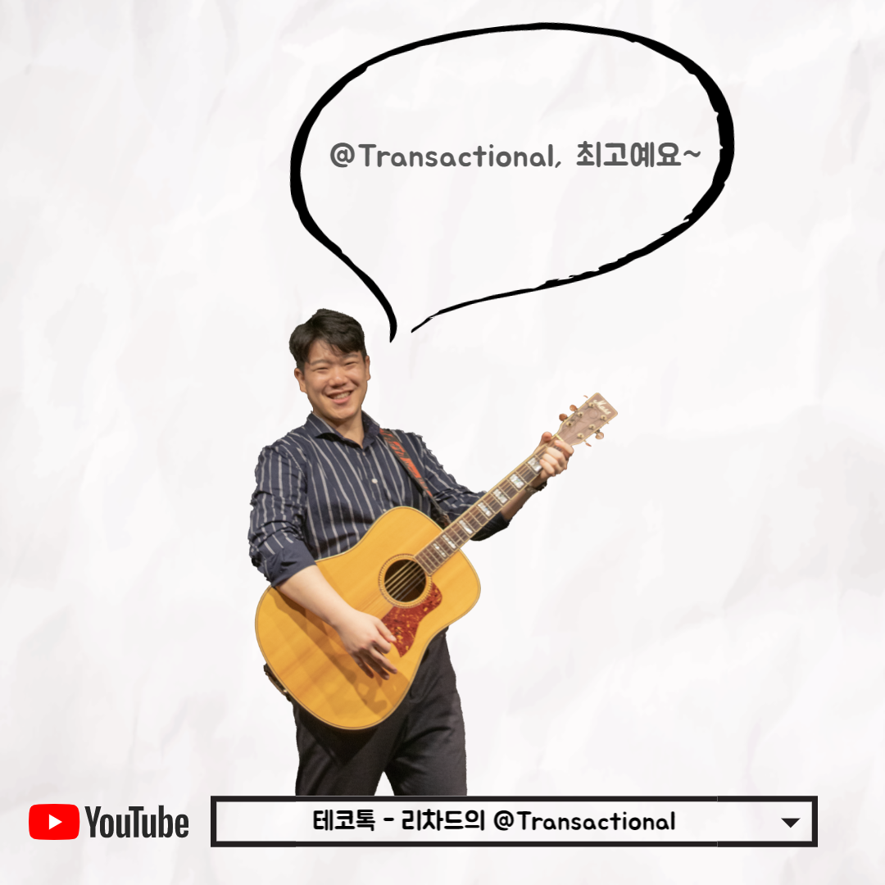

### 테코톡 - 리차드의 @Transactional

📮 테코톡

주제: @Transactional

발표자: 리차드🎶

트랜잭션이 무엇인지 궁금하신가요?! 또 @Transactional 애너테이션은 AOP와 무슨 관련이 있을까요?

@Transactional에 대해서 궁금하시다면 테코톡에서 만나봐요!

영상은 유튜브에 "리차드의 @Transactional"로 검색하시면 찾아보실 수 있습니다.

우아한Tech 유튜브:https://www.youtube.com/c/%EC%9A%B0%EC%95%84%ED%95%9CTech

우아한테크코스 홈페이지:https://woowacourse.github.io

우테코 블로그(Tecoble):https://tecoble.techcourse.co.kr

#우아한테크코스#우테코#테코톡#개발자#java#javascript#spring#react#개발문화#개발#개발자#woowahantechcourse#wooteco#techcourse
