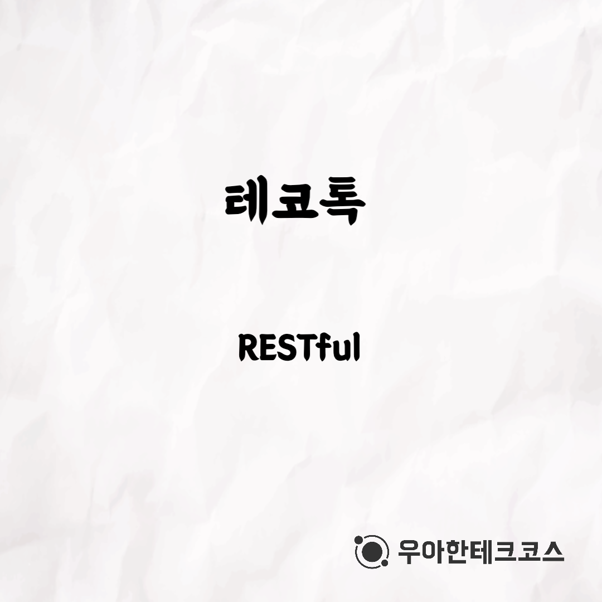
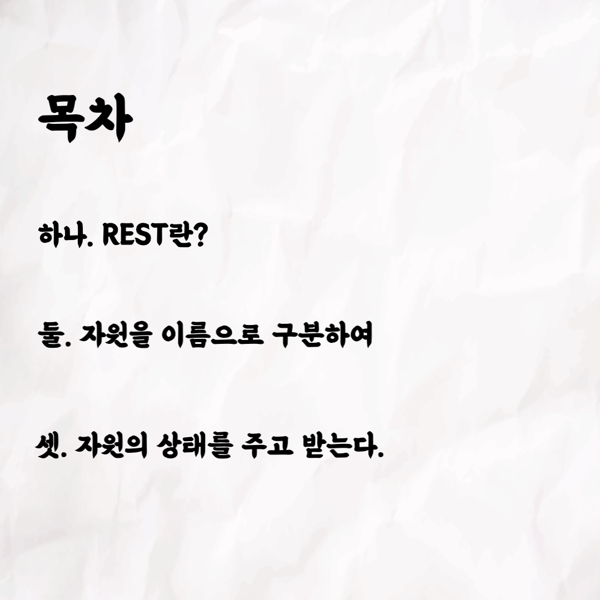
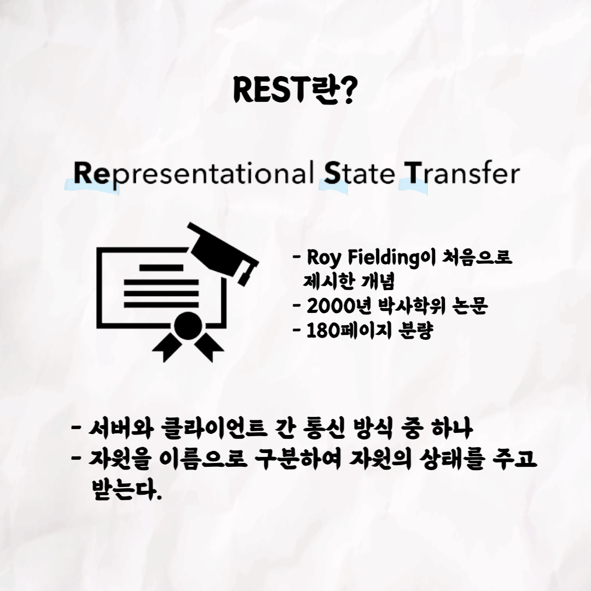
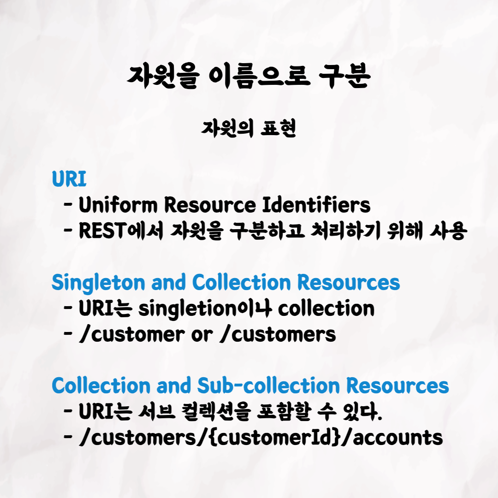
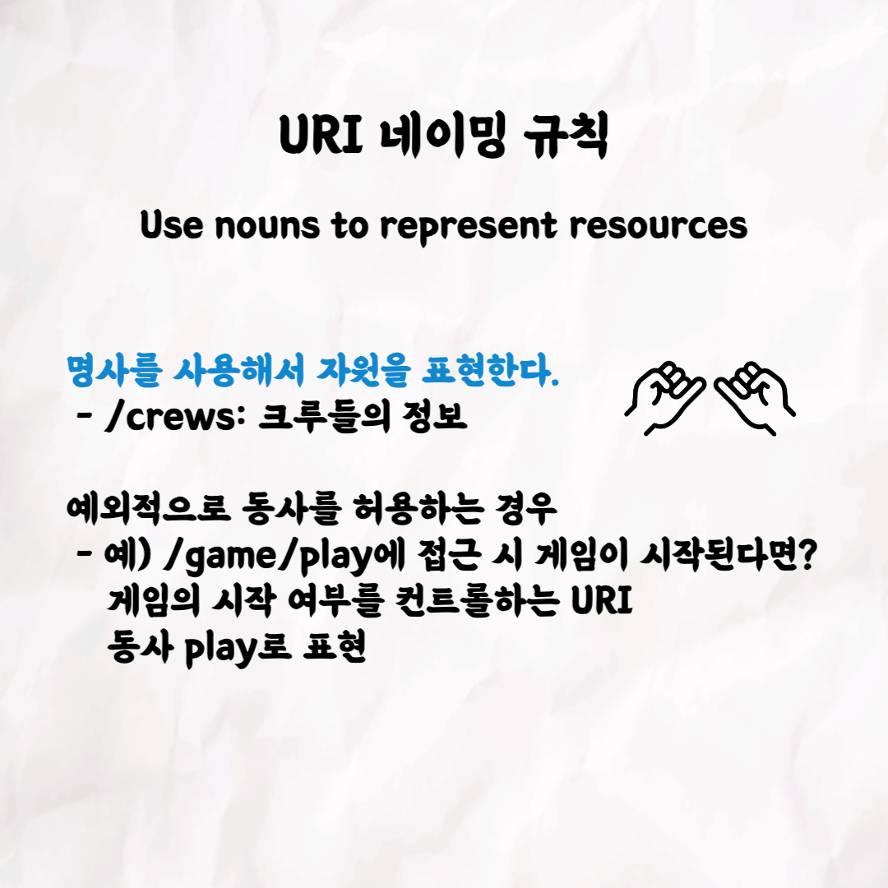
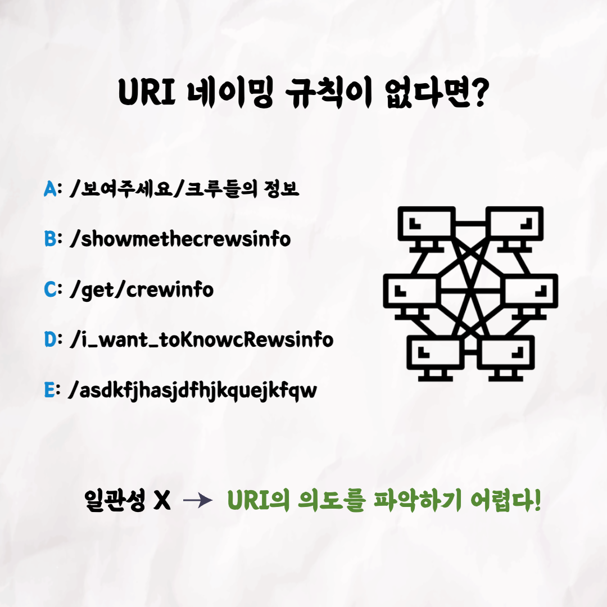
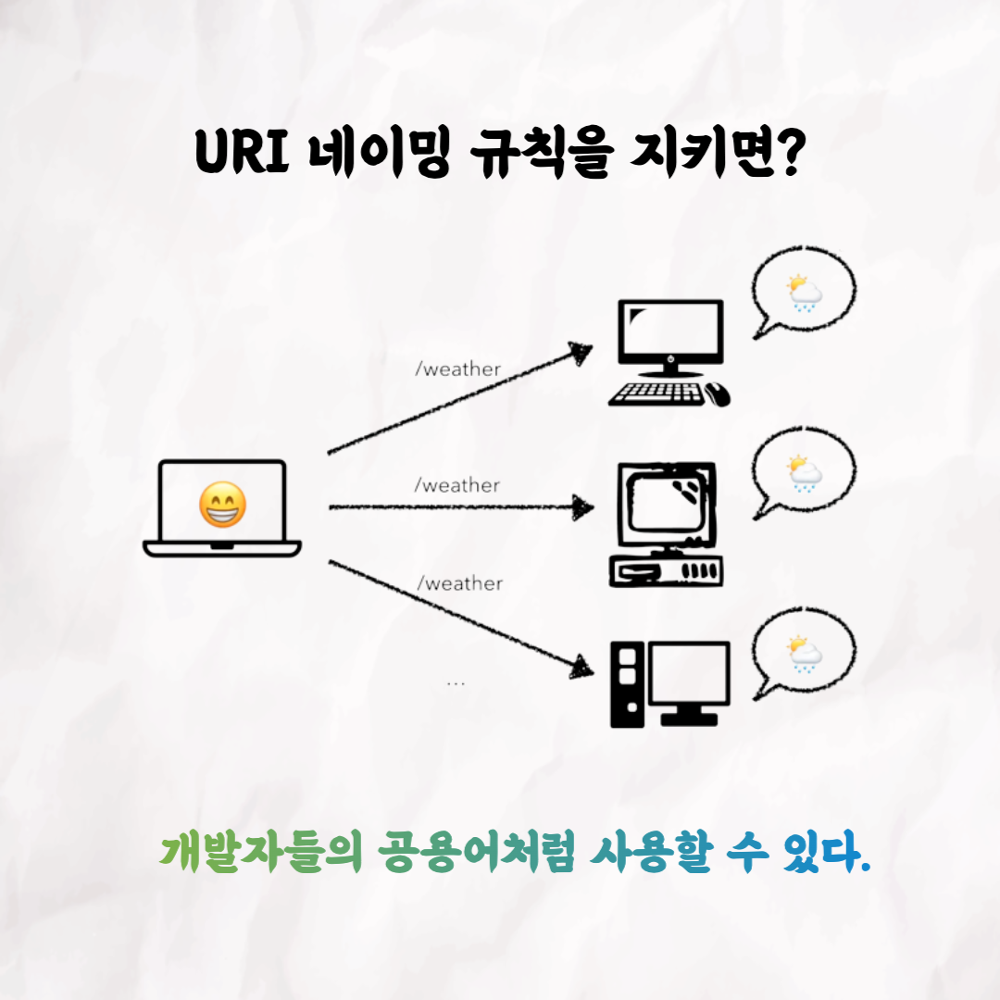
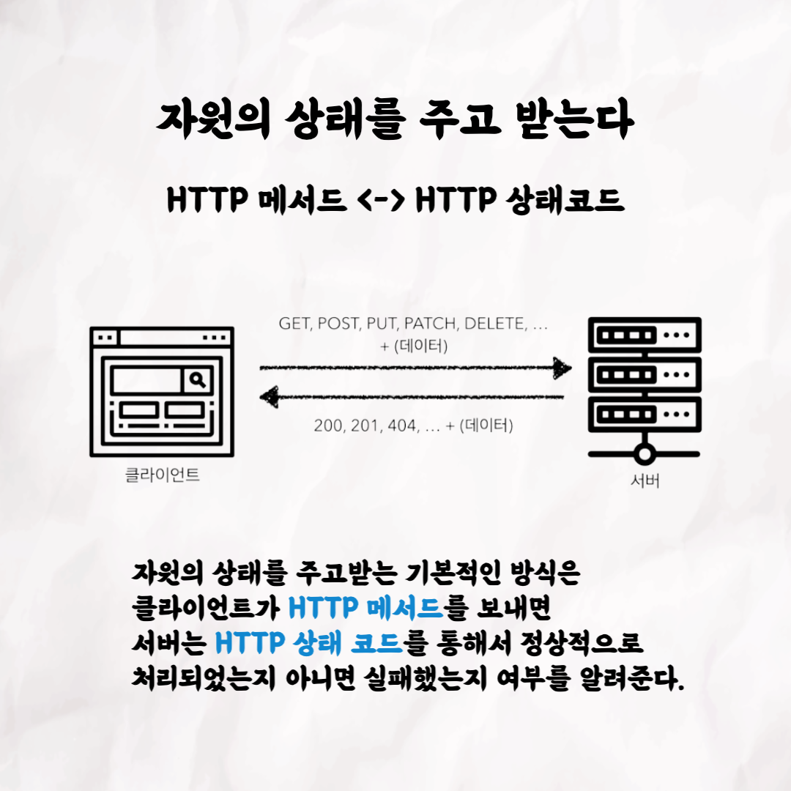
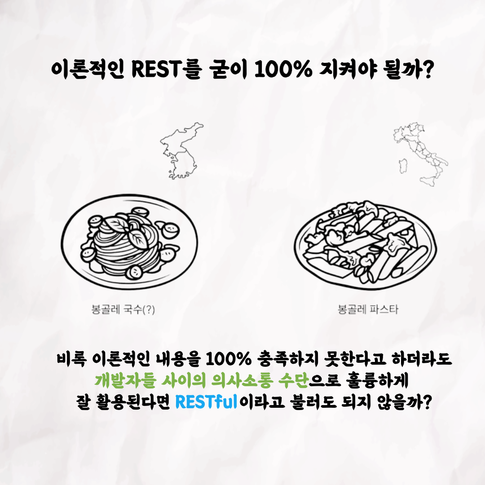
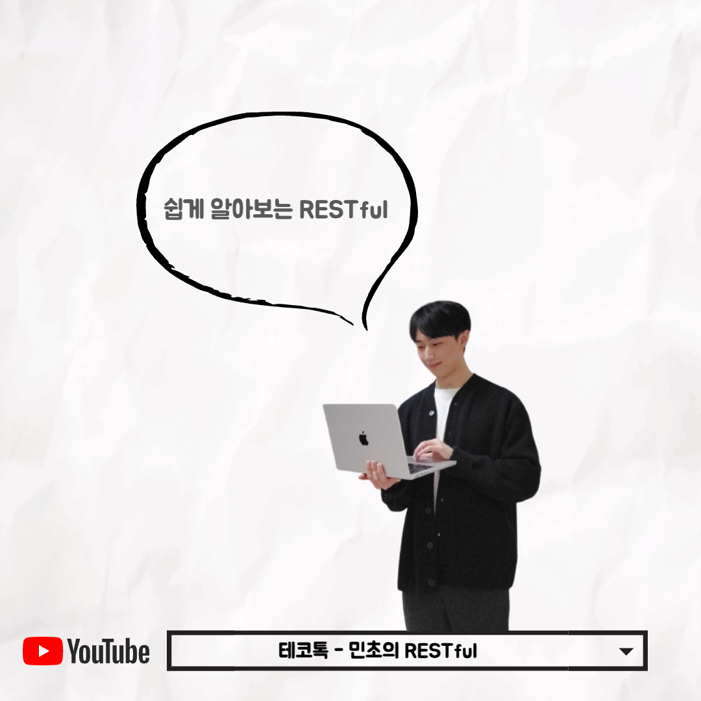

### 테코톡 - 민초의 RESTful

📮 테코톡

주제: RESTful

발표자: 민초

민초 크루가 RESTful에 대해서 발표해주셨어요!
평소 RESTful에 대해서 궁금하셨던 분들은
유튜브 민초의 RESTful을 시청해보세요!! 많은 도움이 되실거라고 생각합니다~!

영상은 유튜브에 "민초의 RESTful"으로 검색하시면 찾아보실 수 있습니다

테코톡 영상 링크:https://www.youtube.com/watch?v=fW1WGmj10rA

우아한Tech 유튜브:https://www.youtube.com/c/%EC%9A%B0%EC%95%84%ED%95%9CTech

우아한테크코스 홈페이지:https://woowacourse.github.io

우테코 블로그(Tecoble):https://tecoble.techcourse.co.kr

#우아한테크코스#우테코#테코톡#개발자#java#javascript#spring#react#개발문화#개발#개발자#woowahantechcourse#wooteco#techcourse#parameter#argument
