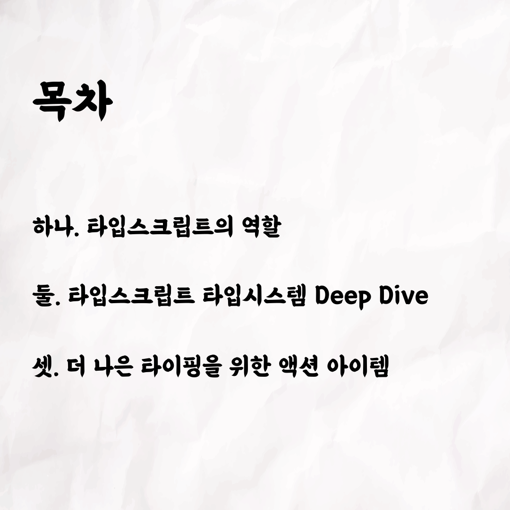
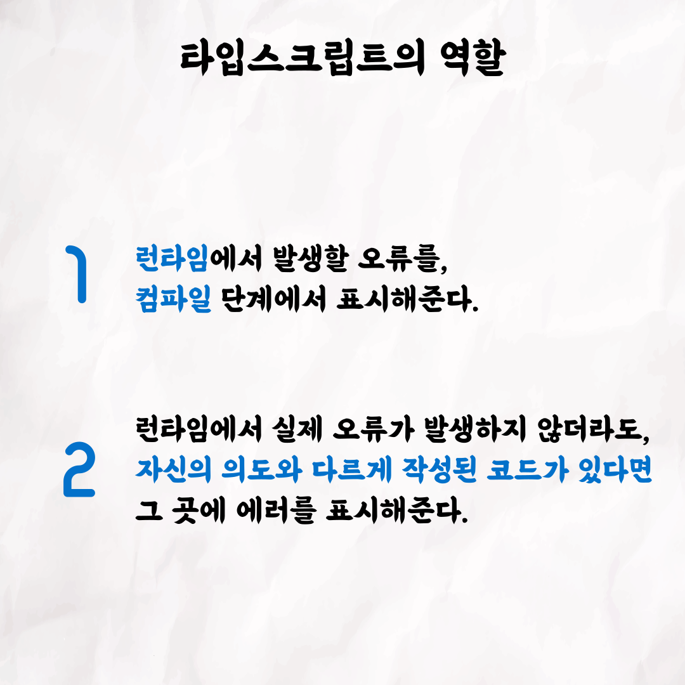
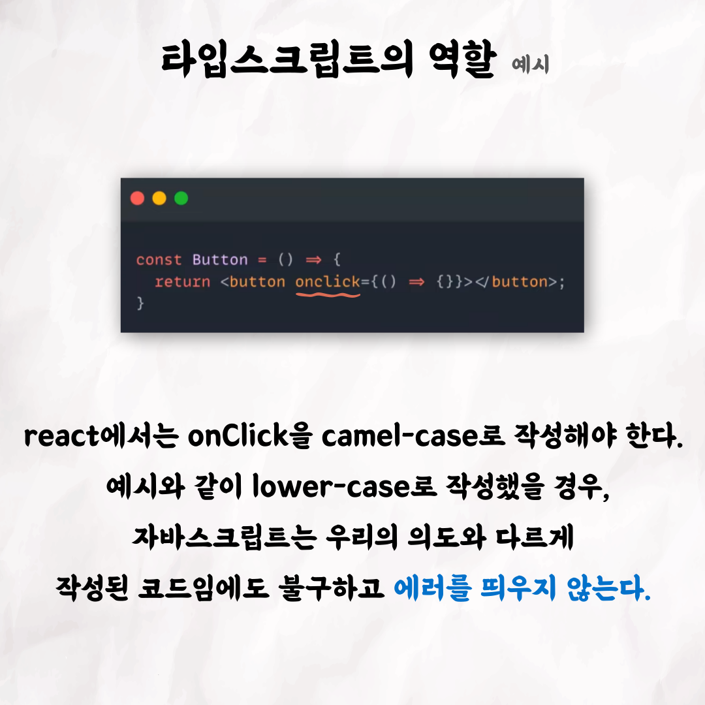
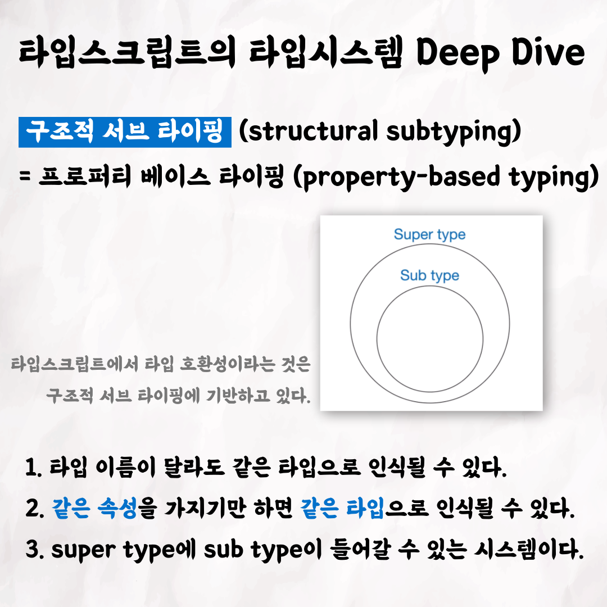
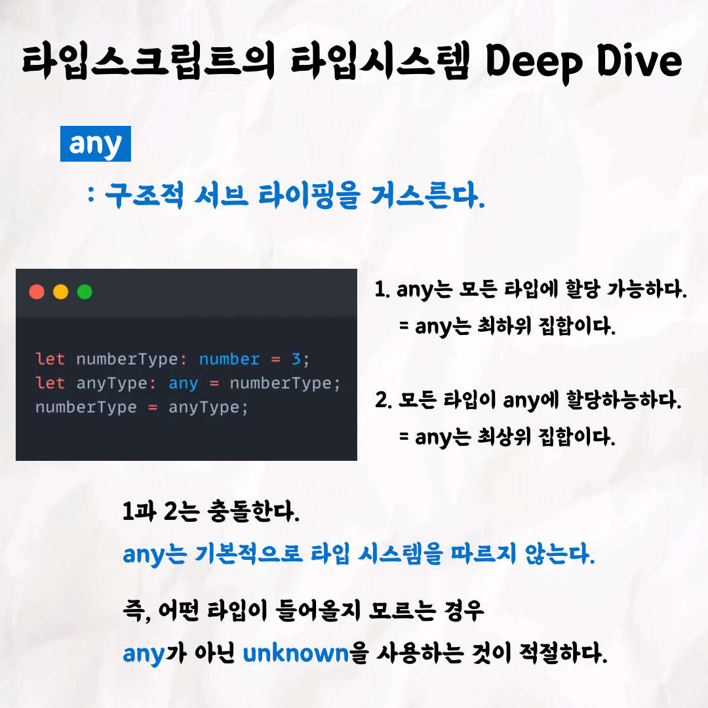
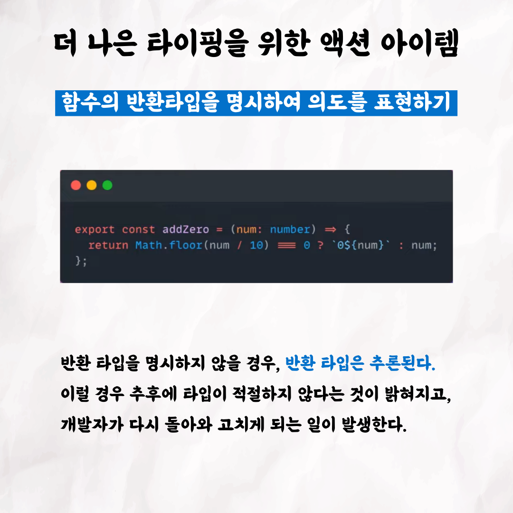
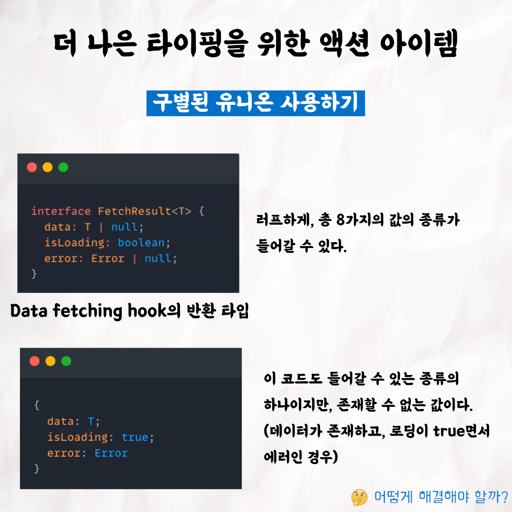

## 시지프의 타입스크립트 도약하기

 

테코톡 👩🏻‍💻🧑🏻‍💻    
  
주제 : 타입스크립트 도약하기   
  
발표자 : 시지프 ⚽️   
   
우아한테크코스만의 문화인 테코톡,   
이번 주인공은 ~ 시지프입니다 !   
최근 타입스크립트를 사용하는 프로젝트가 많을 것 같은데요.    
타입스크립트는 어떤 타입 시스템을 가지고 있는지 궁금하지 않으신가요? 🤔    
궁금증을 시지프가 시원하게 해소해드릴게요 !  
   
영상은 유튜브에 "시지프의 타입스크립트 도약하기"로 검색하시면    
찾아보실 수 있습니다.  
   
우아한Tech 유튜브 : https://www.youtube.com/c/%EC%9A%B0%EC%95%84%ED%95%9CTech

우아한테크코스 홈페이지 : https://woowacourse.github.io

우테코 블로그(Tecoble) : https://tecoble.techcourse.co.kr

#우아한테크코스 #우테코 #잠실 #선릉 #부트캠프 #java #javascript #spring #react #개발문화 #개발 #개발자 #wooteco #techcourse #테코톡 #tecotalk #typescript #type #typesystem
