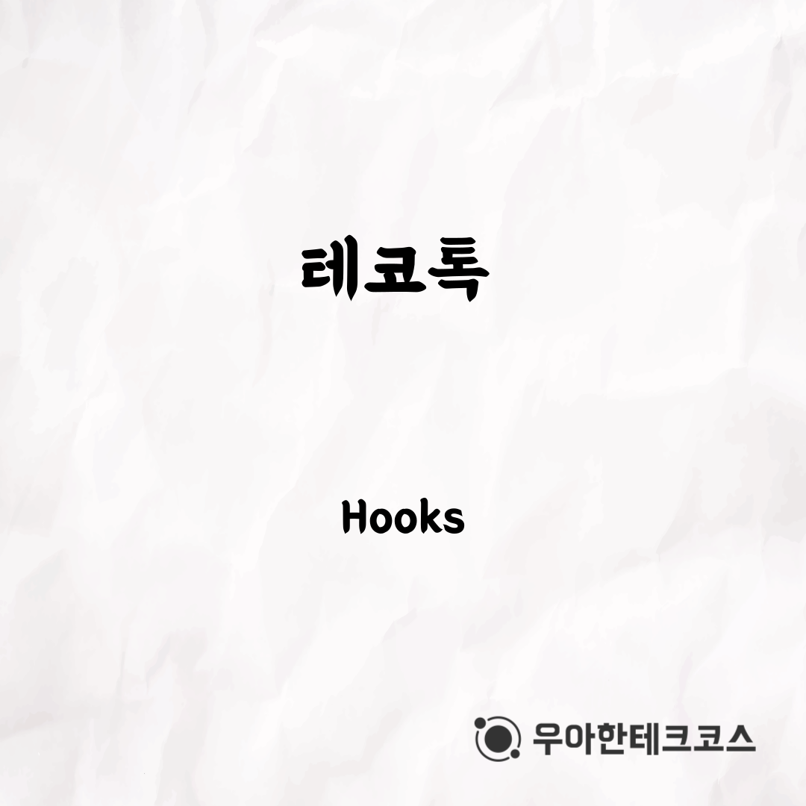
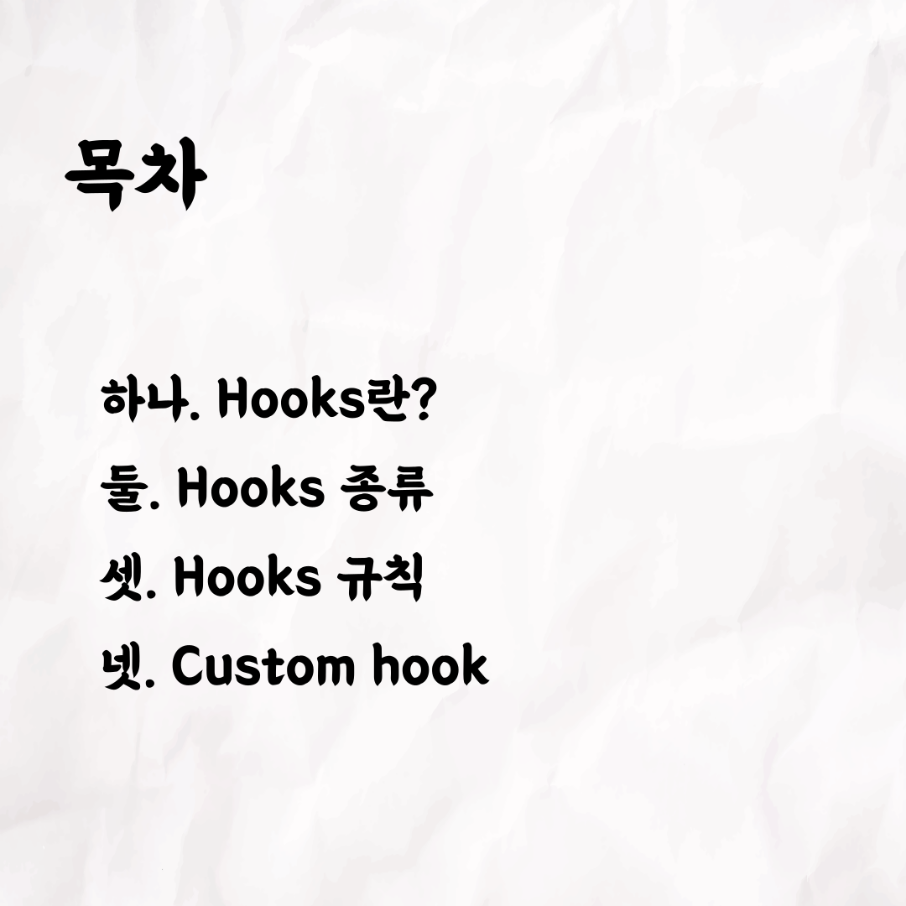
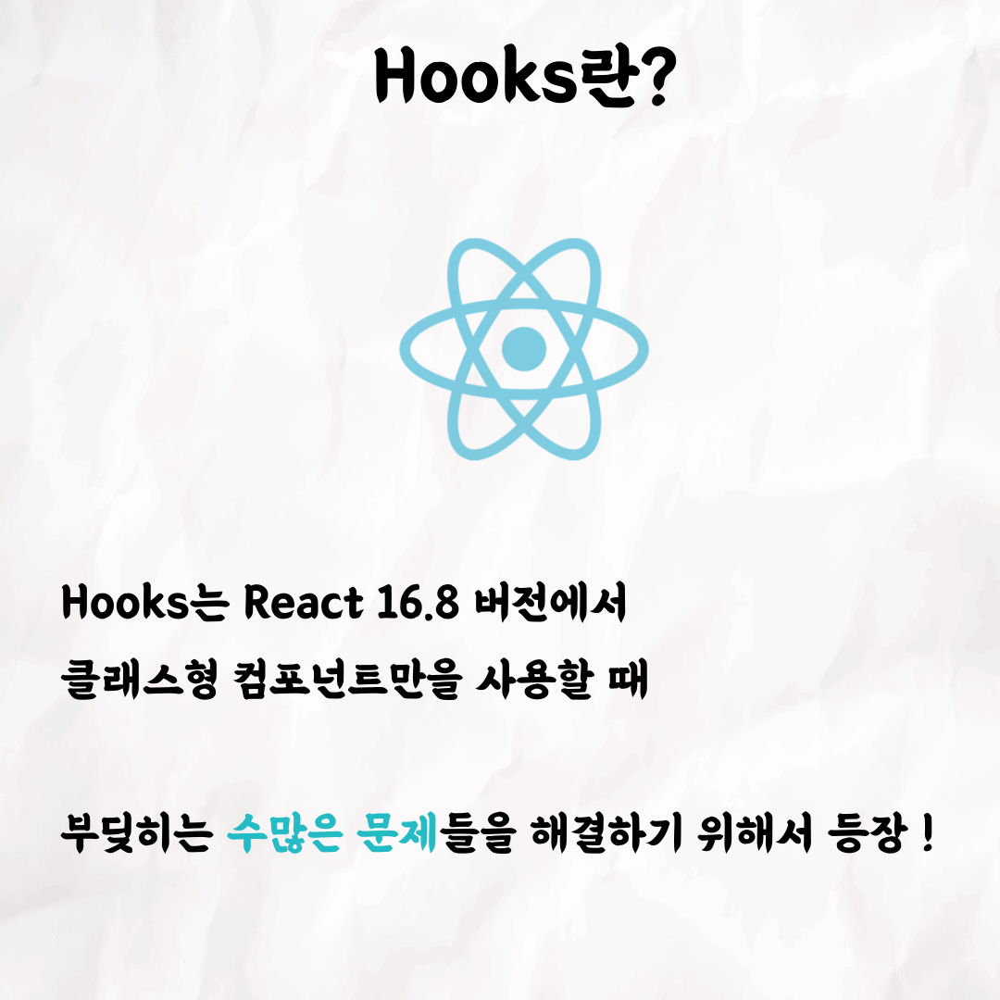
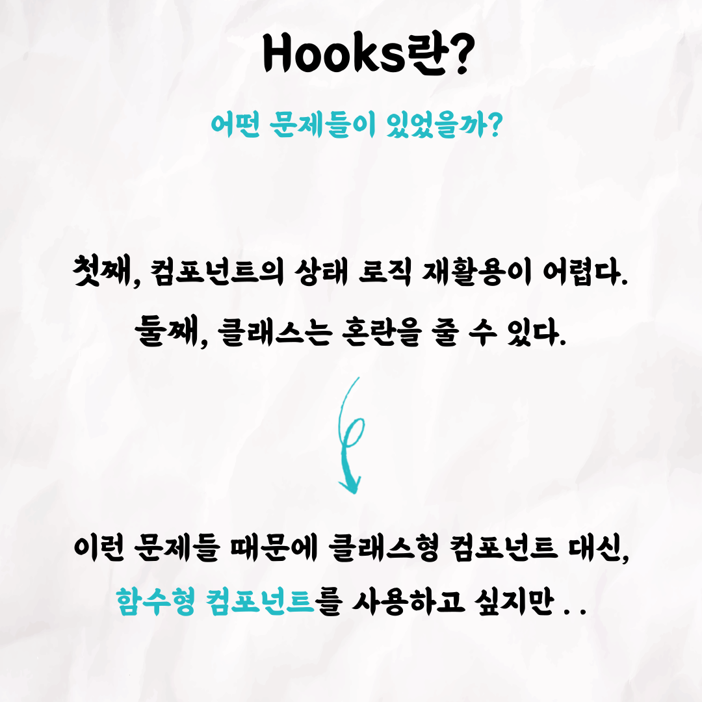
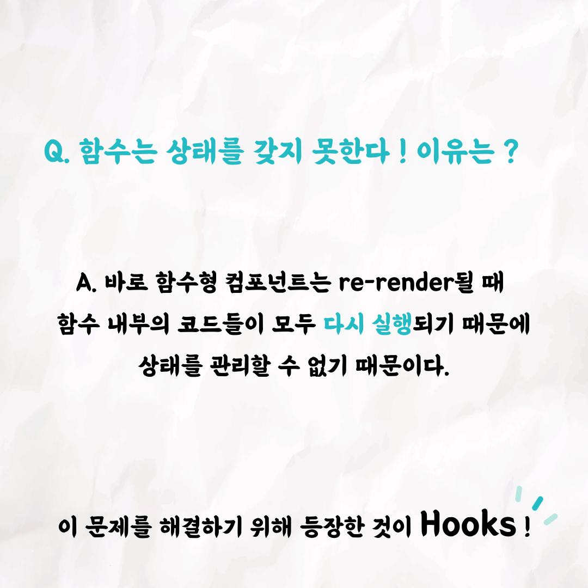
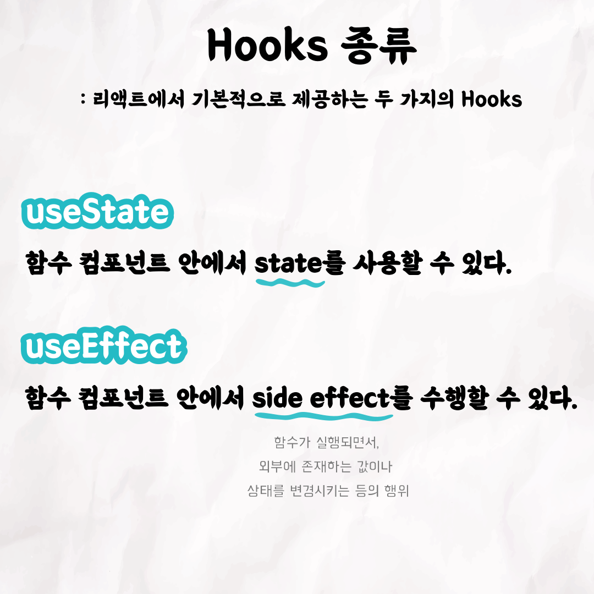
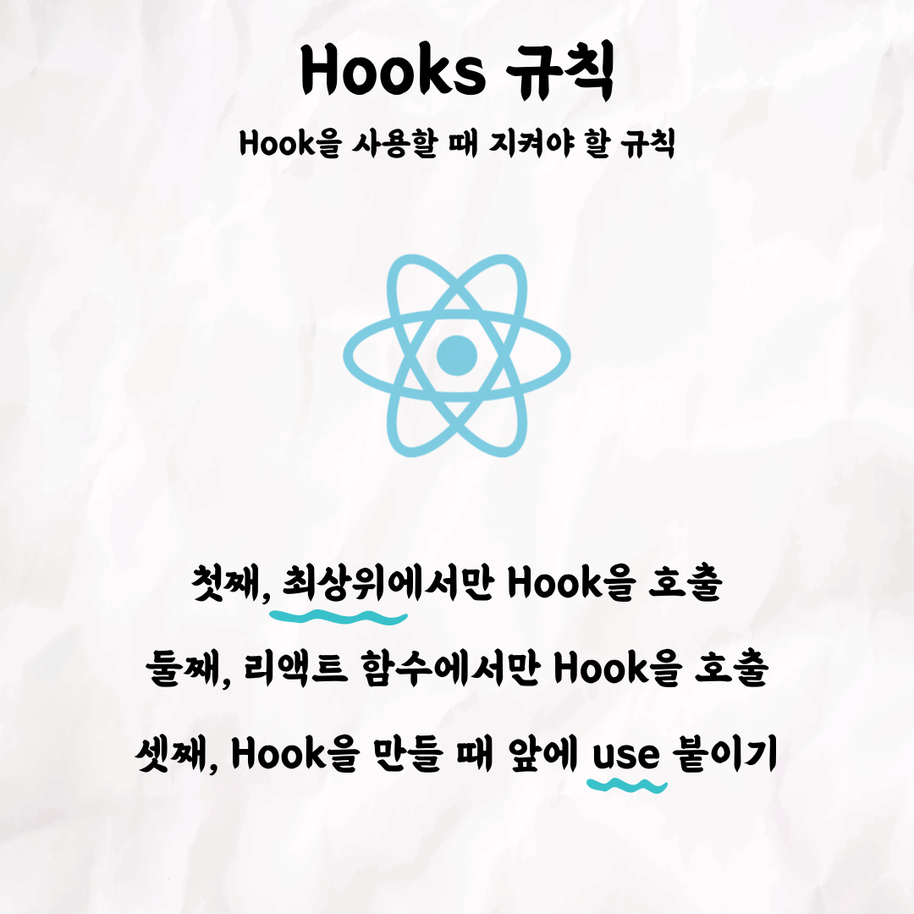
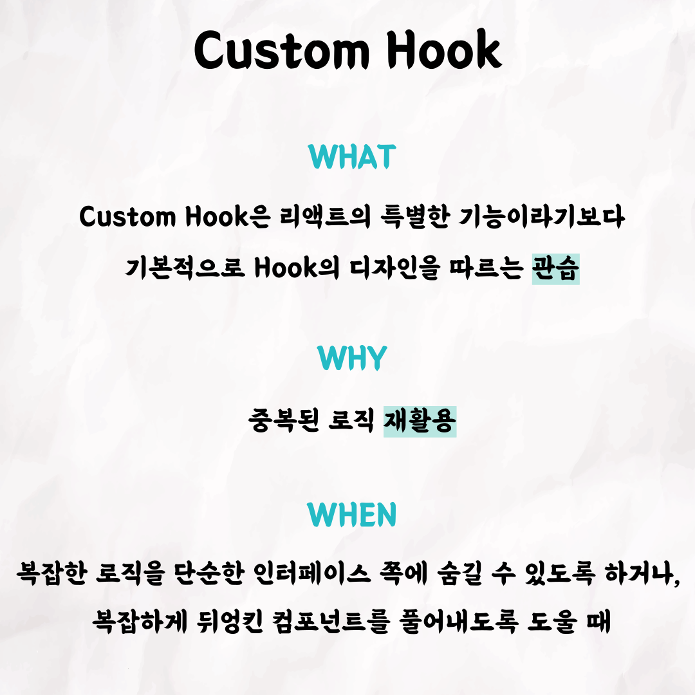

## [테코톡] 우연의 Hooks 최종본

### 1번 - 표지

### 2번

### 3번

### 4번

### 5번

### 6번

### 7번

### 8번

### 9번

 

테코톡 👩🏻‍💻🧑🏻‍💻  
  
주제 : Hooks  
  
발표자 : 우연   

우아한테크코스만의 문화인 테코톡,  
이번 주인공은 우연인데요 😆  
리액트에서 Hook이란 무엇이고, 어떤 이유로 등장하게 되었을까요❓  
Hook을 여러모로 사용하고는 있지만 자세한 이야기는 모른다면, 우연의 Hooks 보러가시죠 😆  

영상은 유튜브에 "우연의 Hooks"로 검색하시면  
찾아보실 수 있습니다.  

우아한Tech 유튜브 : https://www.youtube.com/c/%EC%9A%B0%EC%95%84%ED%95%9CTech

우아한테크코스 홈페이지 : https://woowacourse.github.io

우테코 블로그(Tecoble) : https://tecoble.techcourse.co.kr

#우아한테크코스 #우테코 #잠실 #선릉 #부트캠프 #java #javascript #spring #react #개발문화 #개발 #개발자 #wooteco #techcourse #테코톡 #tecotalk #hooks
