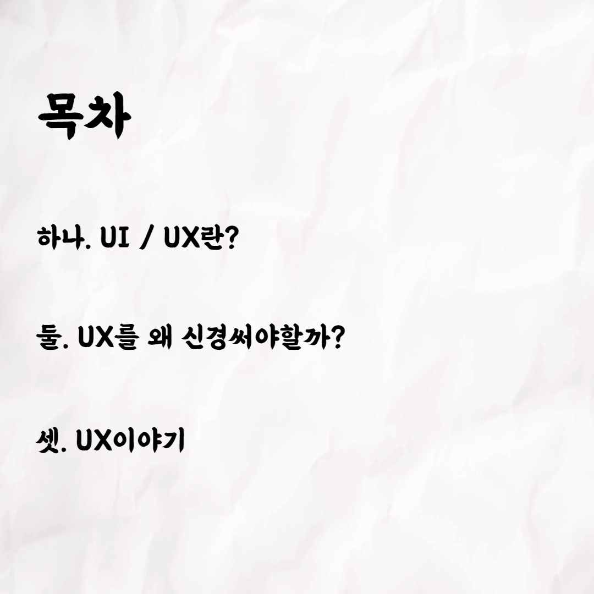
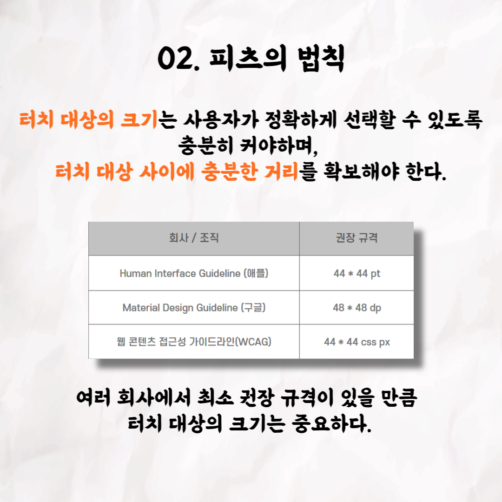
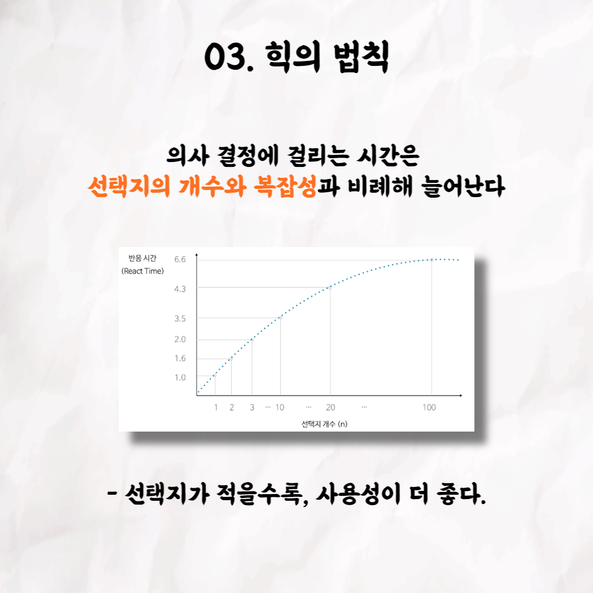
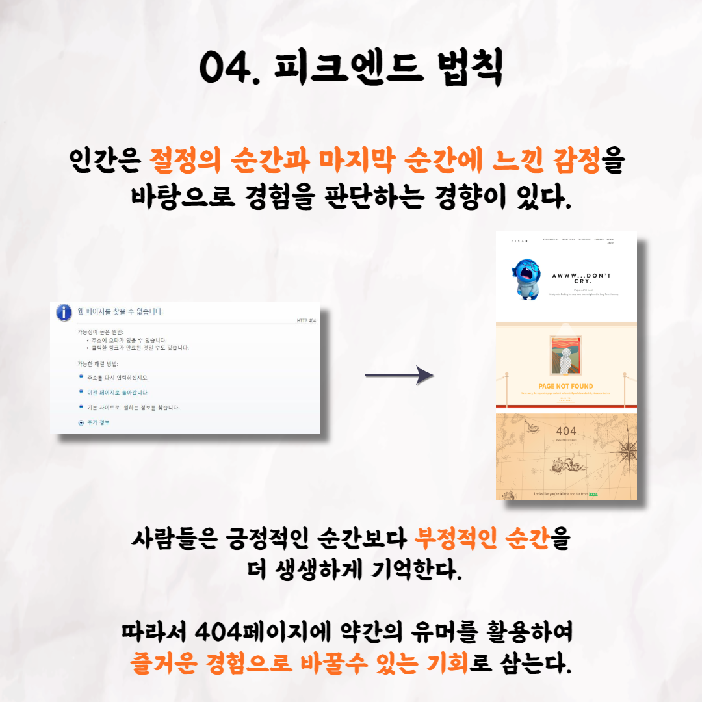

### 테코톡 - 위니의 프론트엔드 개발자에게 UX란?

📮 테코톡

주제: 프론트엔드 개발자에게 UX란?

발표자: 위니

프론트엔드 개발자도 UX를 알아야 하나요? UX는 뭘까요?

위니가 UX란 무엇인지? 라는 주제로 발표를 해주셨어요!

UX가 무엇인지 더 자세히 알고싶다면 위니의 테코톡을 참고해주세요!

더 자세한 이야기는 유튜브에 "위니의 프론트엔드 개발자에게 UX란?"으로 검색해서 찾아보실수 있습니다!

우아한Tech 유튜브:https://www.youtube.com/c/%EC%9A%B0%EC%95%84%ED%95%9CTech

우아한테크코스 홈페이지:https://woowacourse.github.io

우테코 블로그(Tecoble):https://tecoble.techcourse.co.kr

#우아한테크코스 #우테코 #테코톡 #개발자 #java #javascript #ux #개발문화 #개발 #개발자 #woowahantechcourse #wooteco #techcourse #ux #ui
