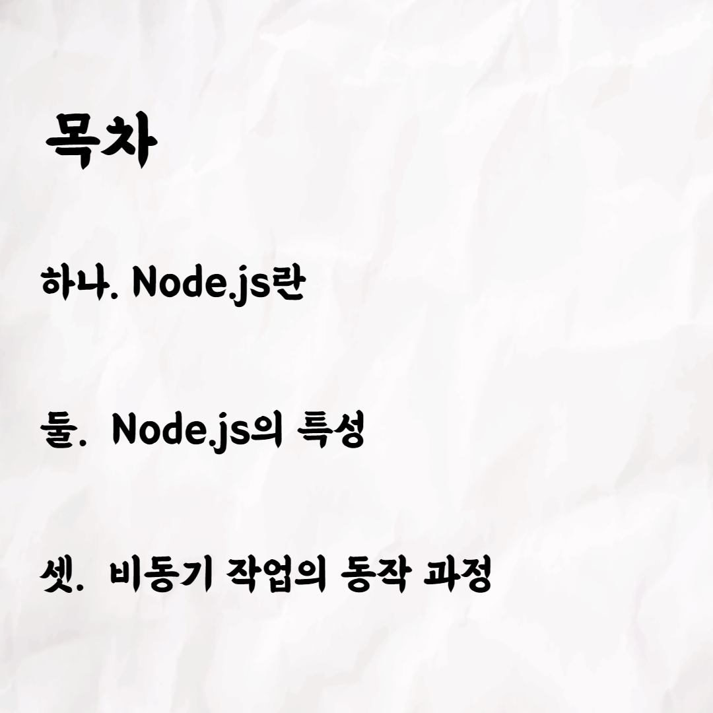
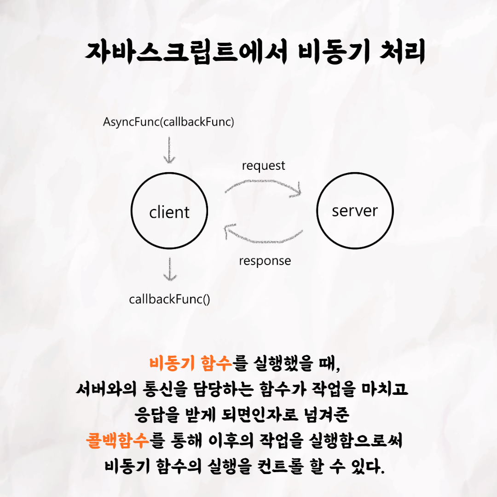
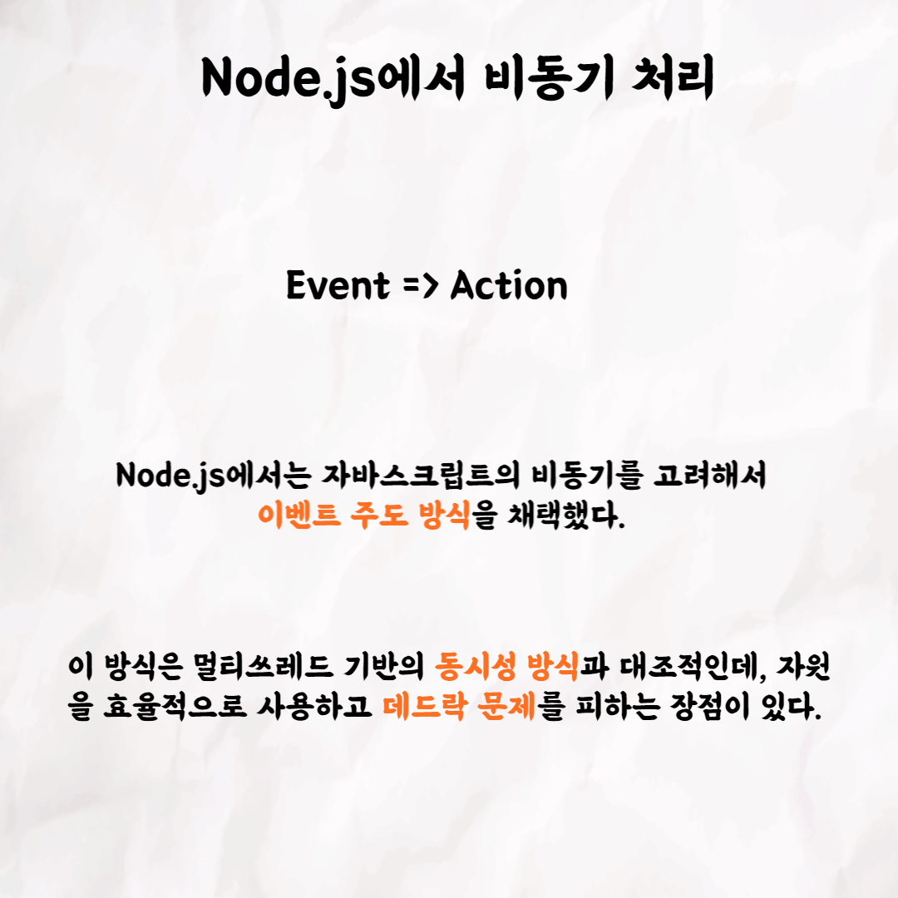
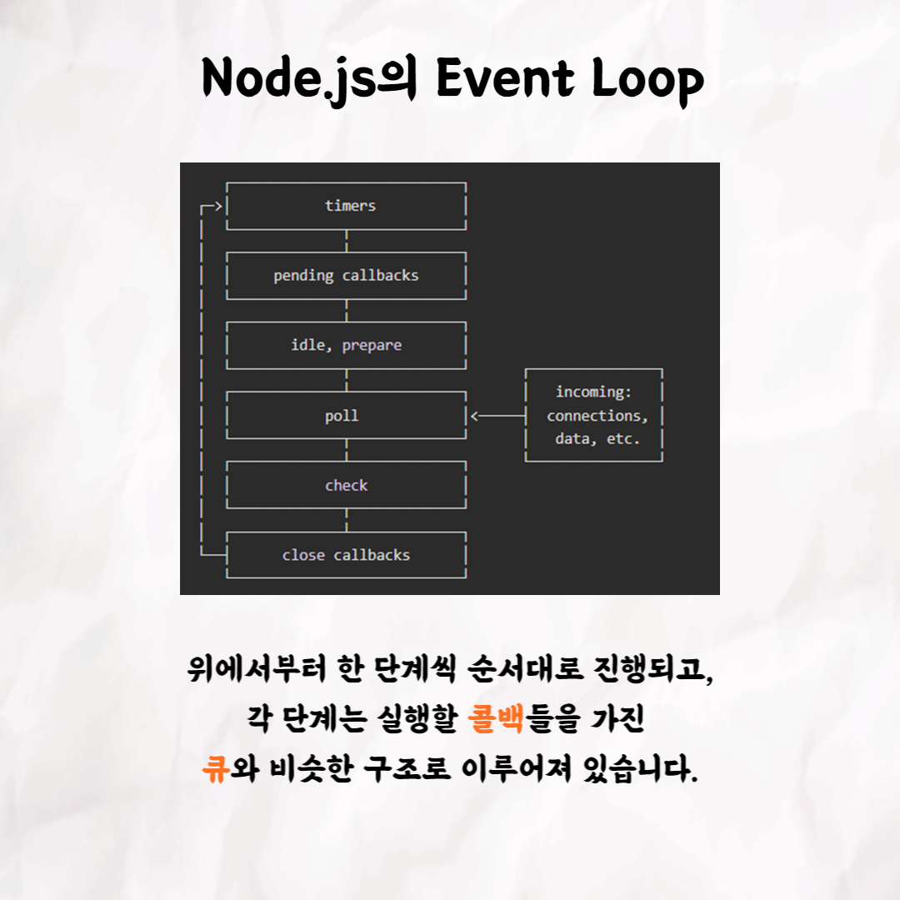
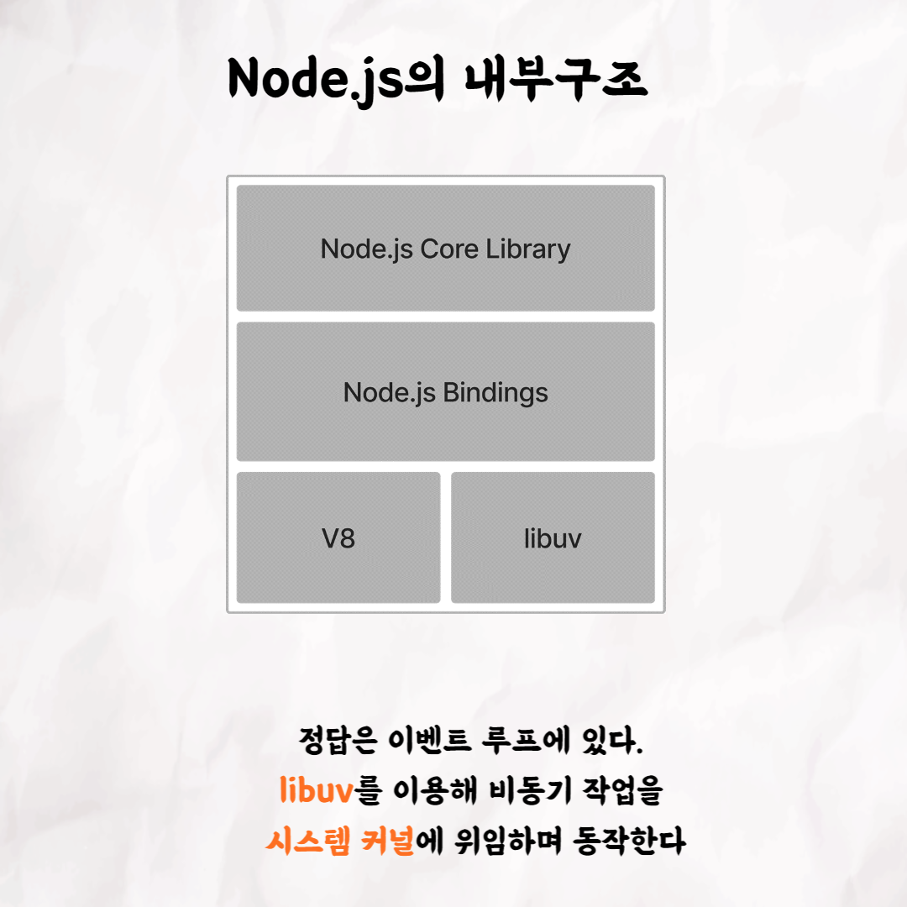

### 테코톡 - 유세지의 Node.js

📮 테코톡

주제: Node.js

발표자: 유세지

평소 Node.js 대해서 궁금하셨던 분들은 유세지의 Node.js를 시청해보세요!! 많은 도움이 되실거라고 생각합니다~!

영상은 유튜브에 "유세지의 Node.js"으로 검색하시면 찾아보실 수 있습니다.

우아한Tech 유튜브:https://www.youtube.com/c/%EC%9A%B0%EC%95%84%ED%95%9CTech

우아한테크코스 홈페이지:https://woowacourse.github.io

우테코 블로그(Tecoble):https://tecoble.techcourse.co.kr

#우아한테크코스 #우테코 #테코톡 #개발자 #java #javascript #노드 #node.js #react #개발문화 #개발 #개발자 #woowahantechcourse #wooteco #techcourse
