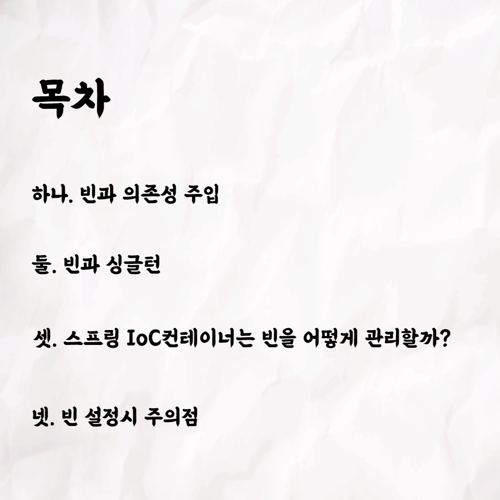
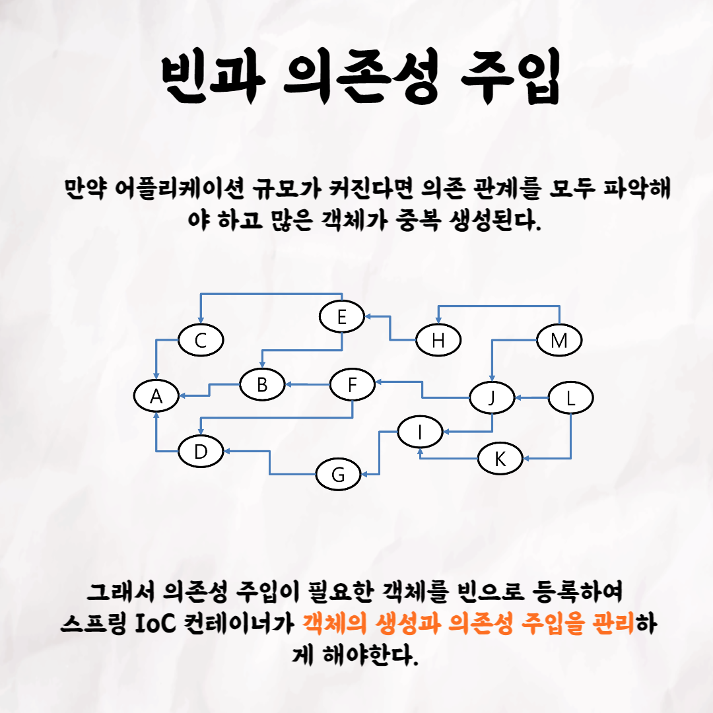
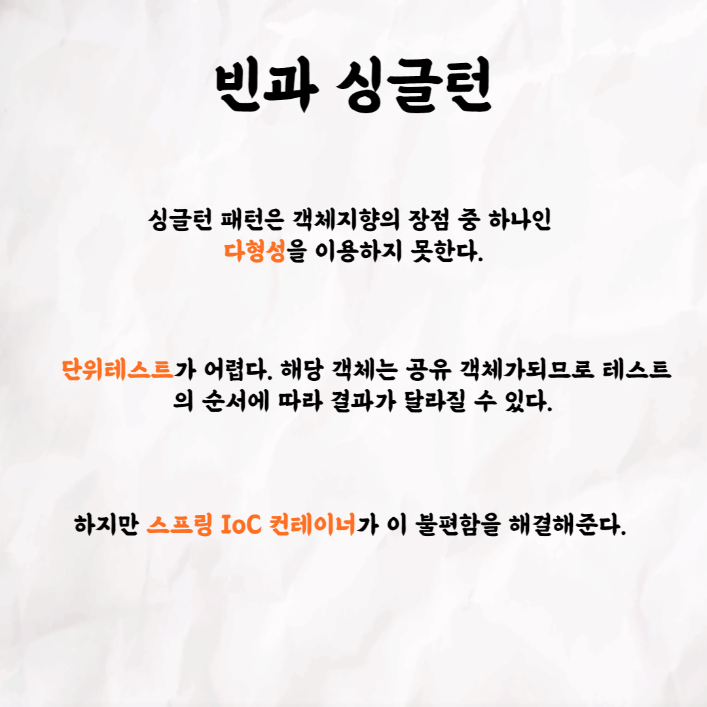
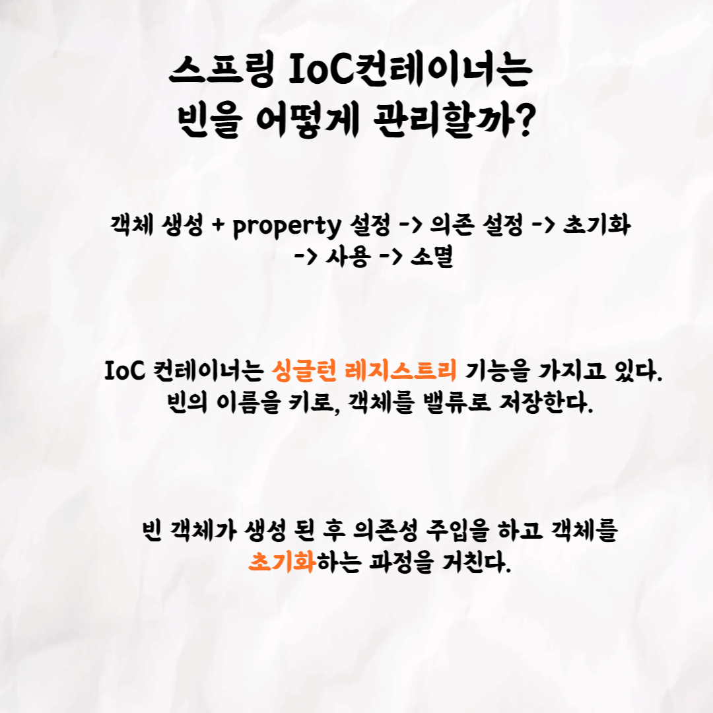
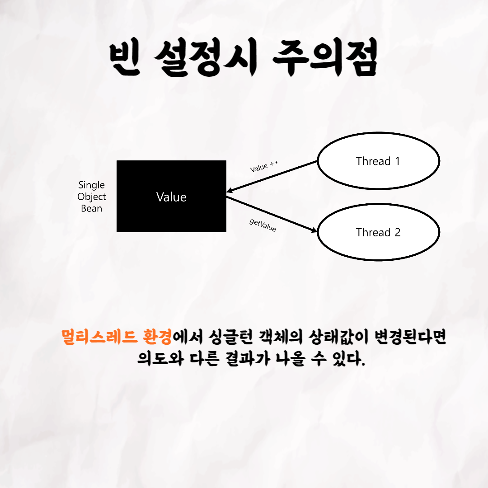

## 주디의 Spring Bean

### 1번 

### 2번

### 3번

### 4번

### 5번

### 6번

### 7번

### 8번

 

테코톡 👩🏻‍💻🧑🏻‍💻  
  
주제 : Spring Bean
  
발표자 : 주디 🥕  

우아한테크코스만의 문화인 테코톡, 이번 주인공은 주디인데요 😆  
평소에 스프링 빈이 어떤 방식으로 생성되고 관리되는지 궁금했던 분 계셨나요❓❗️  
주디가 여러분의 궁금증을 시원하게 해결해드리기 위해 등장 ❗️  

영상은 유튜브에 "주디의 Spring Bean"로 검색하시면  
찾아보실 수 있습니다.

우아한Tech 유튜브 : https://www.youtube.com/c/%EC%9A%B0%EC%95%84%ED%95%9CTech

우아한테크코스 홈페이지 : https://woowacourse.github.io

우테코 블로그(Tecoble) : https://tecoble.techcourse.co.kr

#우아한테크코스 #우테코 #잠실 #선릉 #부트캠프 #Spring #Bean #싱글톤 #개발문화 #개발 #개발자 #wooteco #techcourse #테코톡 #tecotalk
