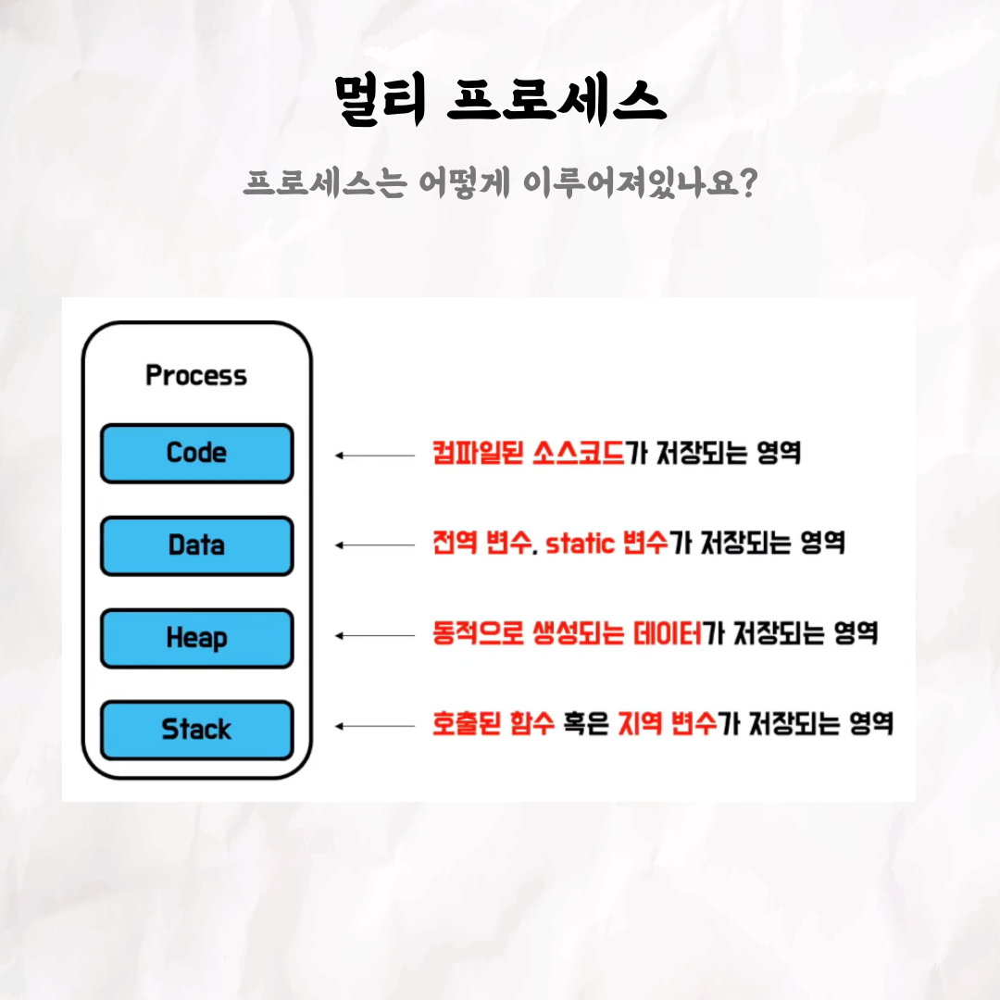

## 후니의 스프링 트랜잭션

### 1번

### 2번

### 3번

### 4번

### 5번

### 6번

### 7번

### 8번

### 9번

### 10번

📮 테코톡

주제 : Process vs Thread

발표자 : 쿼리치 🤑

우아한테크코스만의 문화인 테코톡, 이번 주인공은 쿼리치입니다 🎉
면접 단골 질문 중 하나의 프로세스와 스레드가 이번 주제입니다 ㅎㅎ
아는 내용이지만, 한 번에 대답하기 어렵지 않으셨나요?
프로세스와 스레드의 차이에 대해서 궁금하다면 10분 남짓의 영상을 시청해보는건 어떨까요❓

영상은 유튜브에 "쿼리치의 Process vs Thread"로 검색하시면 찾아보실 수 있습니다.

우아한Tech 유튜브 : https://www.youtube.com/c/%EC%9A%B0%EC%95%84%ED%95%9CTech

우아한테크코스 홈페이지 : https://woowacourse.github.io

우테코 블로그(Tecoble) : https://tecoble.techcourse.co.kr

#우아한테크코스 #우테코 #잠실 #선릉 #부트캠프 #java #javascript #spring #react #개발문화 #개발 #개발자 #wooteco #techcourse #테코톡 #tecotalk #프로세스 # Process #스레드 #Thread
