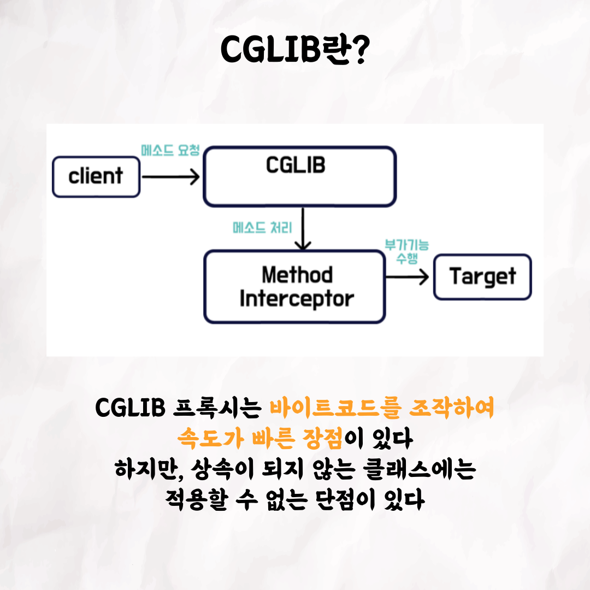

### 테코톡 - 기론, 리버의 JDK Dynamic Proxy와 CGLIB

📮 테코톡

주제: JDK Dynamic Proxy와 CGLIB

발표자: 기론, 리버

스프링의 큰 축을 담당하는 프록시! 공부하면 할수록 굉장히 어려운 개념인데요. 그럼에도 백엔드 크루인 기론과 리버가 정말 디테일하게 조사한 결과를
테코톡에서 발표해주었는데요! 아시는 분이라면 한 번 더 확인해보시는 기회로, 모르시는 분이라면 자세한 설명으로 큰 그림을 그리는 것은 어떨까요?

우아한Tech 유튜브:https://www.youtube.com/c/%EC%9A%B0%EC%95%84%ED%95%9CTech

우아한테크코스 홈페이지:https://woowacourse.github.io

우테코 블로그(Tecoble):https://tecoble.techcourse.co.kr

#우아한테크코스#우테코#테코톡#개발자#java#javascript#spring#react#개발문화#개발#개발자#woowahantechcourse#wooteco#techcourse#브라우저렌더링#브라우저#browser#HTML#CSS
