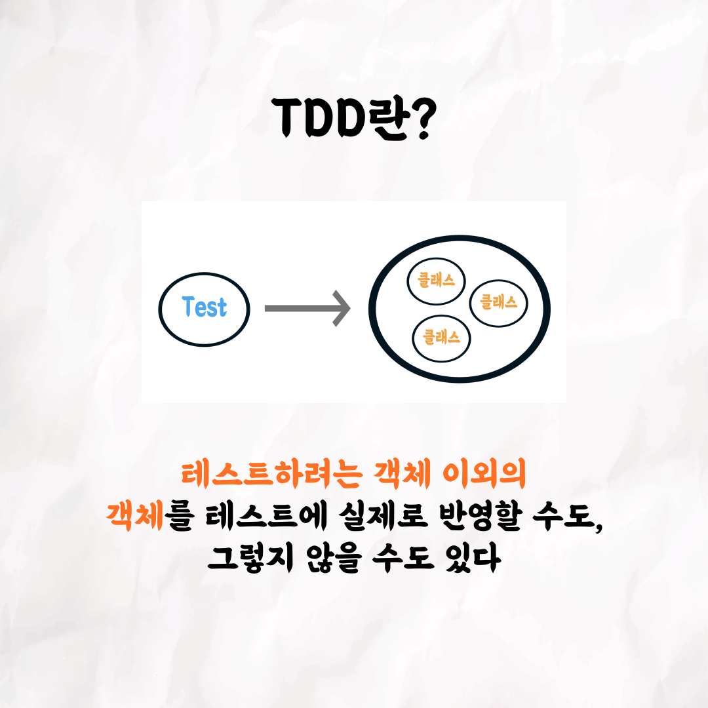

### 테코톡 - 더즈 & 티키 Classic TDD vs Mockist TDD

주제: Classic TDD vs Mockist TDD

발표자: 더즈, 티키

테스트 코드는 개발에 있어서 안정감을 느끼게 해주는 장치인데요. 요즘에는 많은 곳에서 TDD를 쓰고 있습니다.
그런데 테스트 코드 작성 방식에 있어서도 Classic TDD와 Mockist TDD가 나뉘는데요!
생소한 두 진영을 백엔드 크루인 더즈와 티키가 상세히 설명해드립니다. 각 진영의 장점과 단점, 탄생배경과
테스트의 여러 관점에서 디테일한 비교가 궁금하시다면 유튜브에서 확인해보세요!

우아한Tech 유튜브:https://www.youtube.com/c/%EC%9A%B0%EC%95%84%ED%95%9CTech

우아한테크코스 홈페이지:https://woowacourse.github.io

우테코 블로그(Tecoble):https://tecoble.techcourse.co.kr

#우아한테크코스#우테코#테코톡#개발자#java#javascript#spring#react#개발문화#개발#개발자#woowahantechcourse#wooteco#techcourse
