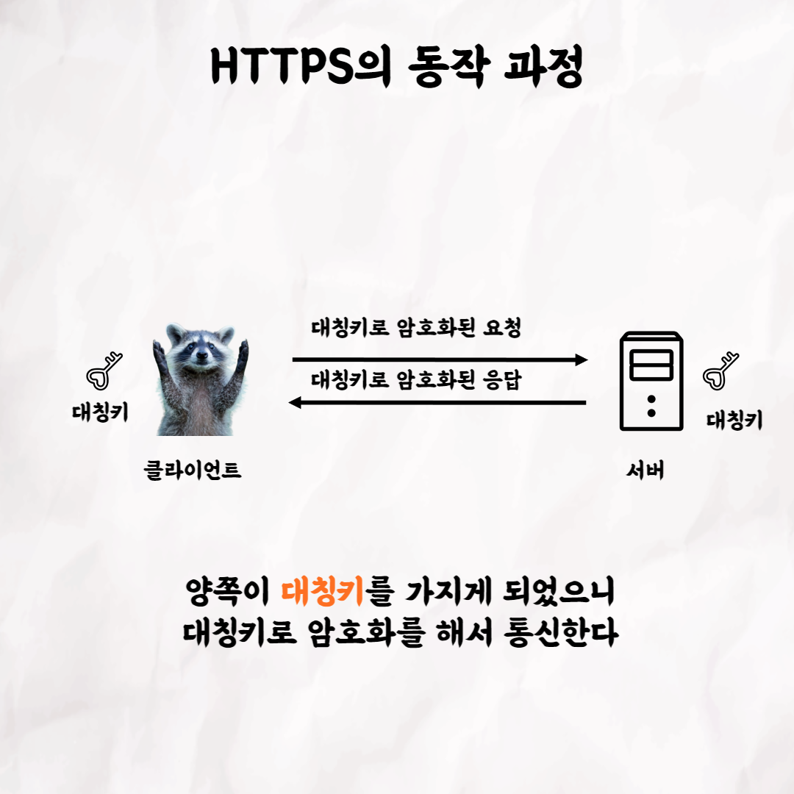

### 테코톡 - 라쿤의 Https

📮 테코톡

주제: Https

발표자: 라쿤

우테코만의 문화인 테코톡에서 라쿤이 Https를 주제로 발표를 해주었어요👏 Http에 보안 기능이 강화된 기술입니다. 
우리가 웹 접속을 할 때 사용하는 Https 몰랐다면 라쿤의 테코톡으로 Https를 공부해보는건 어떨까요?

 영상은 유튜브에 "라쿤의 Https"으로 검색하시면 찾아보실 수 있습니다

우아한Tech 유튜브:https://www.youtube.com/c/%EC%9A%B0%EC%95%84%ED%95%9CTech

우아한테크코스 홈페이지:https://woowacourse.github.io

우테코 블로그(Tecoble):https://tecoble.techcourse.co.kr

#우아한테크코스 #우테코 #테코톡 #개발자 #java # javascript #spring #react #JVM #개발문화 #개발 #개발자 #woowahantechcourse #wooteco #techcourse #https