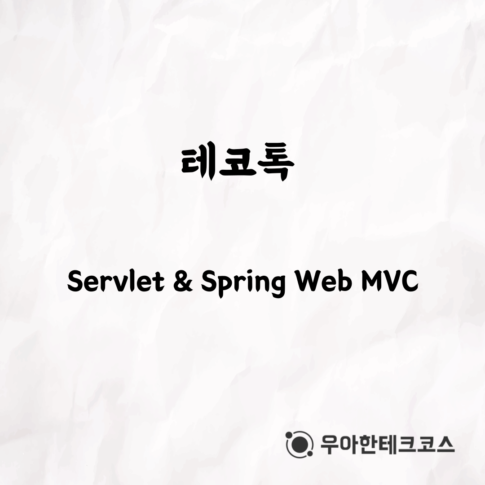
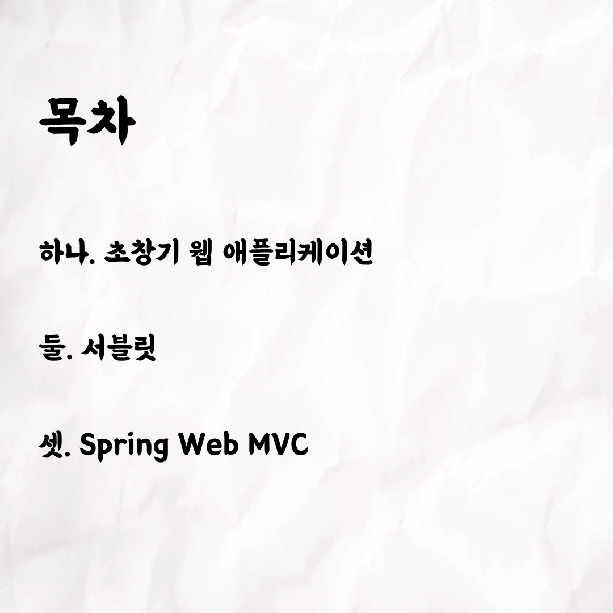
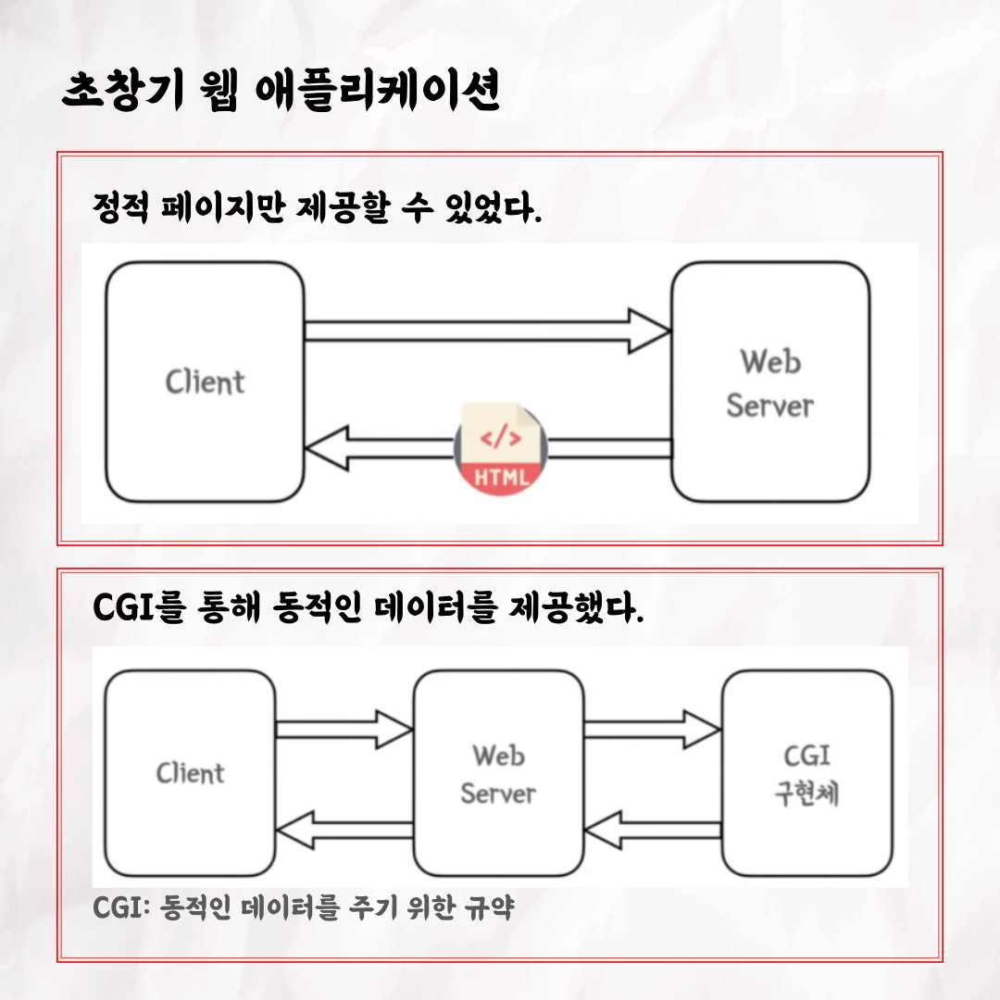
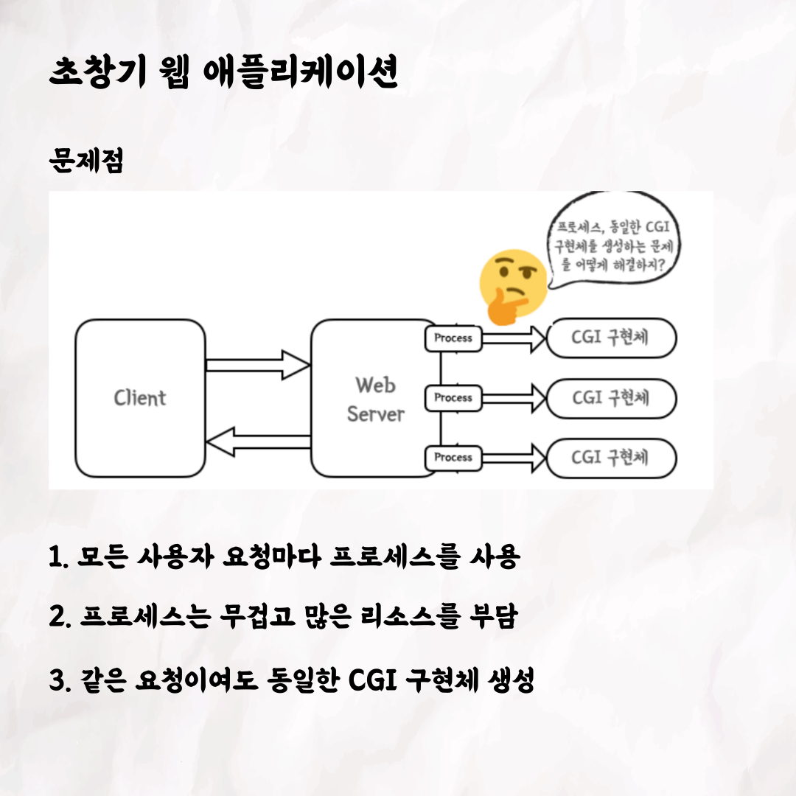
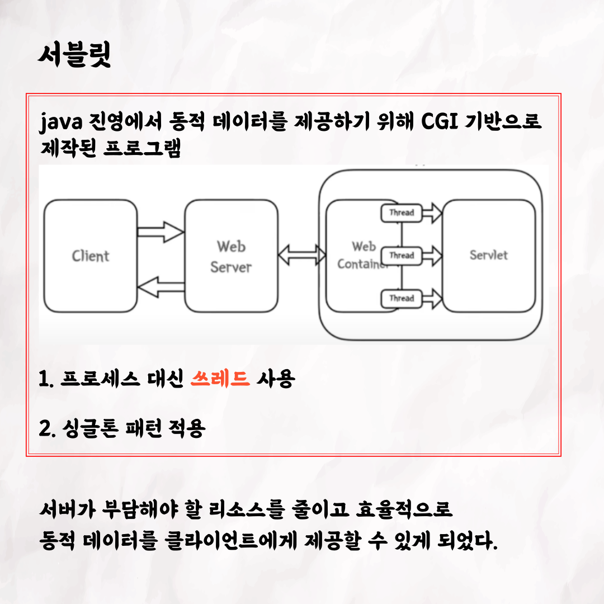
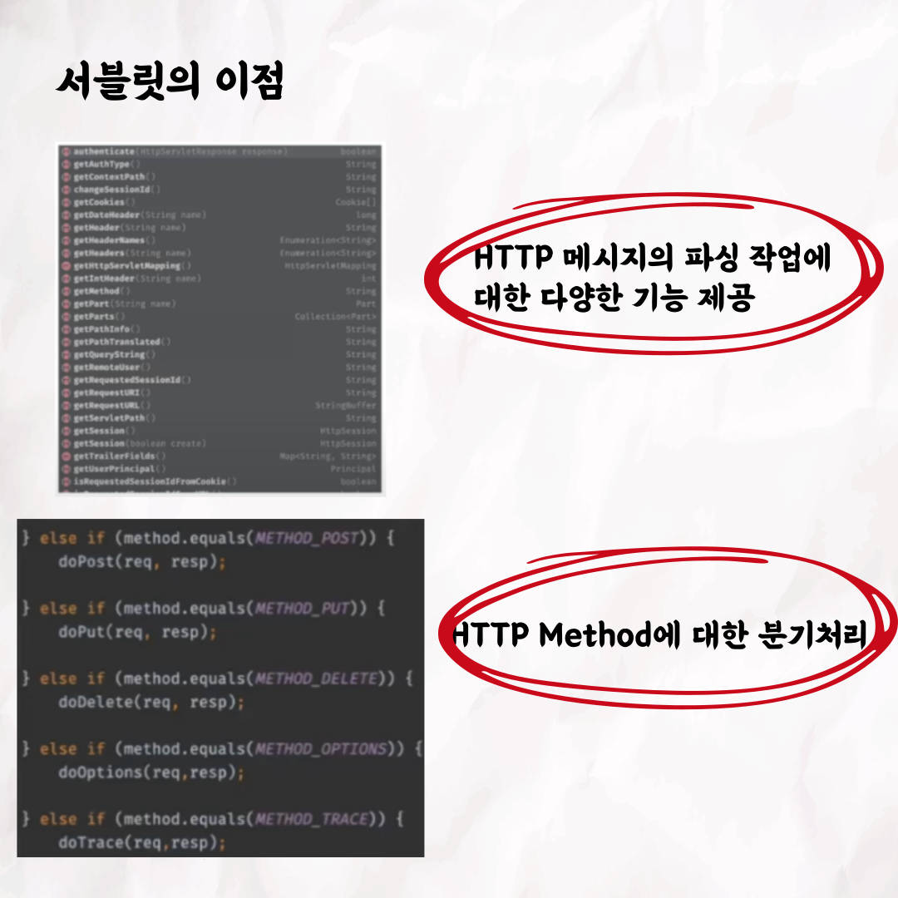
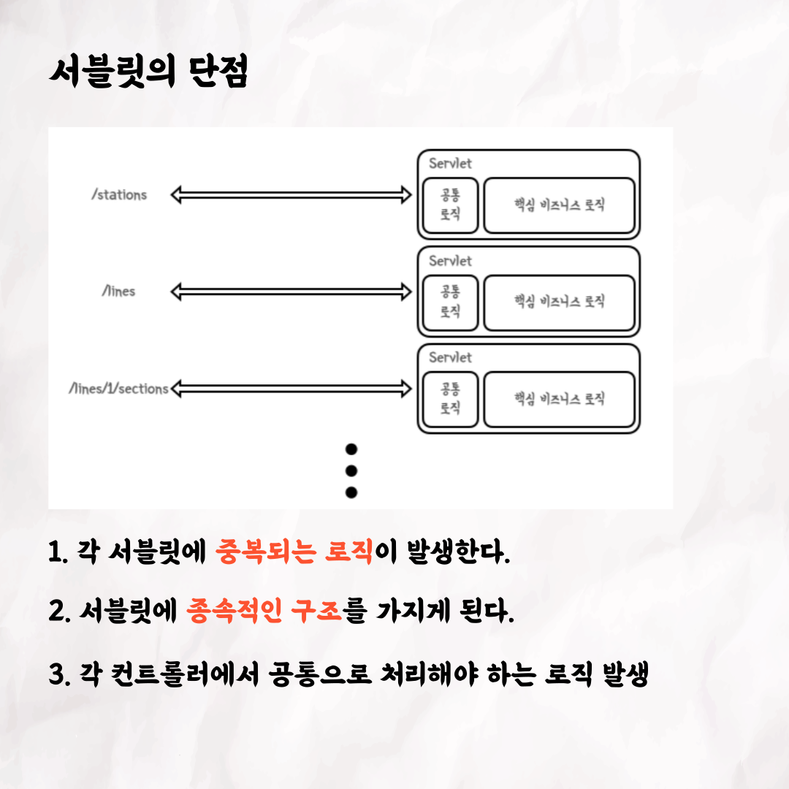
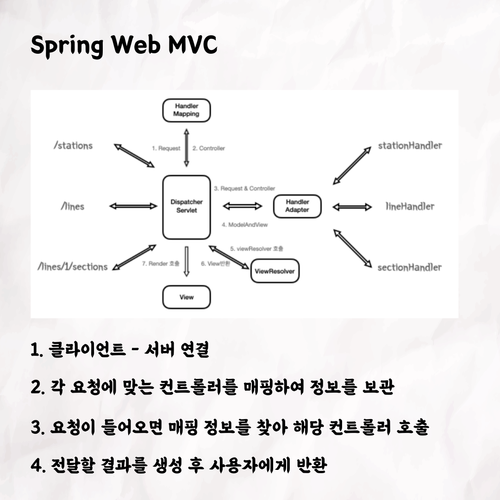
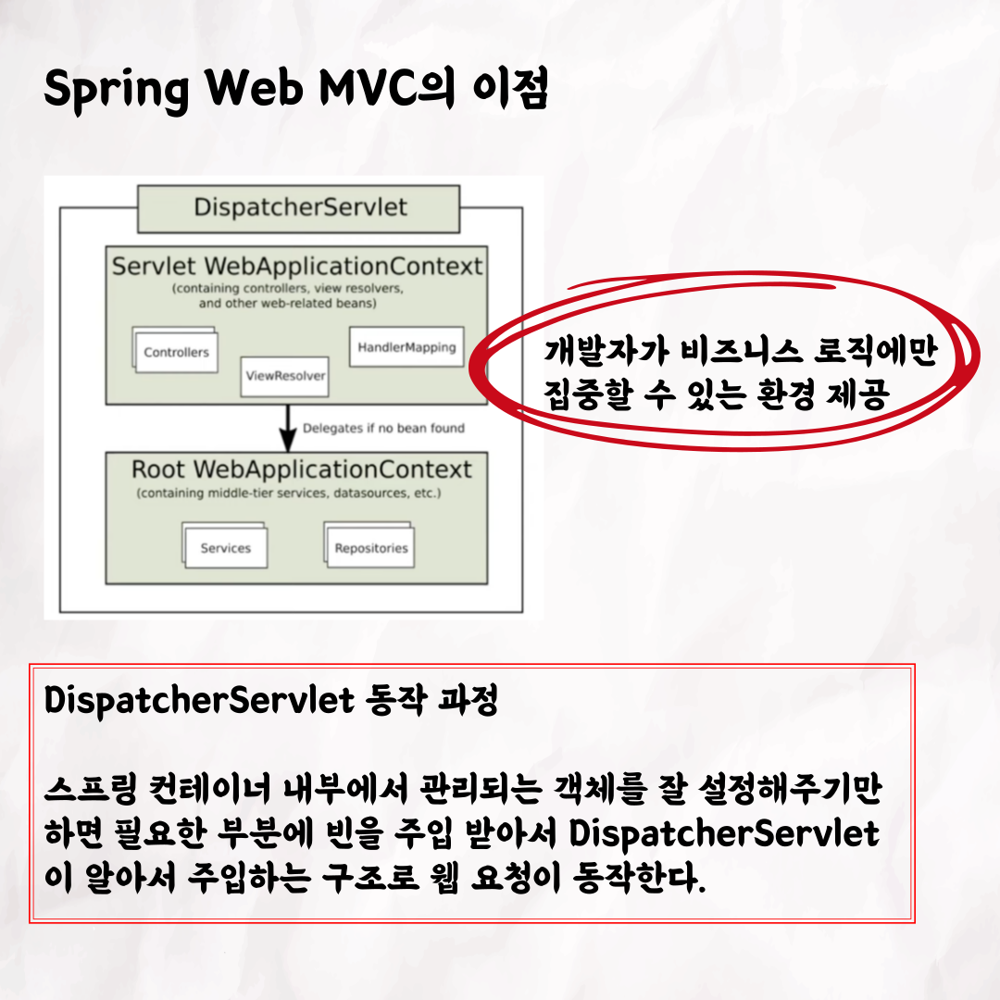
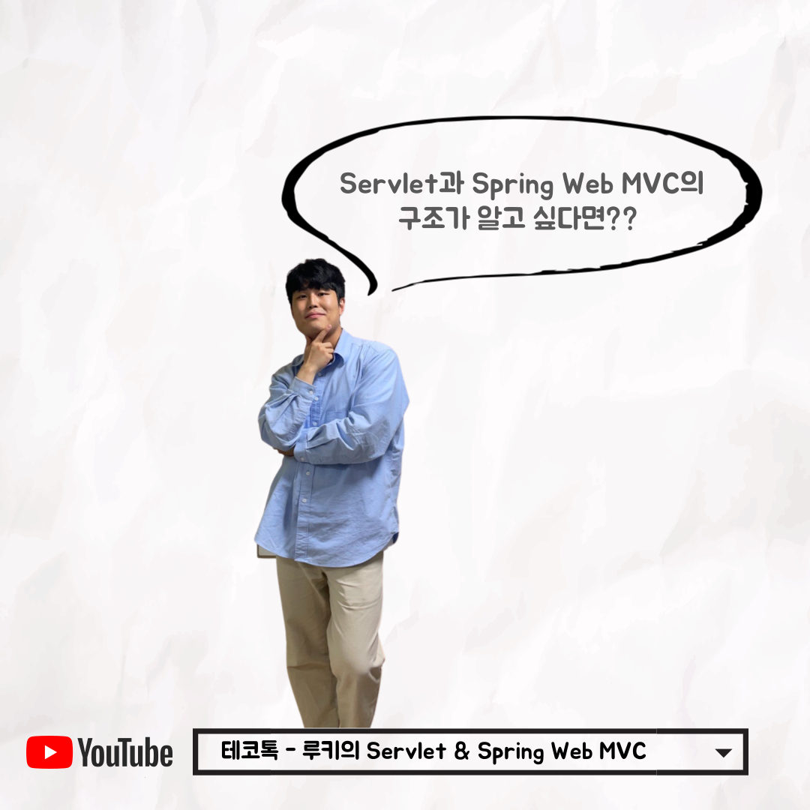

### 테코톡 - 루키의 Servlet & Spring Web MVC

📮 테코톡

주제: Servlet & Spring Web MVC

발표자: 루키🍀

우테코만의 문화인 테코톡에서 루키가 Servlet & Spring Web MVC에 관련된 주제로 발표를 해주었어요👏
Servlet과 Spring Web MVC의 구조를 알고 싶다면 10분 남짓의 루키의 테코톡을 들어보는 건 어떨까요?

영상은 유튜브에 "루키의 Servlet & Spring Web MVC"으로 검색하시면 찾아보실 수 있습니다

우아한Tech 유튜브:https://www.youtube.com/c/%EC%9A%B0%EC%95%84%ED%95%9CTech

우아한테크코스 홈페이지:https://woowacourse.github.io

우테코 블로그(Tecoble):https://tecoble.techcourse.co.kr

#우아한테크코스#우테코#테코톡#개발자#java#javascript#spring#react#개발문화#개발#개발자#woowahantechcourse#wooteco#techcourse#Spring#SpringBoot#Servlet#SpringWebMVC
