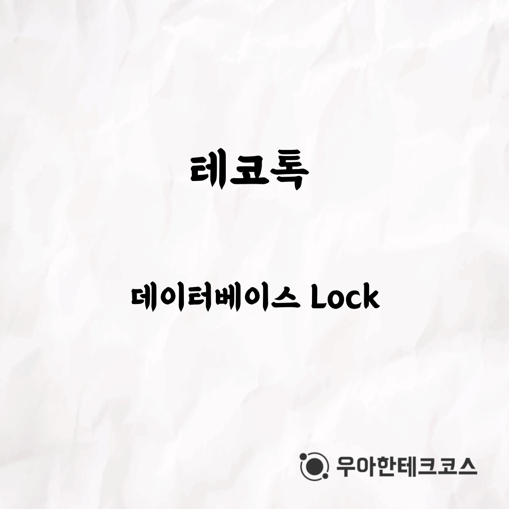
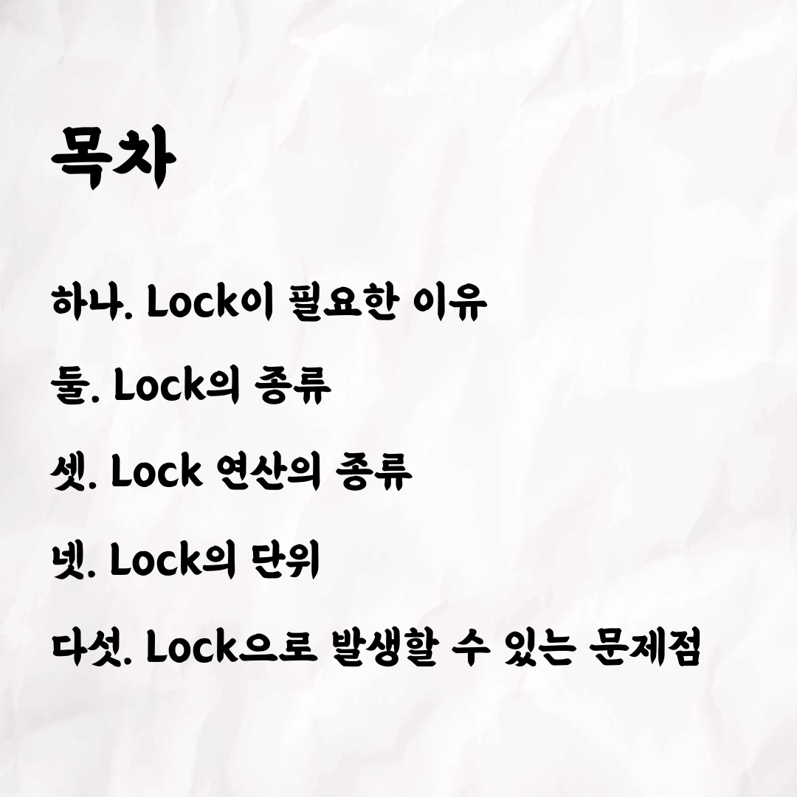
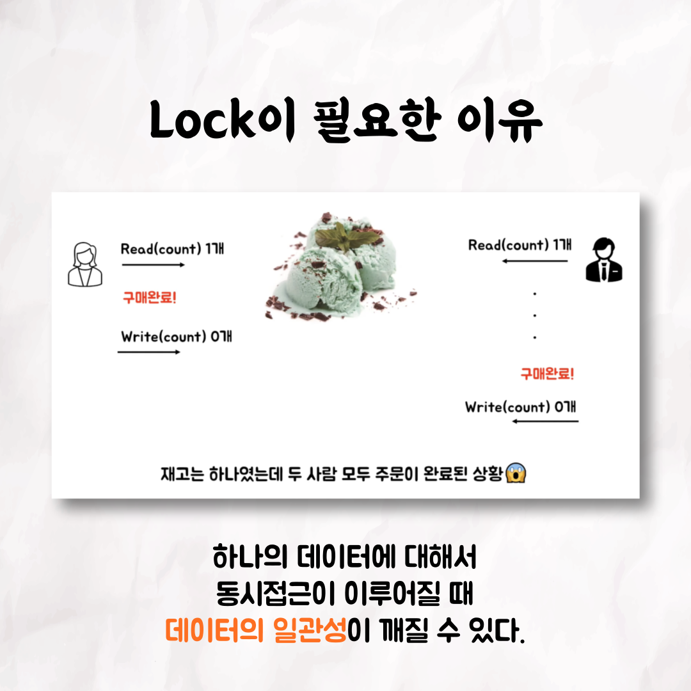
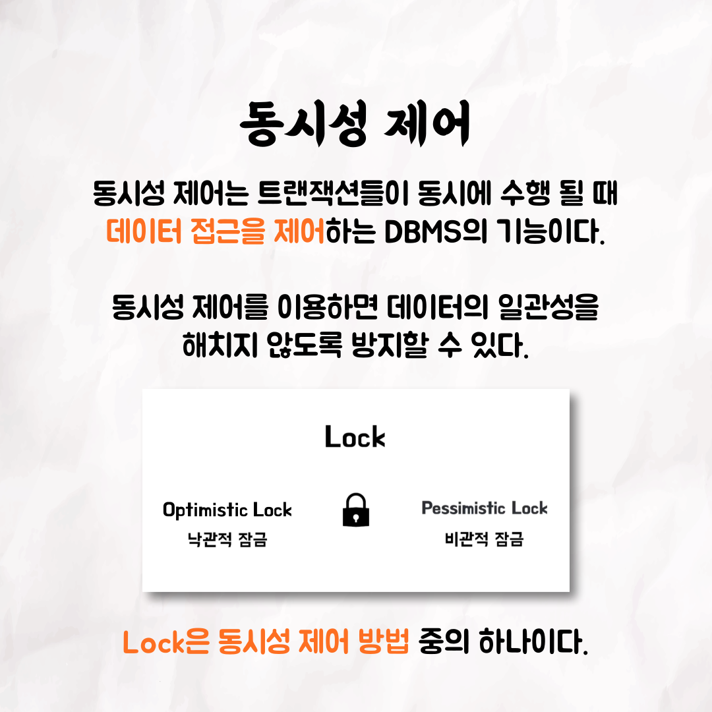
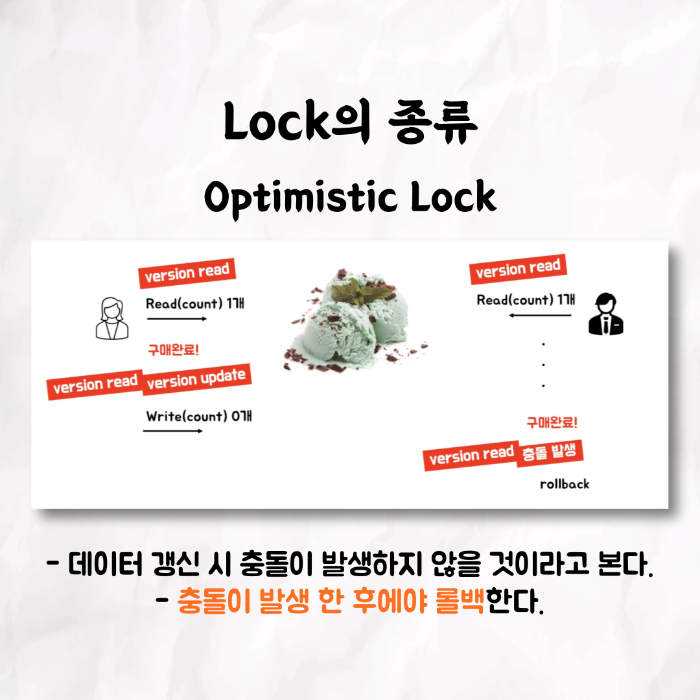
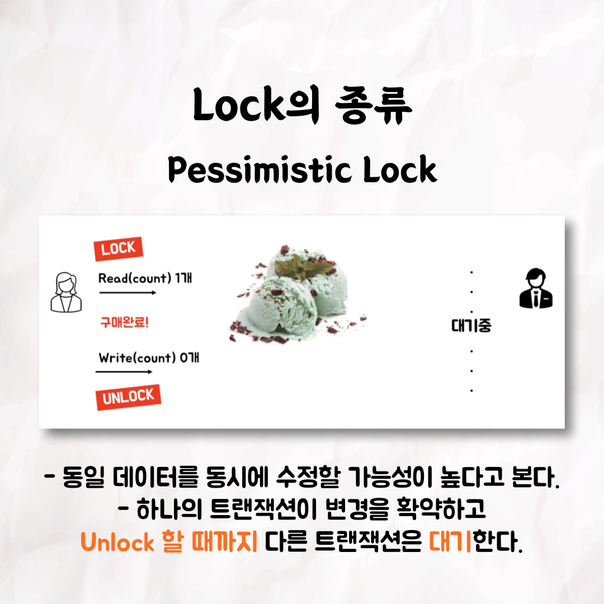
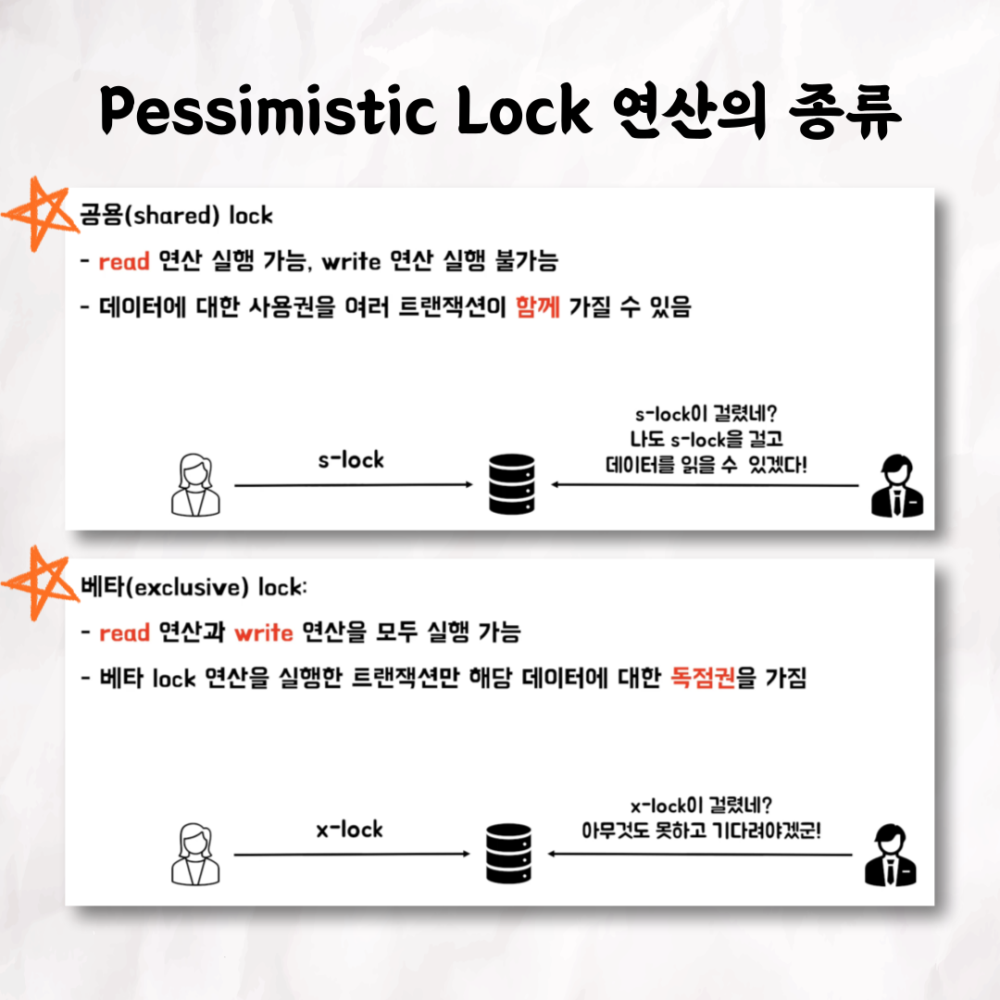
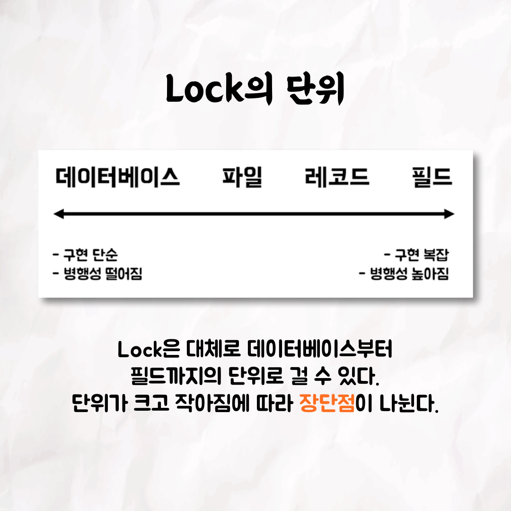
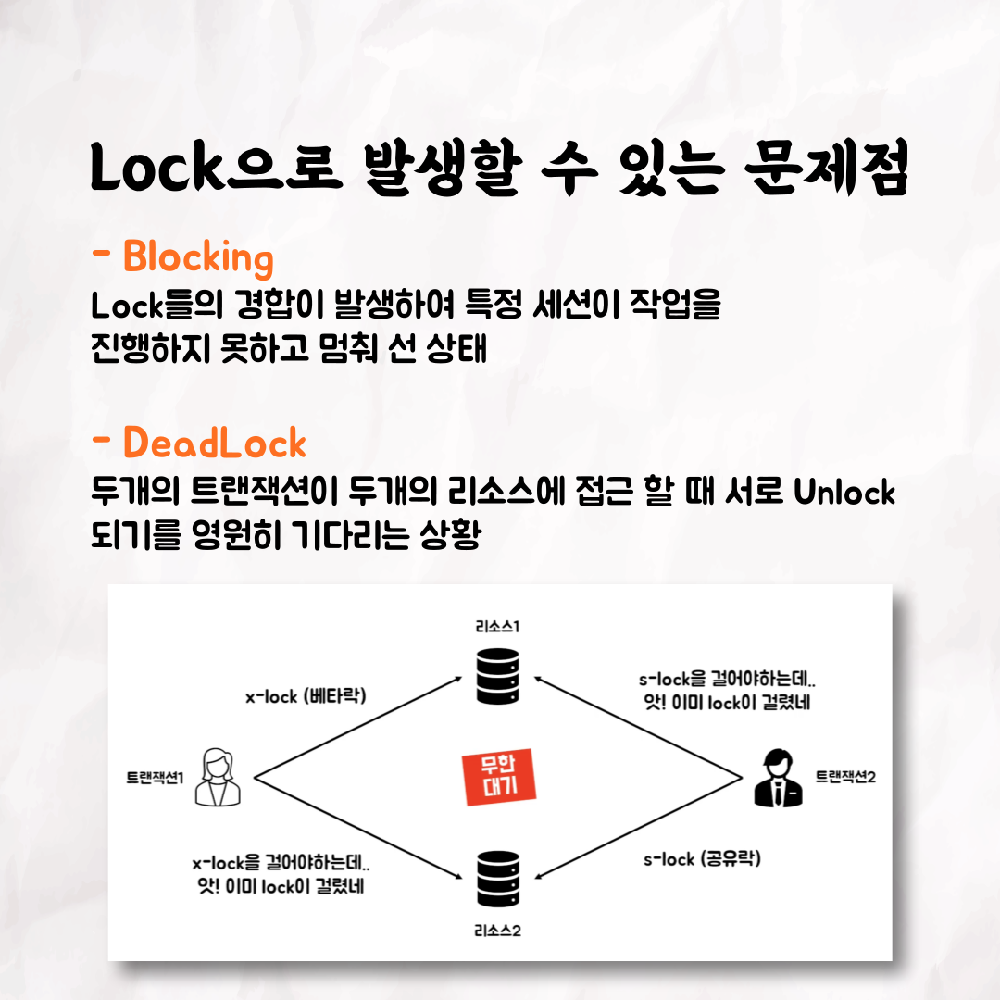

001

002

003

004

005

006

007

008

009

010

📮 테코톡

주제: 데이터베이스 Lock

발표자: 마루🍒🍵

이번엔 마루가 데이터베이스 Lock을 발표해주었습니다~👏
데이터베이스 Lock이 생소하신 분들은 영상을 한번 보시는 건 어떨까요?
Lock의 종류부터, 발생할 수 있는 문제점까지 다루고 있으니 확인해보세요!

영상은 유튜브에 "마루의 데이터베이스 Lock"으로 검색하시면 찾아보실 수 있습니다.

우아한Tech 유튜브:https://www.youtube.com/c/%EC%9A%B0%EC%95%84%ED%95%9CTech

우아한테크코스 홈페이지:https://woowacourse.github.io

우테코 블로그(Tecoble):https://tecoble.techcourse.co.kr

#우아한테크코스 #우테코 #테코톡 #개발자 #java # javascript #spring #react #JVM #개발문화 #개발 #개발자 #woowahantechcourse #wooteco #techcourse #database
