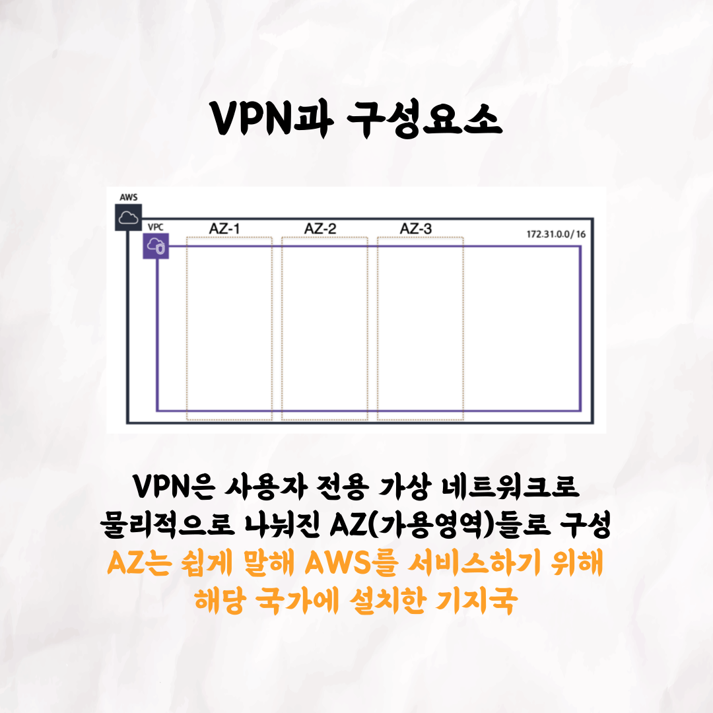

## 애쉬의 AWS 알은체 하기

### 1번 - 표지

### 2번

### 3번

### 4번

### 5번

### 6번

### 7번

### 8번

### 9번

### 10번

 

테코톡 👩🏻‍💻🧑🏻‍💻

주제 : AWS 살짝 알은체 하기

발표자 : 애쉬

많은 분들이 개발하실 때 AWS 서비스를 이용하고 계신데요!
막상 처음 사용하시다 보면 막막하기도 하고, 도대체 어떻게 구성되어 있는지 궁금하셨을텐데요 🤔
백엔드 크루 애쉬가 AWS EC2에 대한 용어설명과 내부구조를 상세히 알려드립니다!
영상은 유튜브에 "애쉬의 AWS 살짝 알은체 하기"로 검색하시면 찾아보실 수 있습니다.  
우아한Tech 유튜브 : https://www.youtube.com/c/%EC%9A%B0%EC%95%84%ED%95%9CTech

우아한테크코스 홈페이지 : https://woowacourse.github.io

우테코 블로그(Tecoble) : https://tecoble.techcourse.co.kr

#우아한테크코스 #우테코 #잠실 #선릉 #부트캠프 #java #javascript #spring #react #개발문화 #개발 #개발자 #wooteco #techcourse #테코톡 #tecotalk
