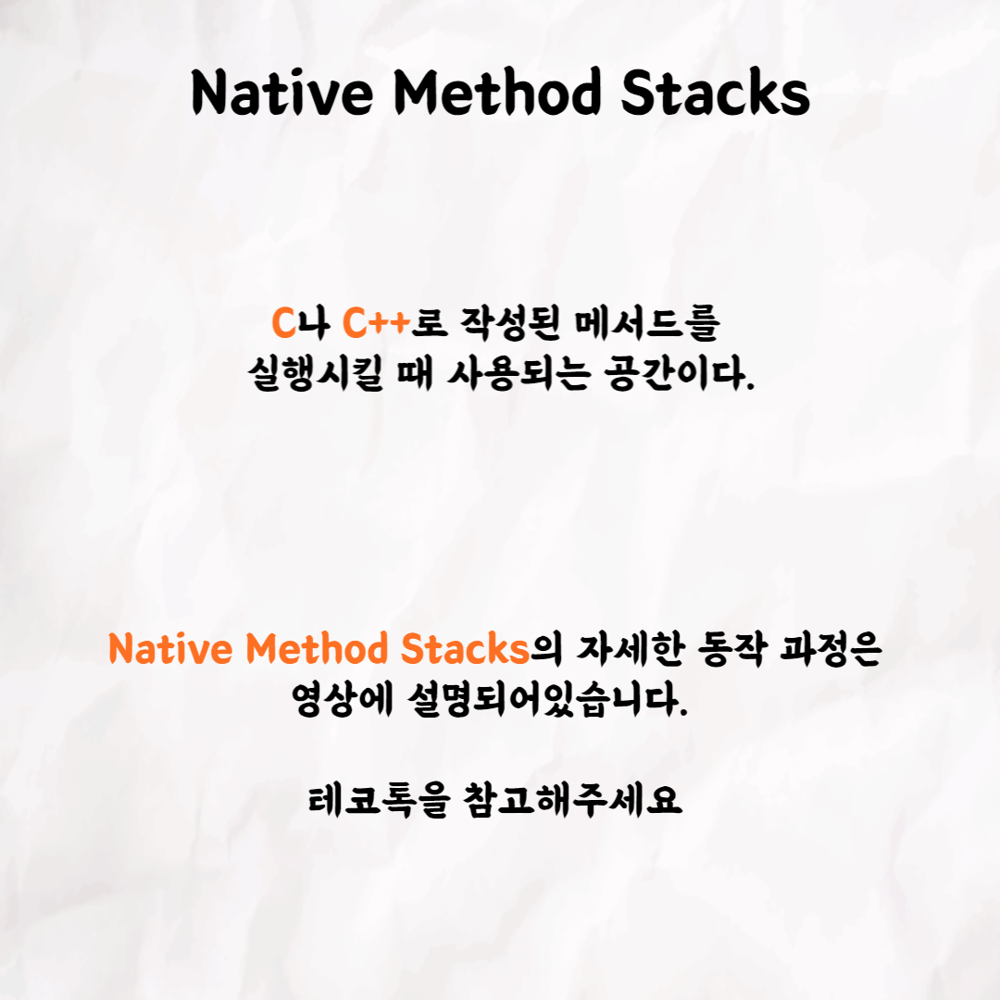

### 테코톡 - 어썸오의 JVM Memory Layout

📮 테코톡

주제: JVM Memory Layout

발표자: 어썸오🏝️

우테코만의 문화인 테코톡에서 어썸오가 JVM Memory Layout이라는 주제로 발표를 해주었어요👏 우리가 사용하는 자바가 실행될 때 내부적으로 어떤 과정이 일어나는지에 관련한 기술입니다. 
우리가 작성한 코드가 실행될 때 어떤 과정을 거치는지 몰랐다면 어썸오의 테코톡으로 JVM Memory Layout을 공부해보는건 어떨까요?

 영상은 유튜브에 "어썸오의 JVM Memory Layout"으로 검색하시면 찾아보실 수 있습니다

우아한Tech 유튜브:https://www.youtube.com/c/%EC%9A%B0%EC%95%84%ED%95%9CTech

우아한테크코스 홈페이지:https://woowacourse.github.io

우테코 블로그(Tecoble):https://tecoble.techcourse.co.kr

#우아한테크코스 #우테코 #테코톡 #개발자 #java # javascript #spring #react #JVM #개발문화 #개발 #개발자 #woowahantechcourse #wooteco #techcourse