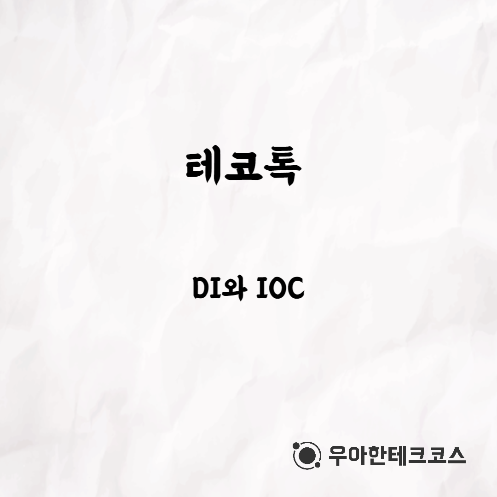
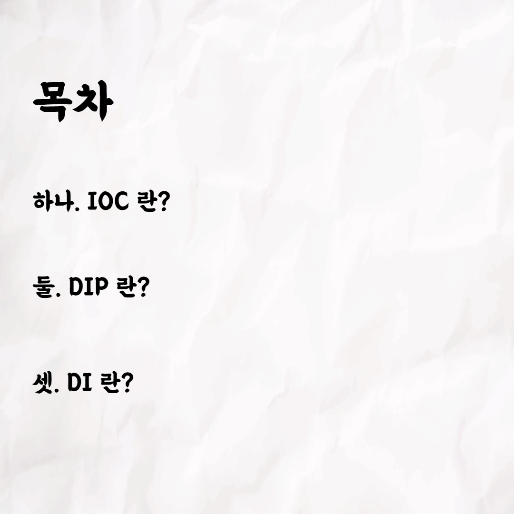
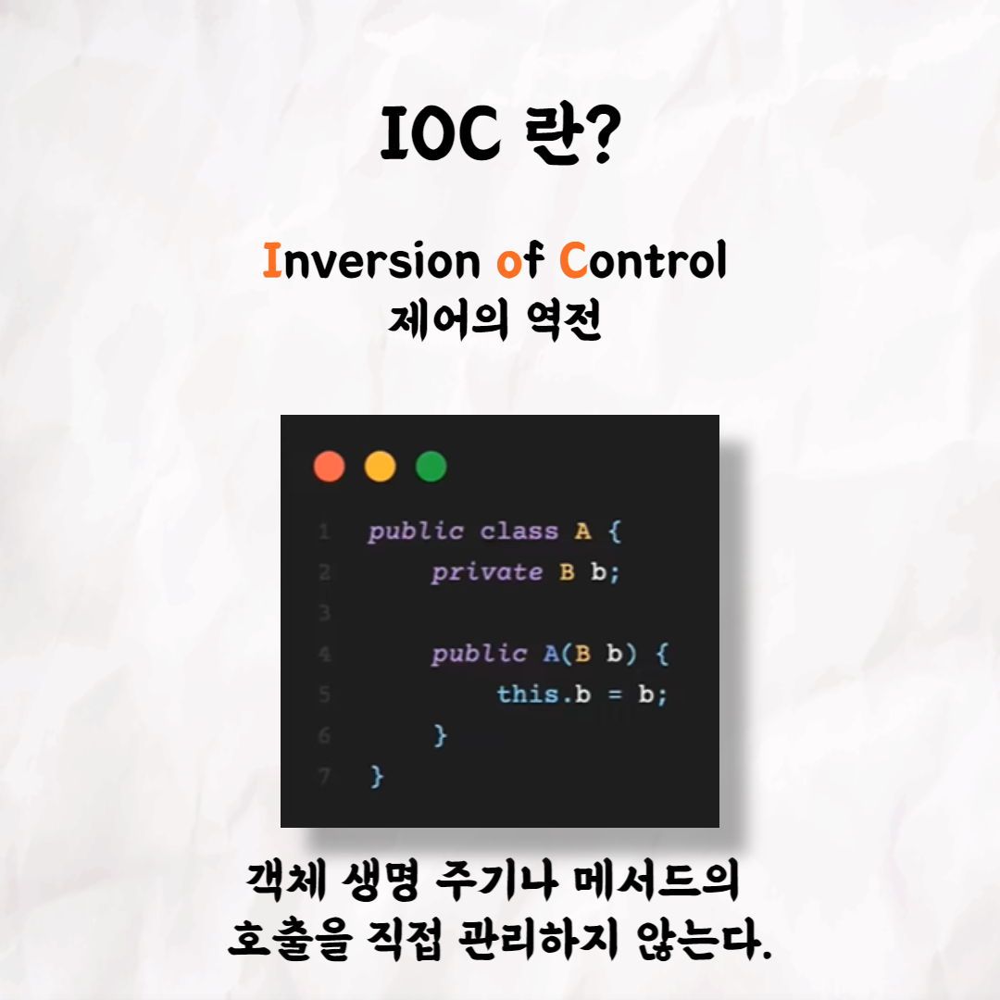
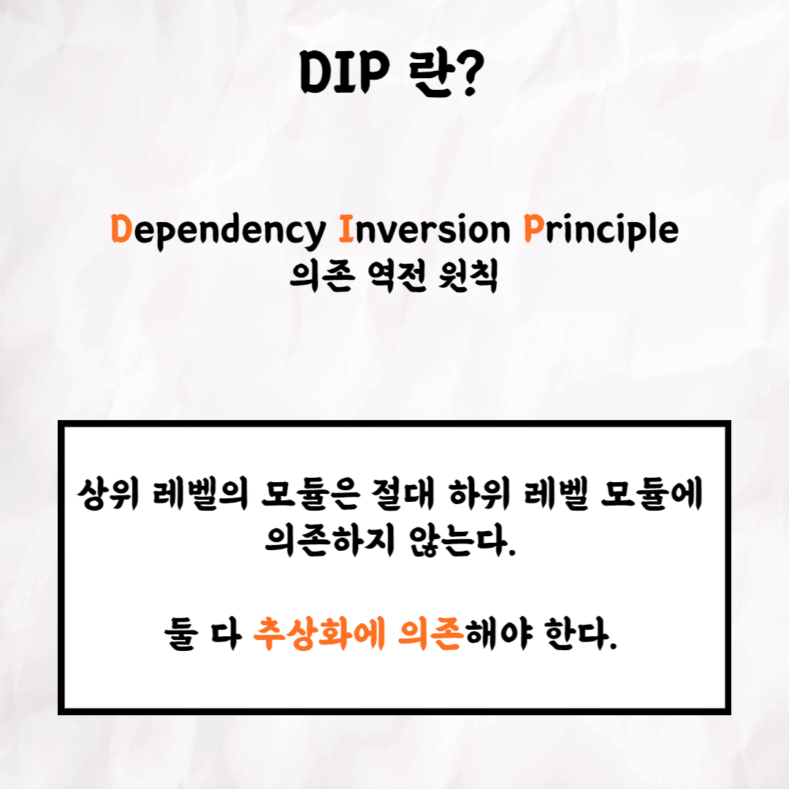
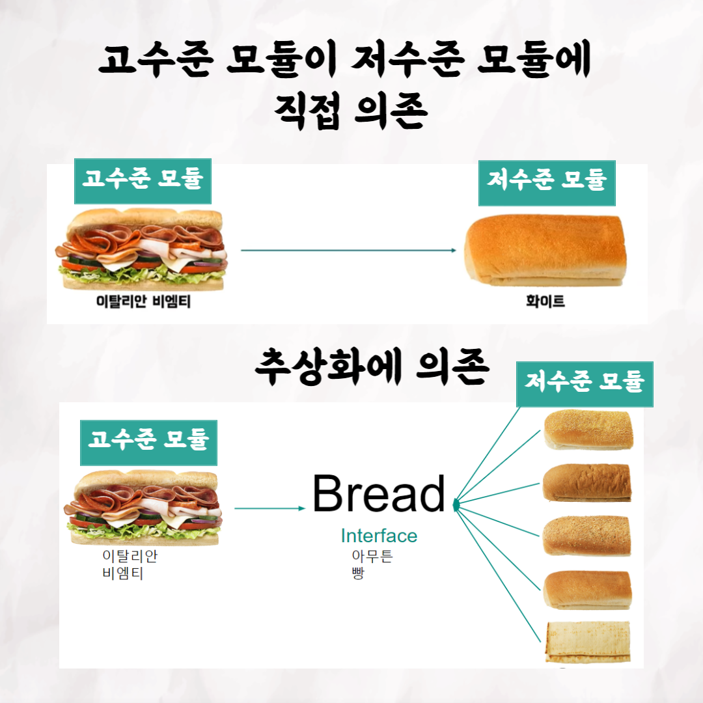
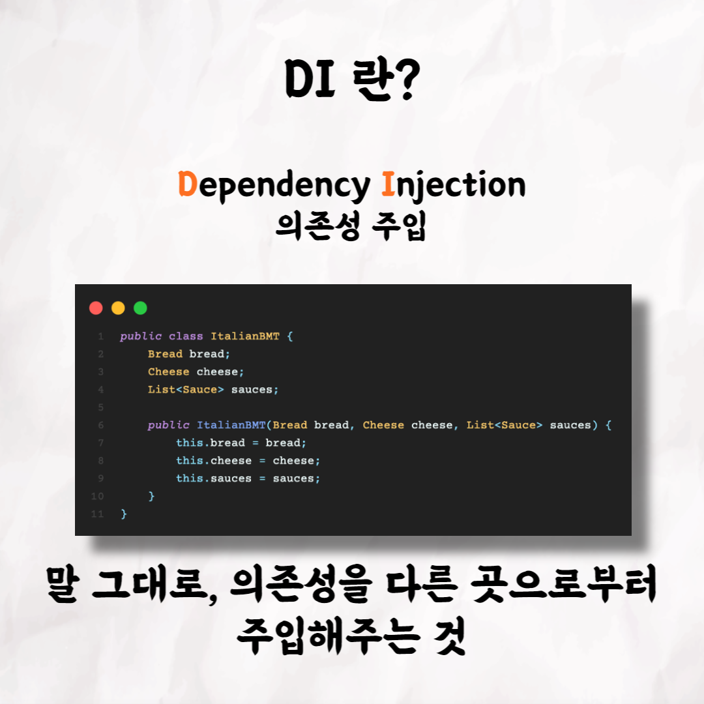
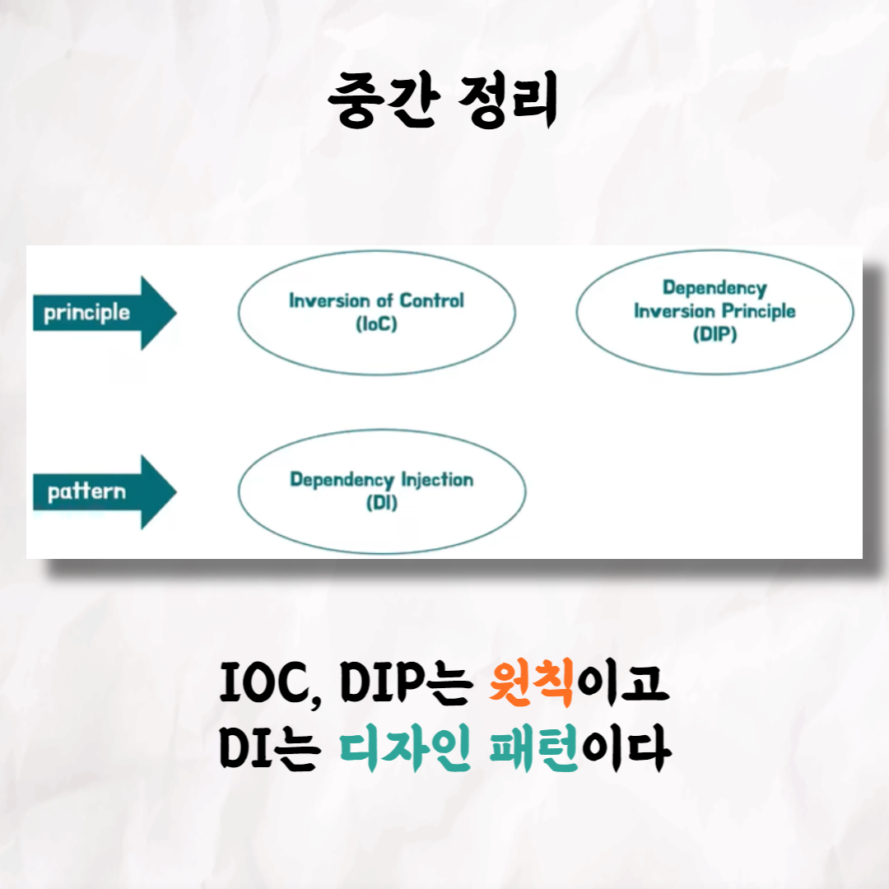
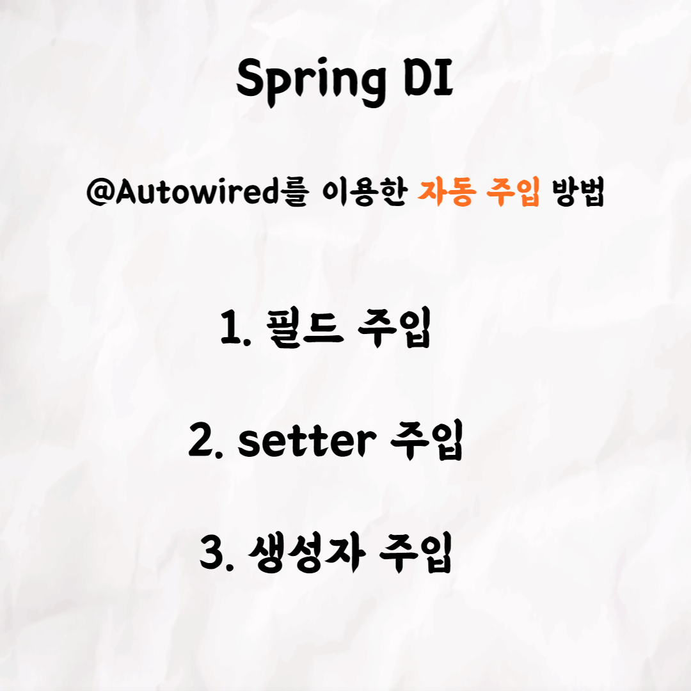

### 테코톡 - 오찌 & 야호의 DI와 IOC

📮 테코톡

주제: DI와 IOC

발표자: 오찌🎤, 야호🥪

우테코만의 문화인 테코톡에서 오찌와 야호가 DI와 IOC라는 주제로 발표를 해주었어요👏\
DI가 무엇이고 IOC가 무엇인지 궁금하신 분들은 영상을 시청하는 것을 추천드려요!

영상 길이는 20분 정도로 출퇴근을 하시는 직장인, 등하교를 하는 학생들에게 부담되지 않고 편하게 들으실 수 있어요!

영상은 유튜브에 "오찌&야호의 DI와 IOC"로 검색하시면 찾아보실 수 있습니다

우아한Tech 유튜브:https://www.youtube.com/c/%EC%9A%B0%EC%95%84%ED%95%9CTech

우아한테크코스 홈페이지:https://woowacourse.github.io

우테코 블로그(Tecoble):https://tecoble.techcourse.co.kr

# 우아한테크코스#우테코#테코톡#개발자#java#javascript#spring#react#개발문화#개발#개발자#woowahantechcourse#wooteco#techcourse
