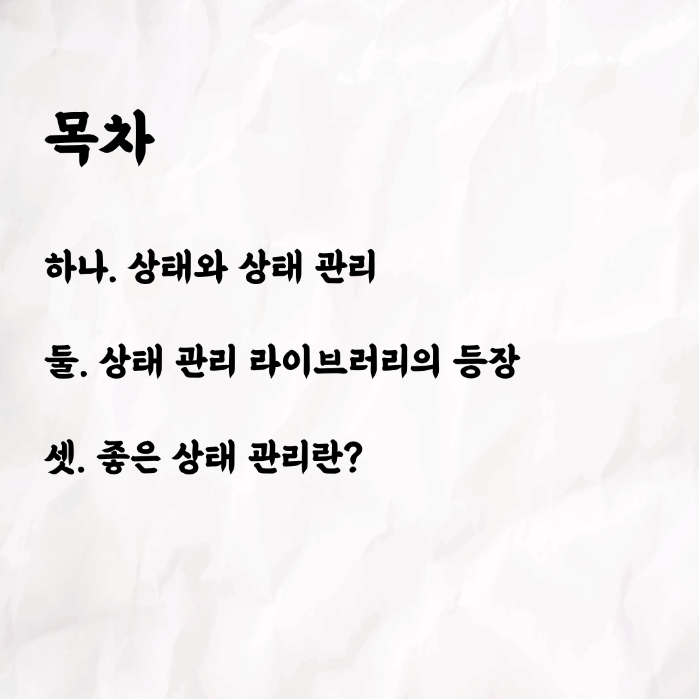
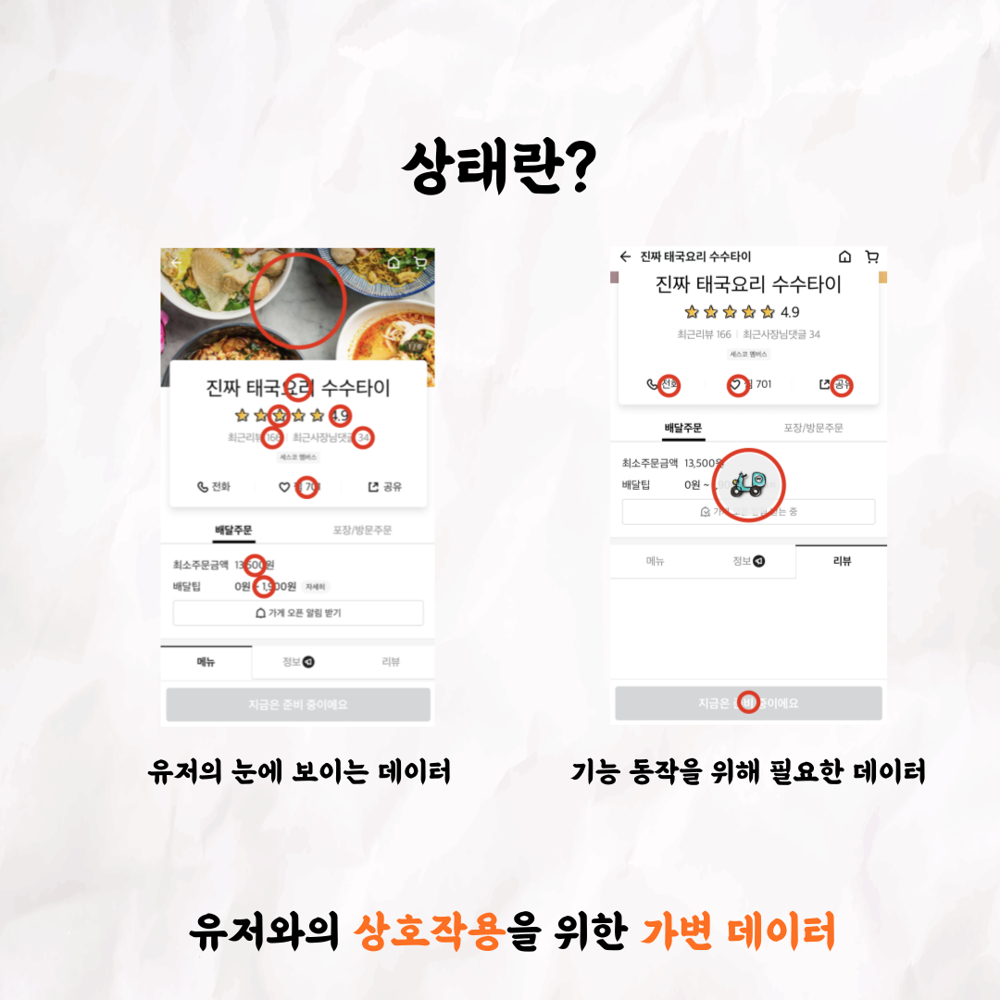
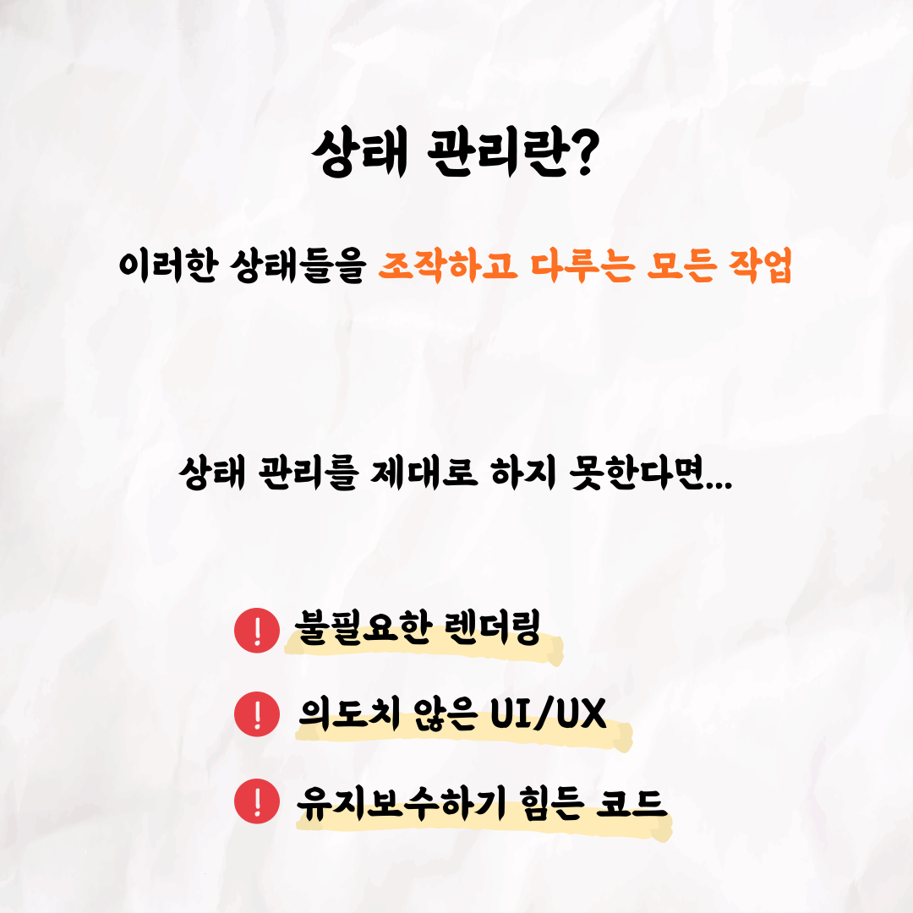
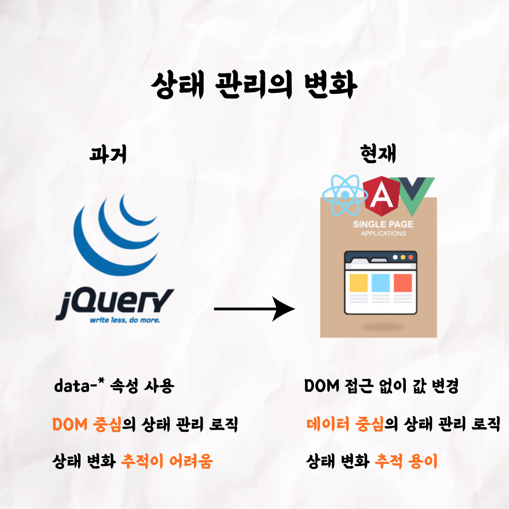
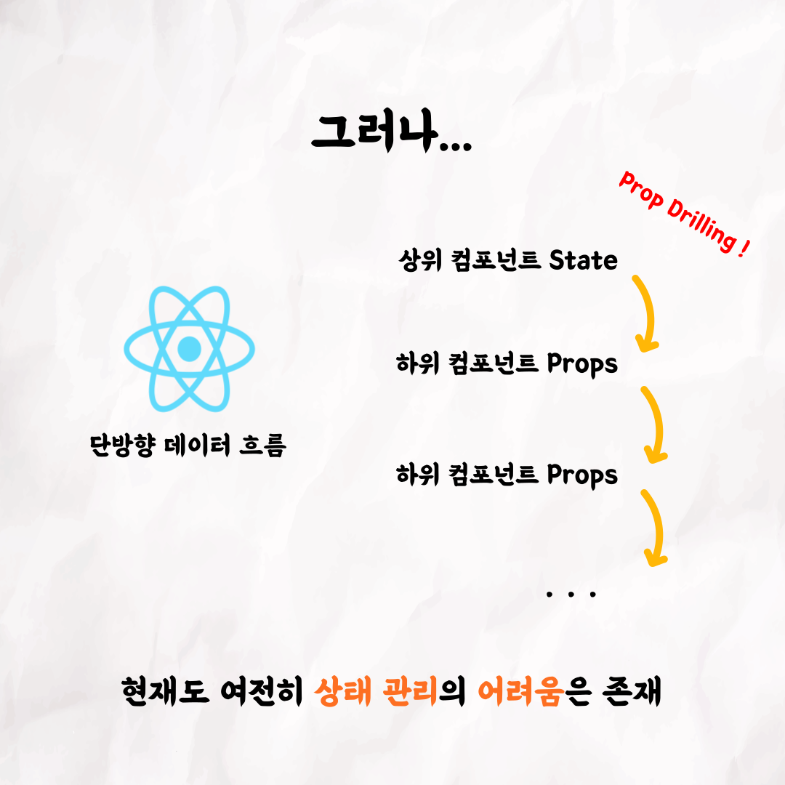
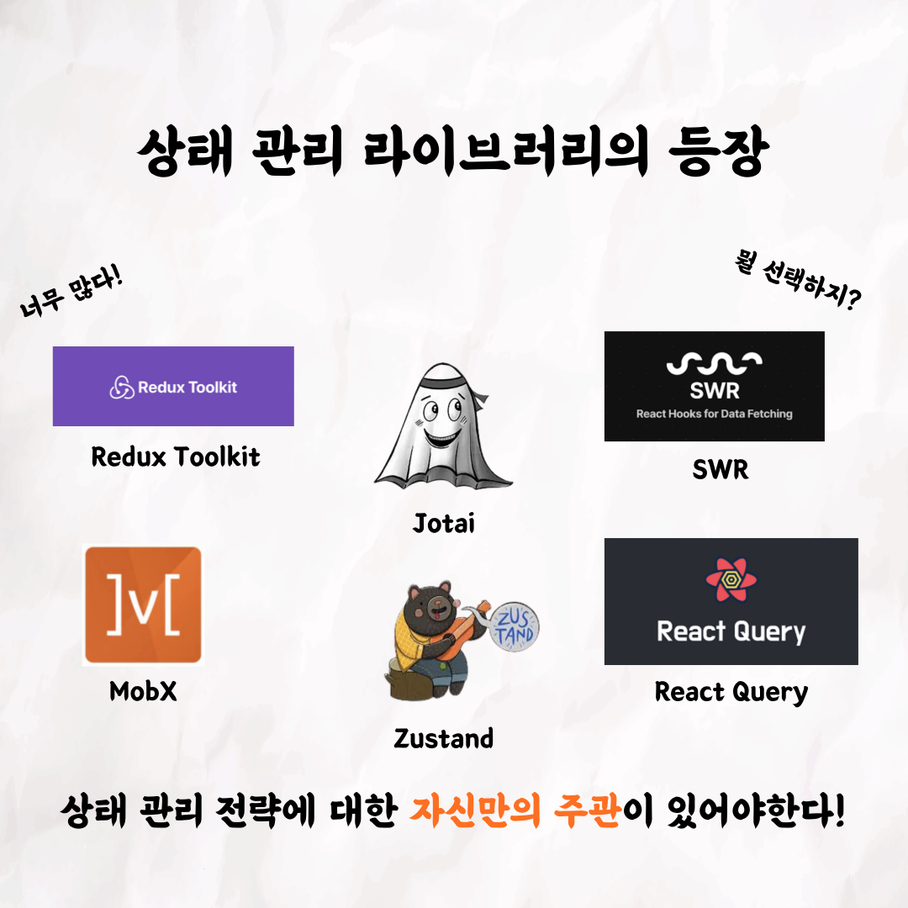
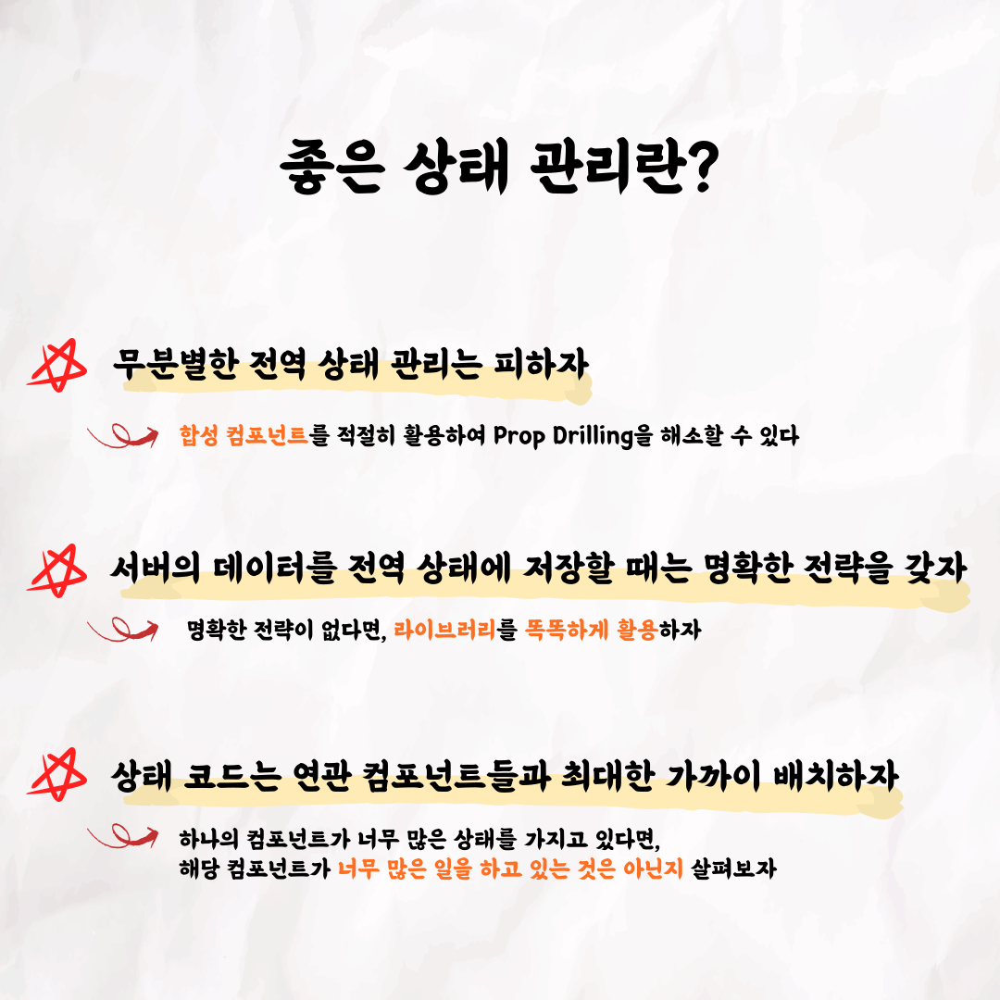

001

002

003

004

005

006

007

008

009

📮 테코톡

주제: 상태 관리

발표자: 온스타

이번 테코톡의 주인공은 온스타입니다. 😆  

프론트엔드 개발을 하다보면 상태 관리에 대해 고민하지 않을 수 없는데요 😭

온스타가 이번에 상태 관리란 무엇이고, 또 좋은 상태 관리란 어떤 것인지에 대해 발표를 진행했습니다❗️

영상은 유튜브에 "온스타의 상태관리"로 검색하시면 찾아보실 수 있습니다!

우아한Tech 유튜브:https://www.youtube.com/c/%EC%9A%B0%EC%95%84%ED%95%9CTech

우아한테크코스 홈페이지:https://woowacourse.github.io

우테코 블로그(Tecoble):https://tecoble.techcourse.co.kr

#우아한테크코스 #우테코 #테코톡 #개발자 #java #javascript #spring #react #개발문화 #개발#개발자 #woowahantechcourse #wooteco #techcourse #state
