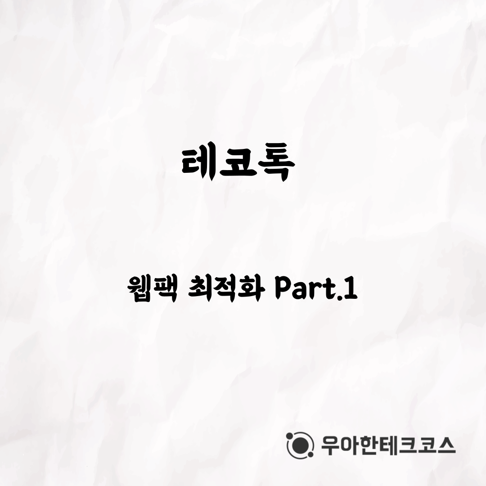
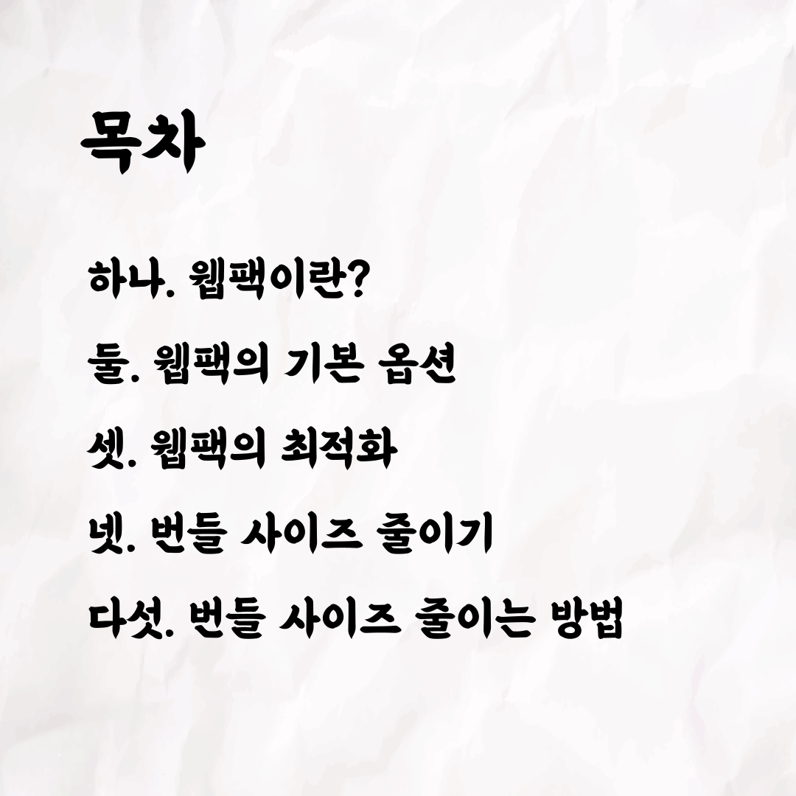
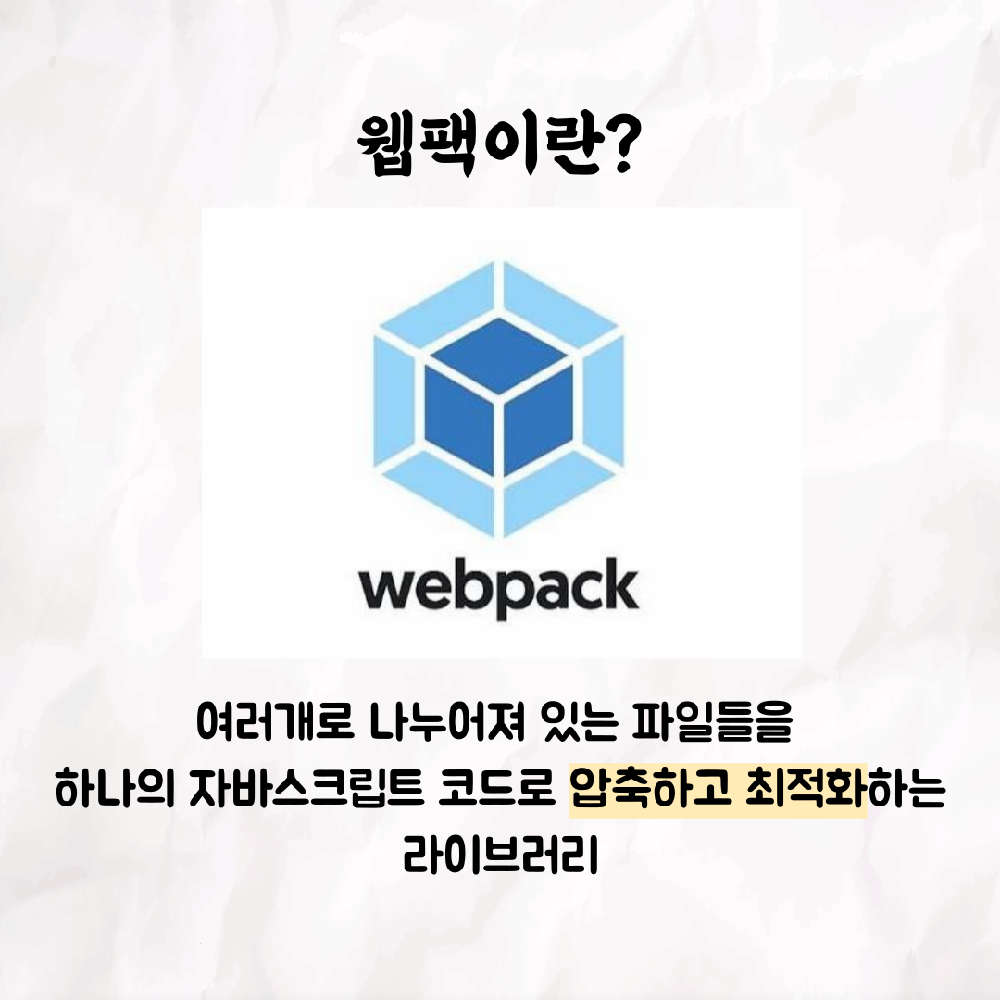
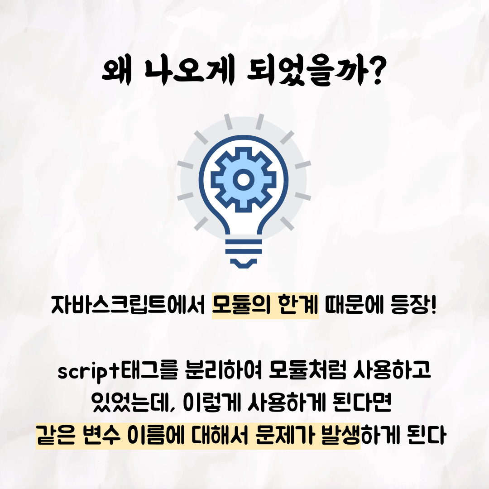
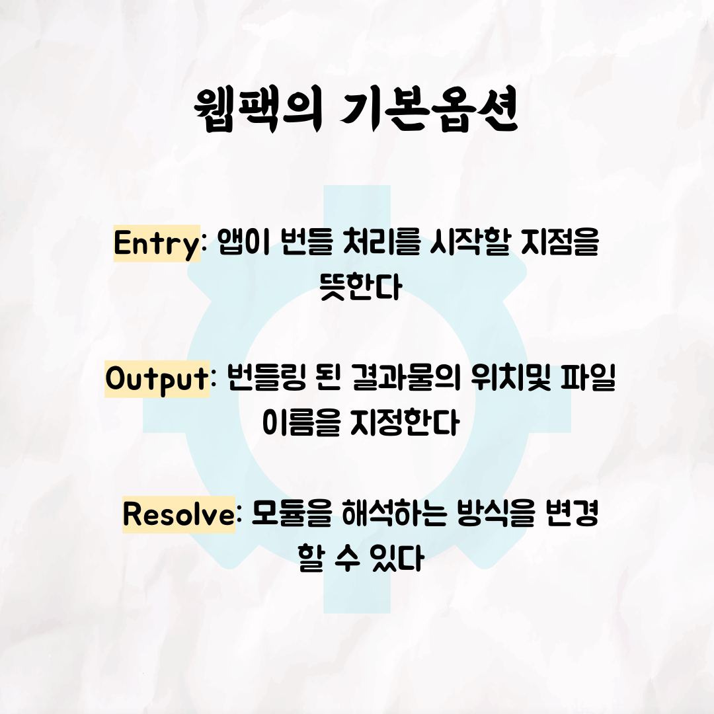
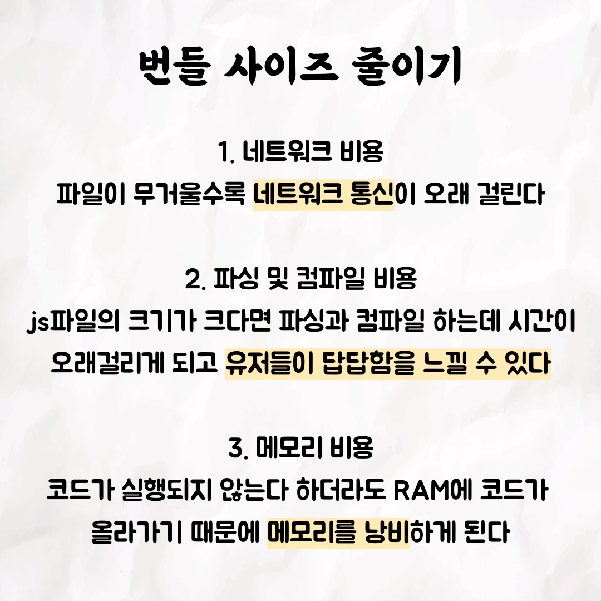
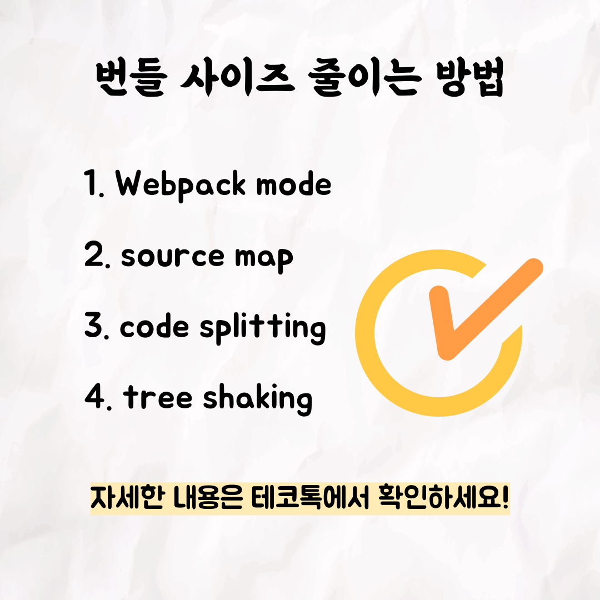

### 사진순서

### 글

테코톡 👩🏻‍💻🧑🏻‍💻

주제 : 웹팩 최적화 Part.1

발표자 : 자스민,병민

우아한테크코스만의 문화인 테코톡,  
이번 주인공은 자스민, 병민인데요 😆  
웹팩 최적화 어떻게 할 수 있을까요?

영상은 유튜브에 "자스민, 병민의 웹팩 최적화" 검색하시면  
찾아보실 수 있습니다.

우아한Tech 유튜브 : https://www.youtube.com/c/%EC%9A%B0%EC%95%84%ED%95%9CTech

우아한테크코스 홈페이지 : https://woowacourse.github.io

우테코 블로그(Tecoble) : https://tecoble.techcourse.co.kr

#우아한테크코스 #우테코 #잠실 #선릉 #부트캠프 #java #javascript #spring #react #개발문화 #개발 #개발자 #wooteco #techcourse #테코톡 #tecotalk #웹팩 #최적화
