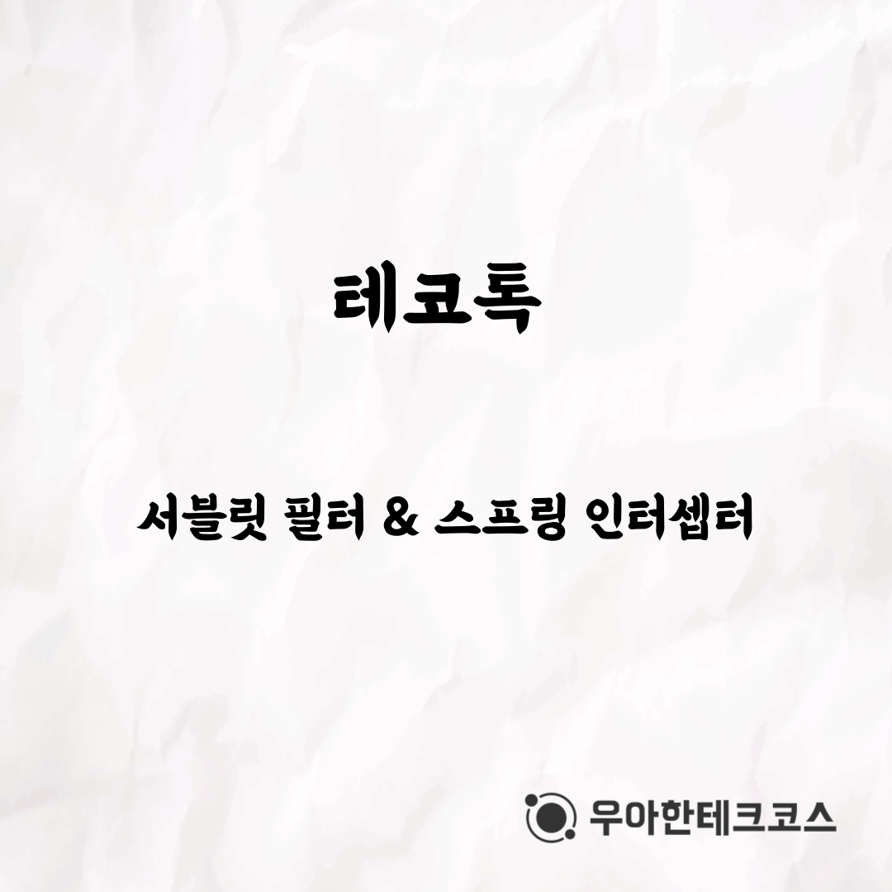
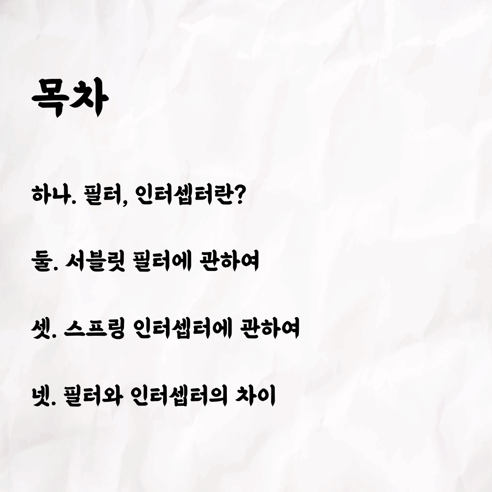
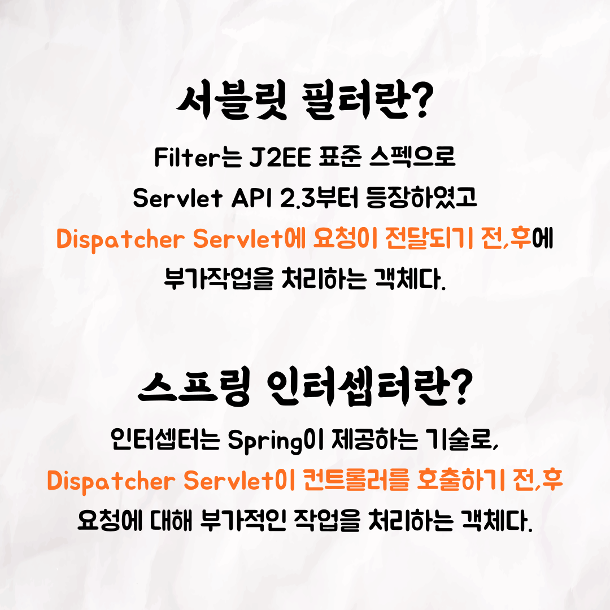
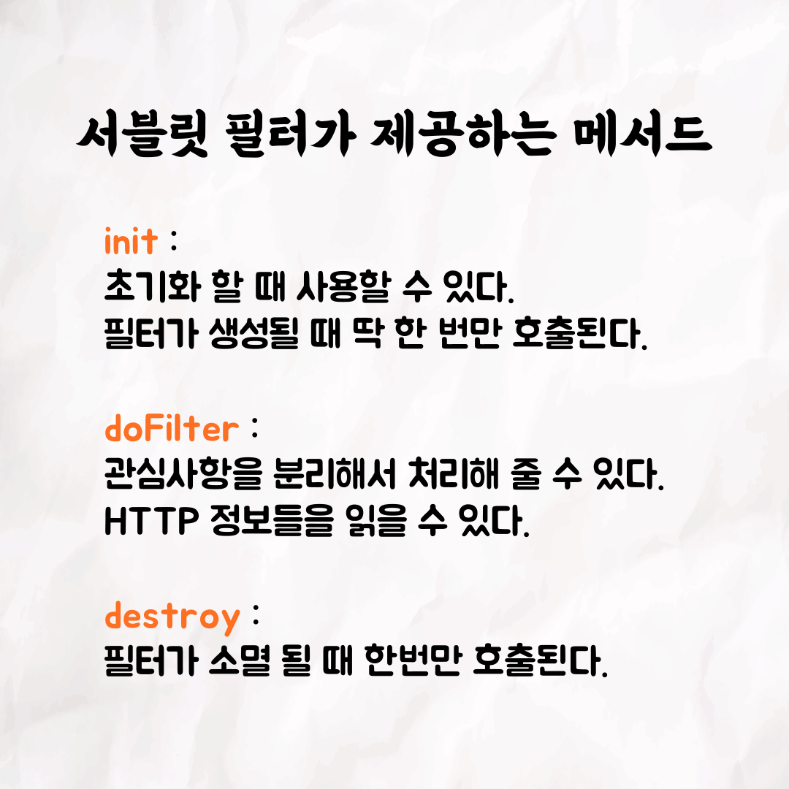
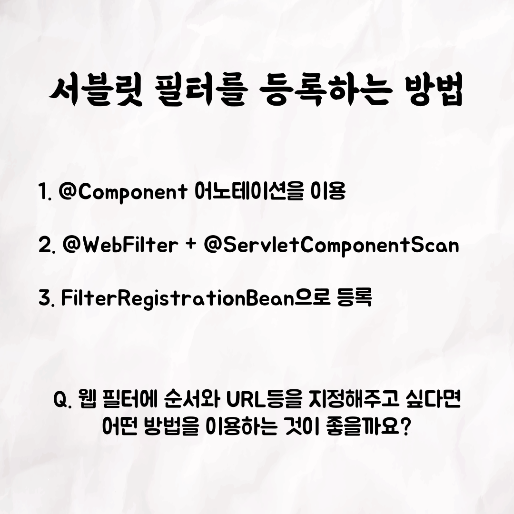
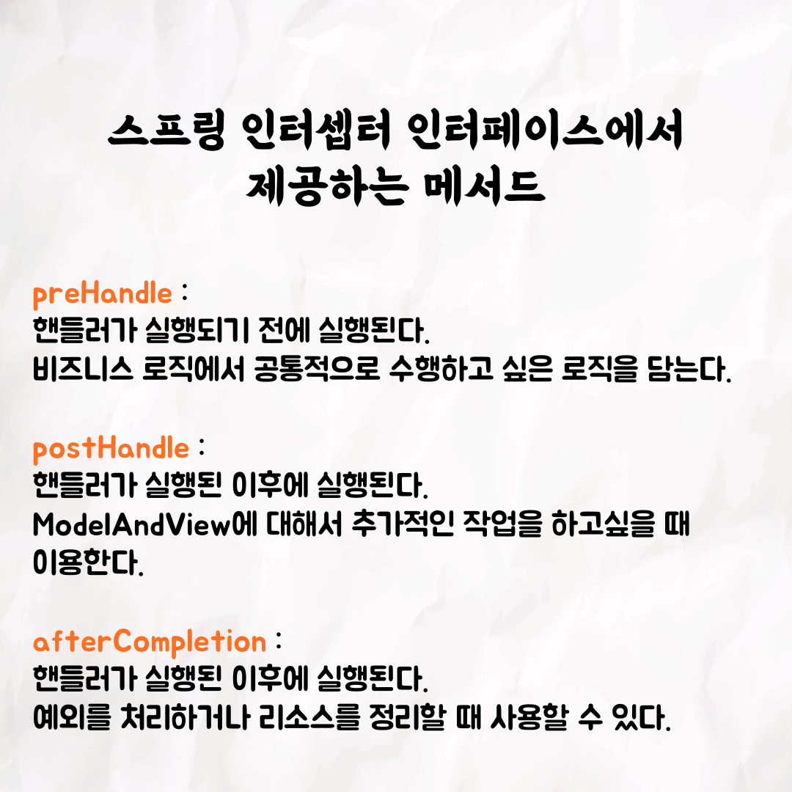
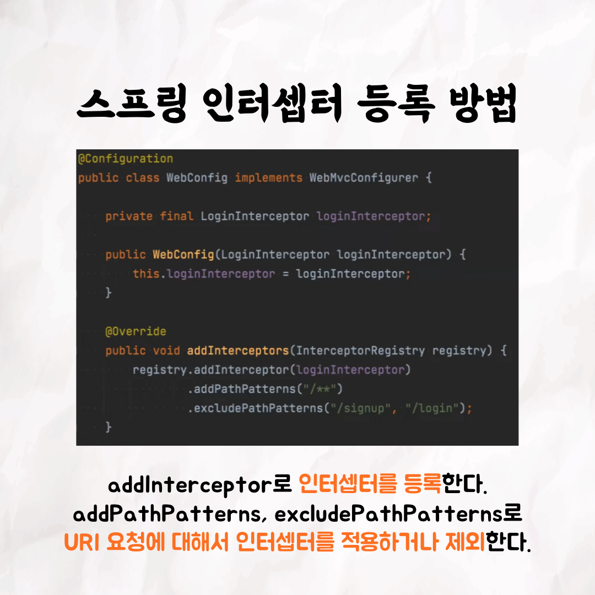
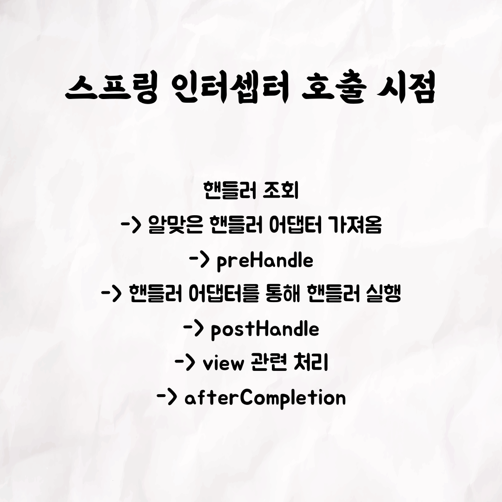
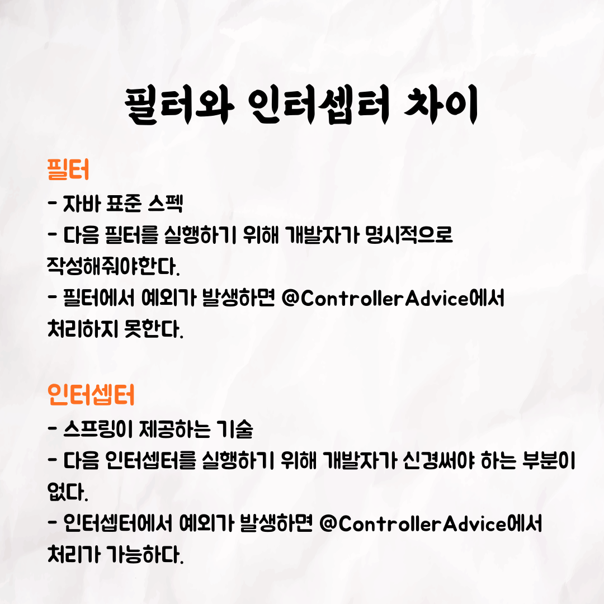

001

002

003

004

005

006

007

008

009

010

📮 테코톡

주제: 서블릿 필터 & 스프링 인터셉터

발표자: 조시, 쿤

우테코만의 문화인 테코톡에서 조시와 쿤이 서블릿 필터와 스프링 인터셉터에 대해서 발표를 해주었어요👏
필터와 인터셉터의 동작 과정에 대해서 자세히 알고싶은 분들은 영상을 시청하시는 것을 추천합니다! 
20분 남짓한 길이에 알찬 내용들이 담겨있습니다😊

영상은 유튜브에 "조시, 쿤의 서블릿 필터 & 스프링 인터셉터"로 검색하시면 찾아보실 수 있습니다

우아한Tech 유튜브:https://www.youtube.com/c/%EC%9A%B0%EC%95%84%ED%95%9CTech

우아한테크코스 홈페이지:https://woowacourse.github.io

우테코 블로그(Tecoble):https://tecoble.techcourse.co.kr

#우아한테크코스#우테코#테코톡#개발자#java#javascript#spring#react#개발문화#개발#개발자#woowahantechcourse#wooteco#techcourse
