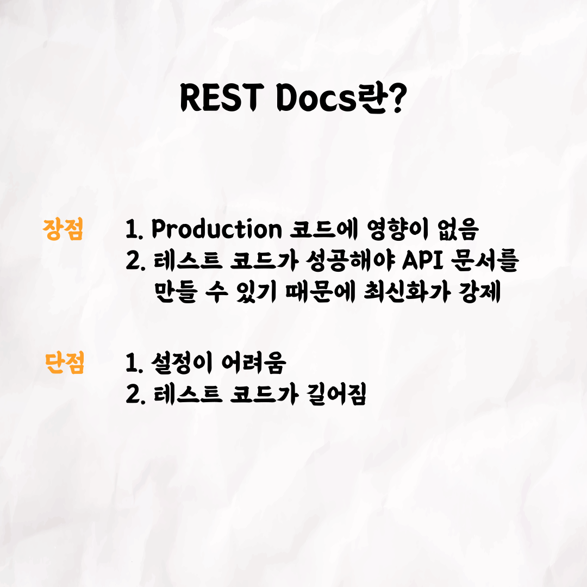

## 승팡,케이의 REST Docs

### 1번 - 표지

### 2번

### 3번

### 4번

### 5번

### 6번

### 7번

### 8번

### 9번

 

테코톡 👩🏻‍💻🧑🏻‍💻

주제 : REST Docs

발표자 : 승팡, 케이

우리 개발은 잘하고 있지만, 문서화는 어떻게 해야 하지..?
매번 문서를 수동으로 작성할 수는 없는 법!
승팡과 케이가 알려주는 REST Docs를 통해 문서화를 자동으로 생성해봐요!
영상은 유튜브에 "승팡과 케이의 REST Docs"로 검색하시면 찾아보실 수 있습니다.  
우아한Tech 유튜브 : https://www.youtube.com/c/%EC%9A%B0%EC%95%84%ED%95%9CTech

우아한테크코스 홈페이지 : https://woowacourse.github.io

우테코 블로그(Tecoble) : https://tecoble.techcourse.co.kr

#우아한테크코스 #우테코 #잠실 #선릉 #부트캠프 #java #javascript #spring #react #개발문화 #개발 #개발자 #wooteco #techcourse #테코톡 #tecotalk
