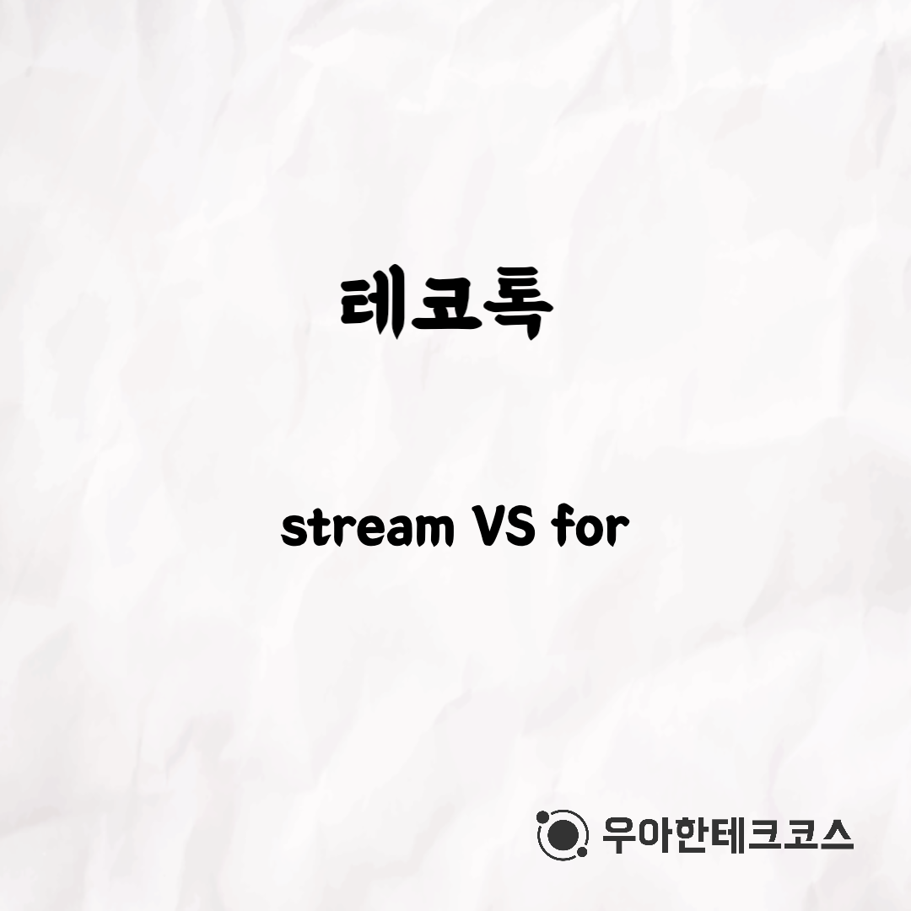
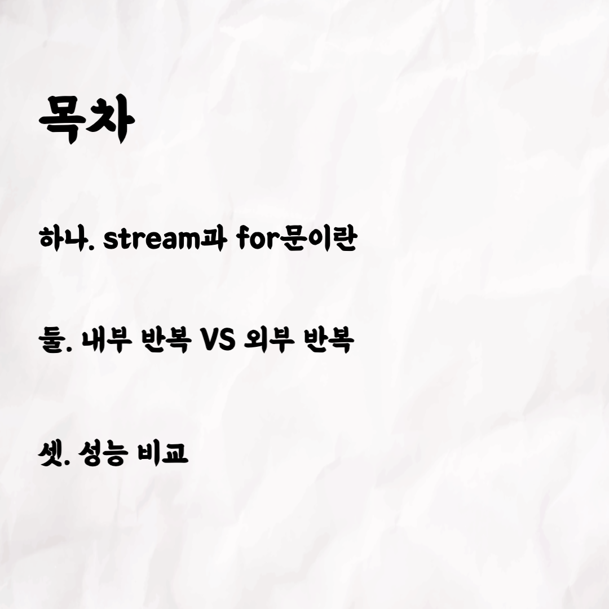
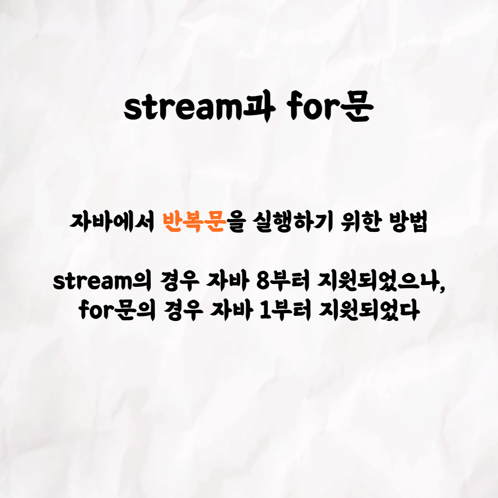
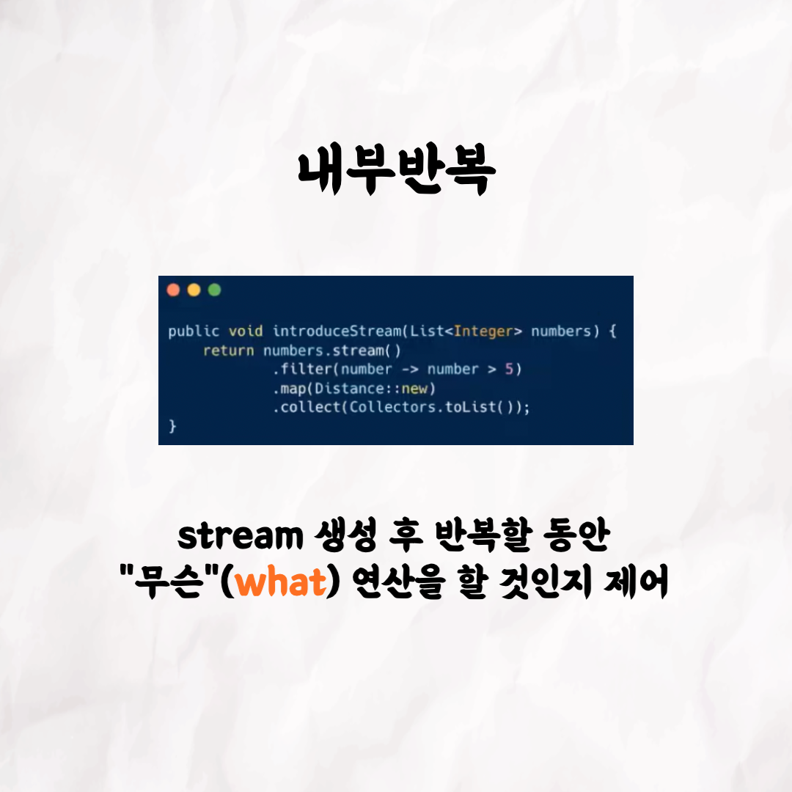
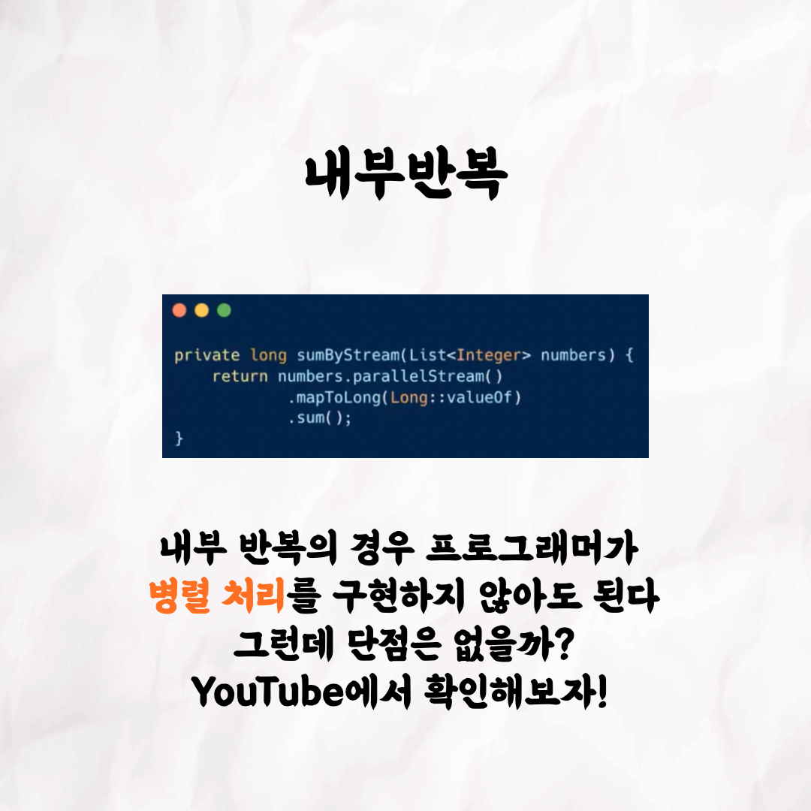
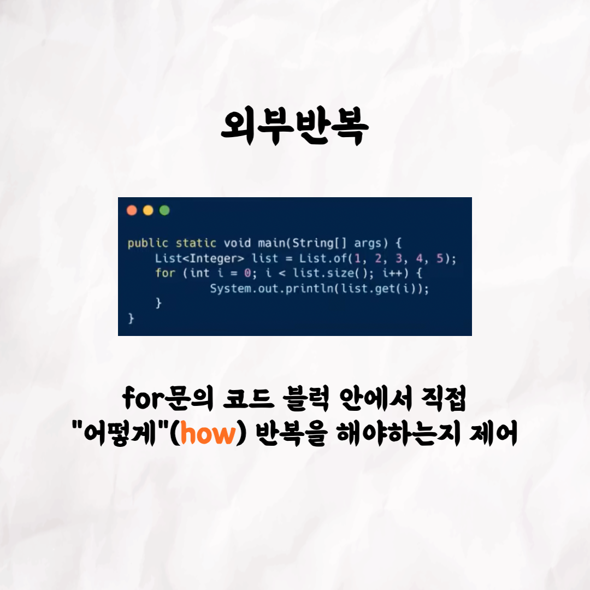
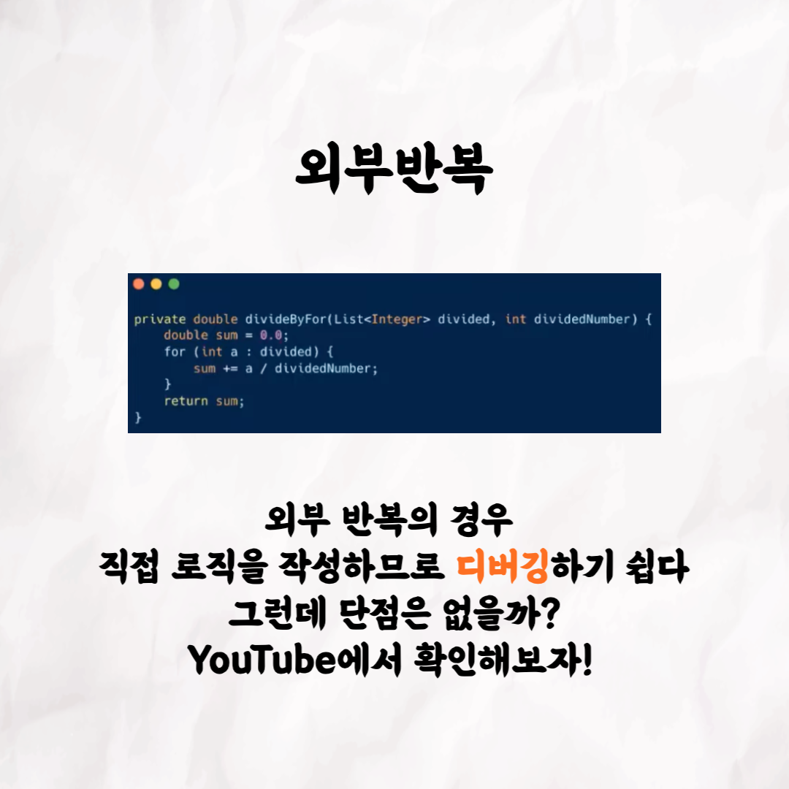
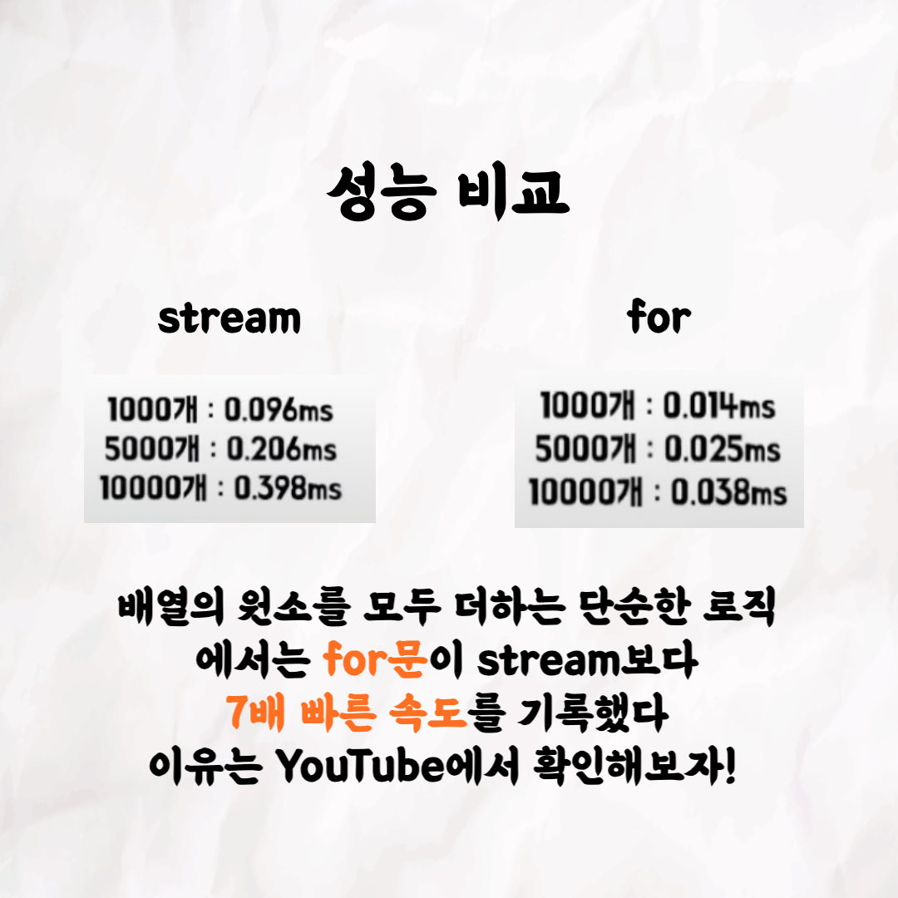
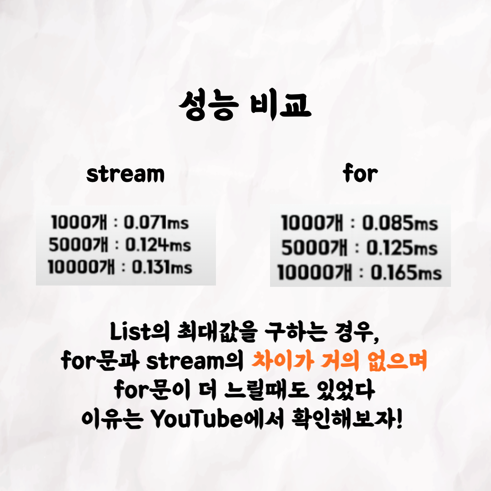

### 테코톡 - 크리스 & 로마 stream vs for

주제: stream vs for

발표자: 크리스, 로마

자바 8 이상을 사용중이라면 stream은 필수죠! 그런데 for문이나 stream이나 큰 차이가 없는거 같은데..
여러분들은 두 기능의 차이를 아시나요? 저희들도 항상 궁금했었는데요!
이번에 우아한테크코스의 백엔드 크루인 크리스와 로마가 다양한 관점에서 두 기능을 비교해보았습니다
영상은 유튜브에서 "stream vs for"로 검색하시면 보실 수 있습니다

우아한Tech 유튜브:https://www.youtube.com/c/%EC%9A%B0%EC%95%84%ED%95%9CTech

우아한테크코스 홈페이지:https://woowacourse.github.io

우테코 블로그(Tecoble):https://tecoble.techcourse.co.kr

#우아한테크코스#우테코#테코톡#개발자#java#javascript#spring#react#개발문화#개발#개발자#woowahantechcourse#wooteco#techcourse
