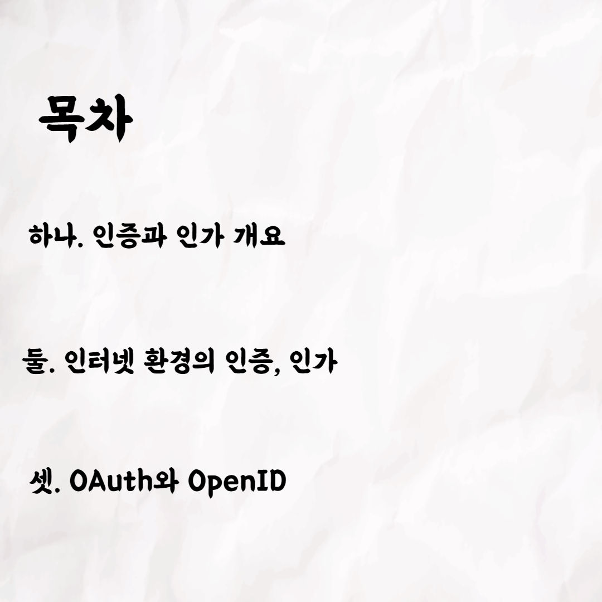
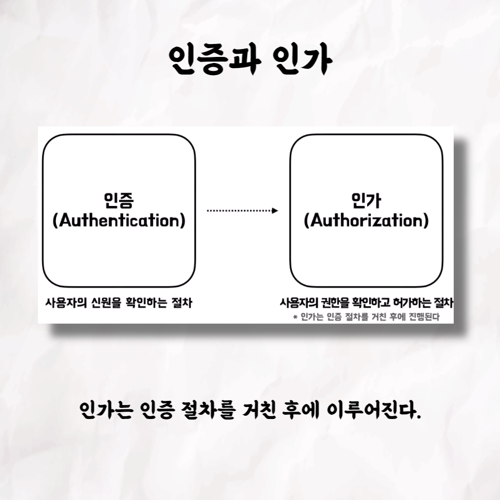
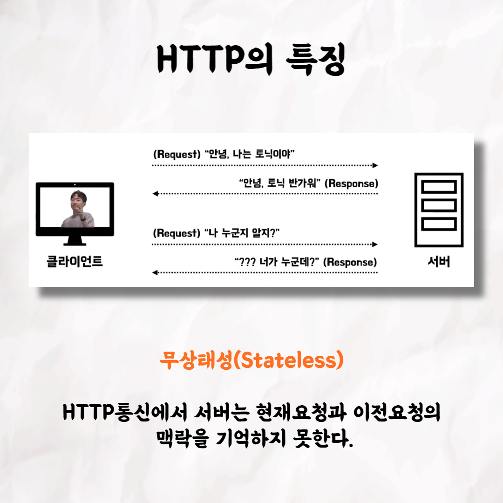
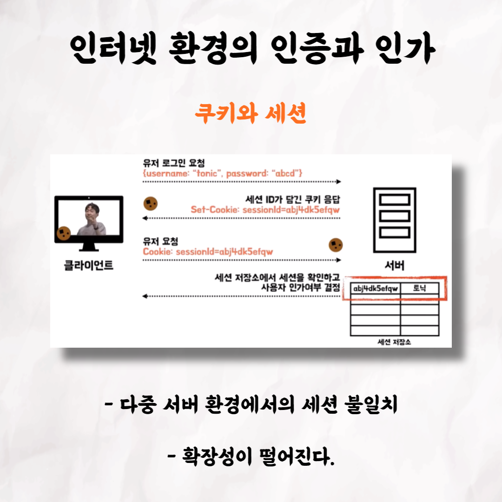
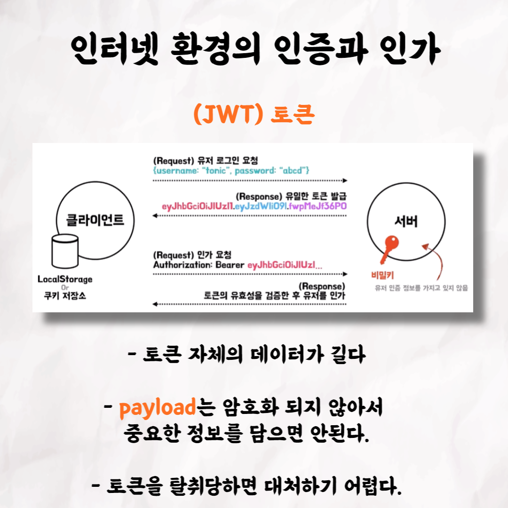
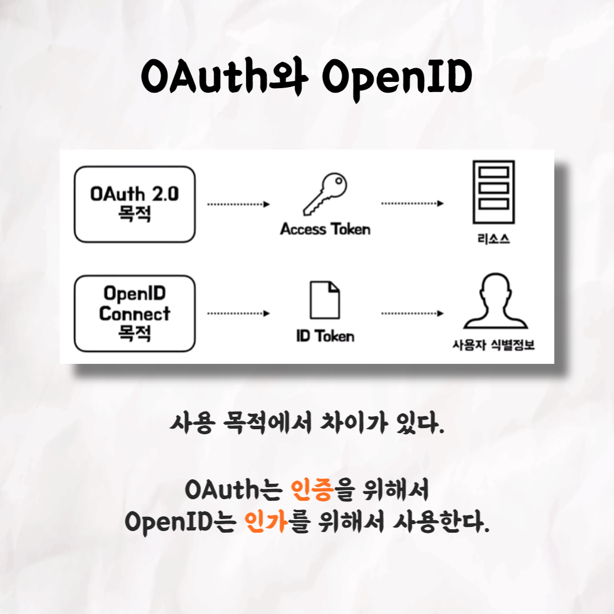
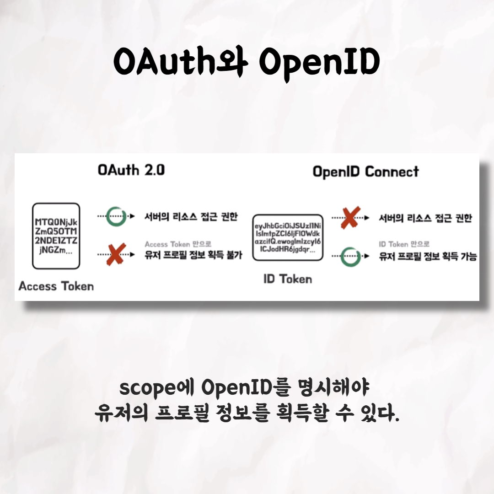
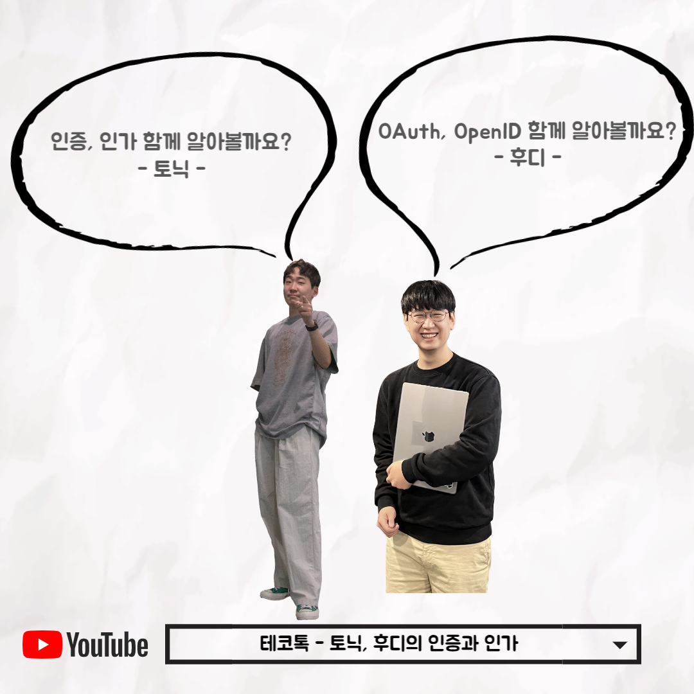

### 테코톡 - 토닉 & 후디의 인증과 인가

📮 테코톡

주제: 인증과 인가

발표자: 토닉, 후디

우테코만의 문화인 테코톡에서 토닉과 후디의 인증과 인가에 대해서 설명해주셨어요👏
인증과 인가가 무엇인지 그리고 OAuth와 OpenID는 뭐가 다른지 알아봐요!

부족사회에서부터 현대사회까지 인증과 인가가 어떻게 변해왔는지를 알고 싶다면 시청하시는 것을 강력 추천합니다! 
영상 길이는 10분 ~ 20분 정도로 출퇴근을 하시는 직장인, 등하교를 하는 학생들에게 부담되지 않고 편하게 들으실 수 있어요!

영상은 유튜브에 "토닉&후디의 인증과 인가"로 검색하시면 찾아보실 수 있습니다

우아한Tech 유튜브:https://www.youtube.com/c/%EC%9A%B0%EC%95%84%ED%95%9CTech

우아한테크코스 홈페이지:https://woowacourse.github.io

우테코 블로그(Tecoble):https://tecoble.techcourse.co.kr

#우아한테크코스#우테코#테코톡#개발자#java#javascript#spring#react#개발문화#개발#개발자#woowahantechcourse#wooteco#techcourse
