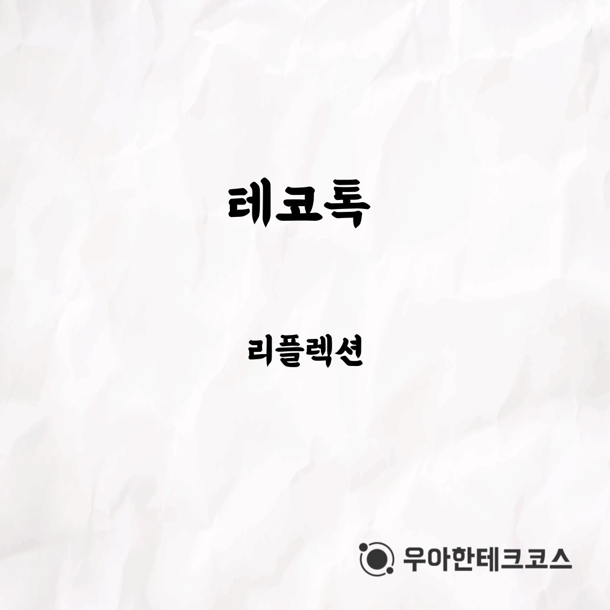
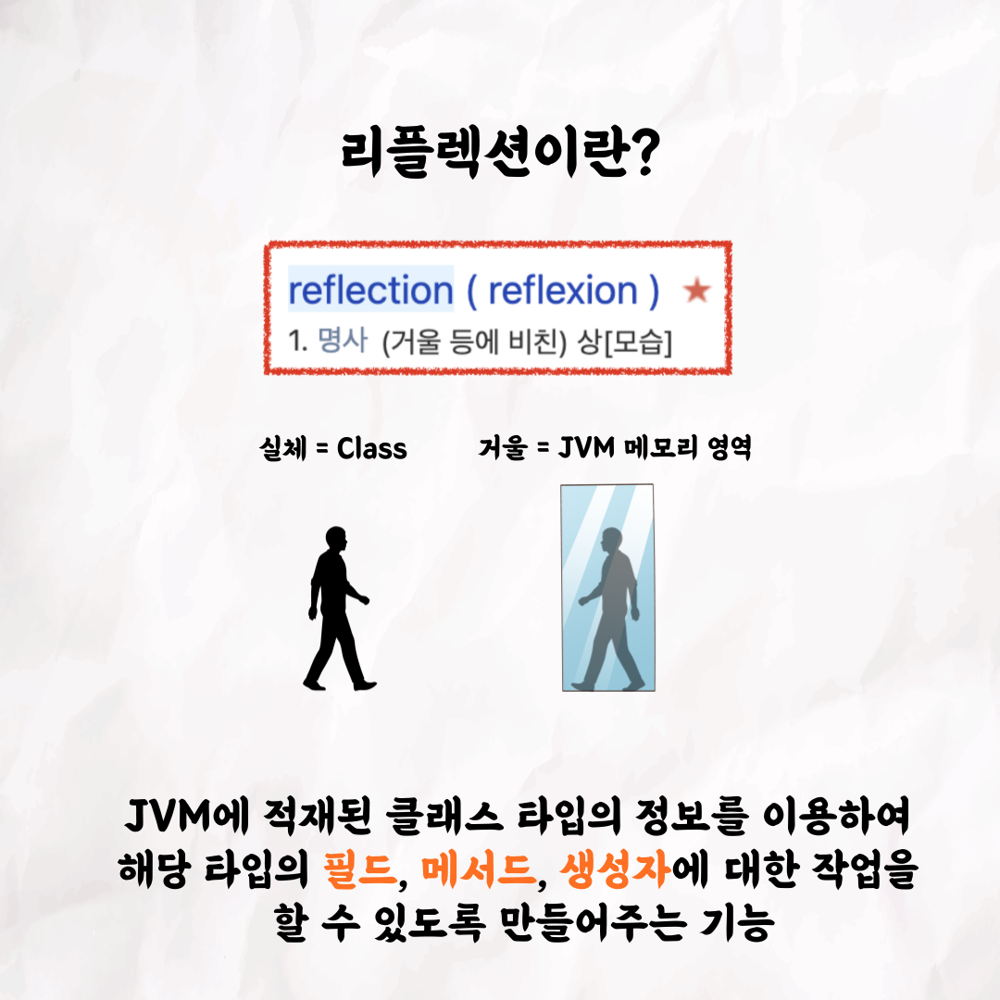
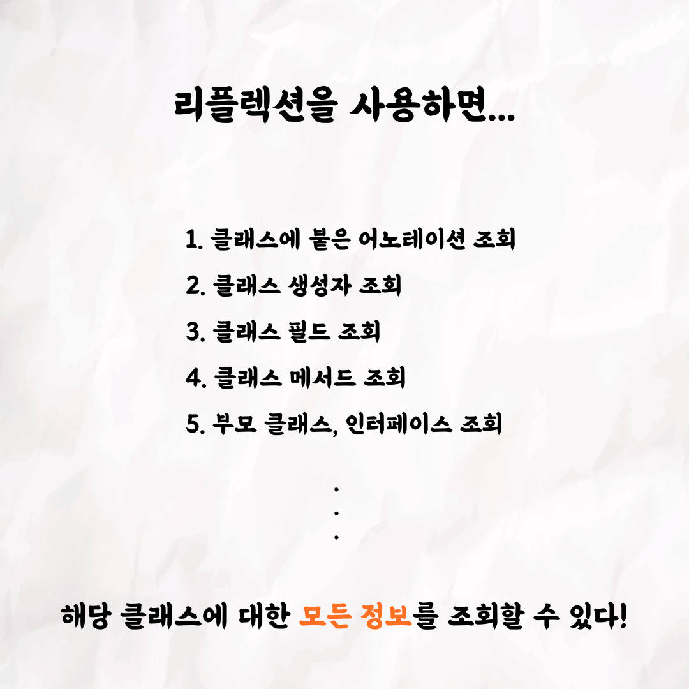
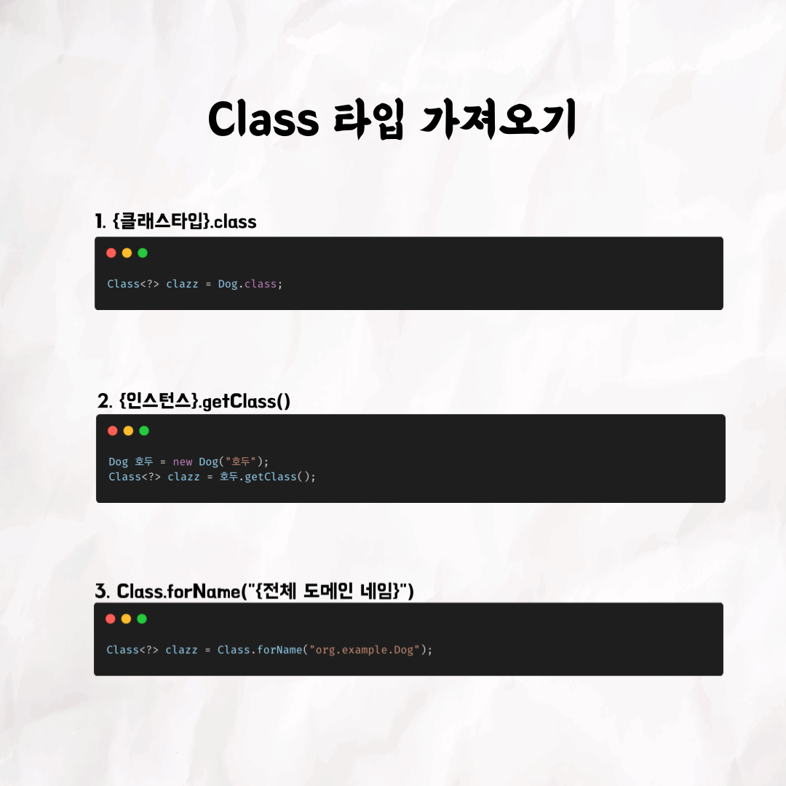
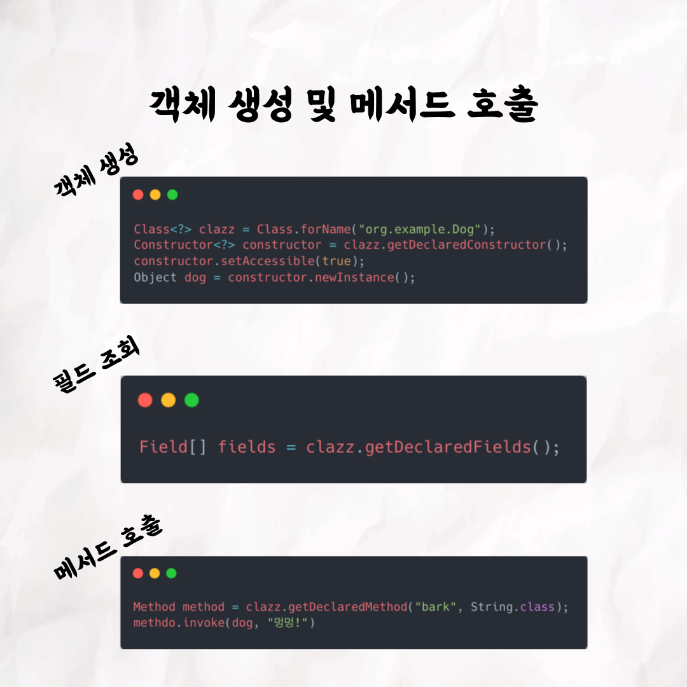
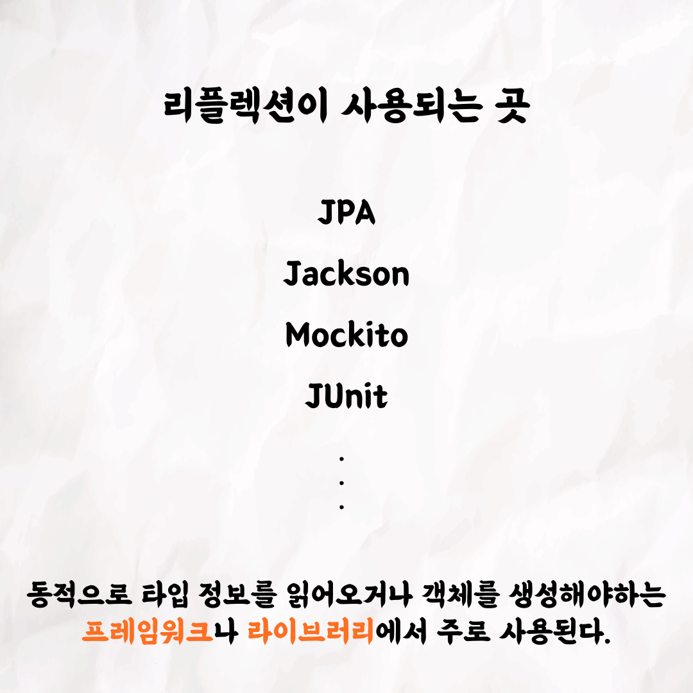
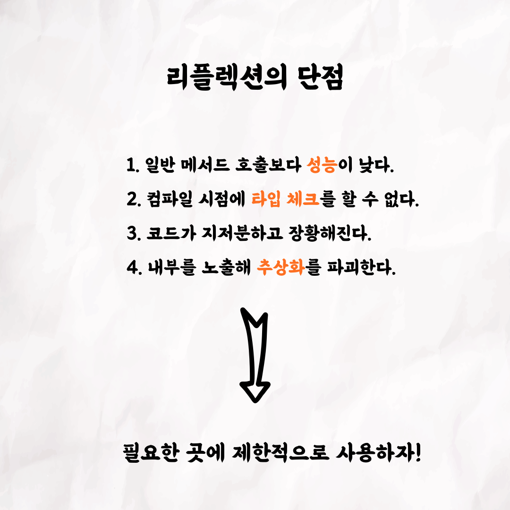
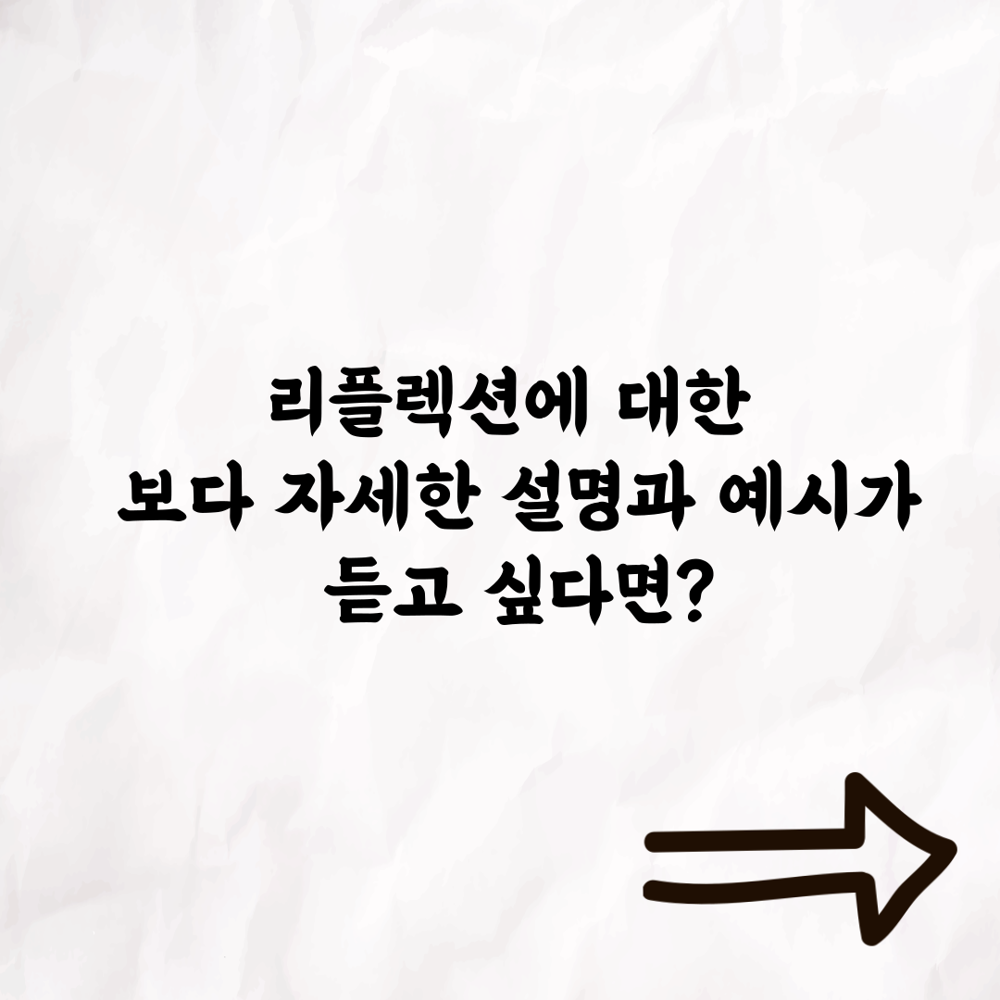
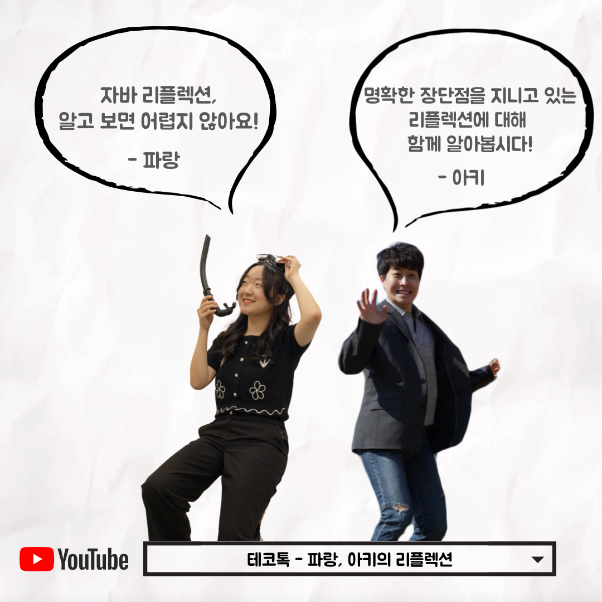

### 테코톡 - 파랑, 아키의 리플렉션

📮 테코톡

주제 : 자바 리플렉션

발표자 : 파랑, 아키 🧑‍💻

우아한테크코스만의 문화인 테코톡, 이번 주인공은 파랑과 아키입니다. 😆  
리플렉션은 익숙지 않고 사용법이 어렵게 느껴질 수 있는데요, 
파랑과 아키가 다양한 예시와 함께 리플렉션을 쉽게 설명해주었습니다 ❗️

영상은 유튜브에 "파랑, 아키의 리플렉션"으로 검색하시면 찾아보실 수 있습니다.

우아한Tech 유튜브 : https://www.youtube.com/c/%EC%9A%B0%EC%95%84%ED%95%9CTech

우아한테크코스 홈페이지 : https://woowacourse.github.io

우테코 블로그(Tecoble) : https://tecoble.techcourse.co.kr

#우아한테크코스 #우테코 #잠실 #선릉 #부트캠프 #java #javascript #spring #react #개발문화 #개발 #개발자 #wooteco #techcourse #테코톡 #tecotalk #리플렉션
